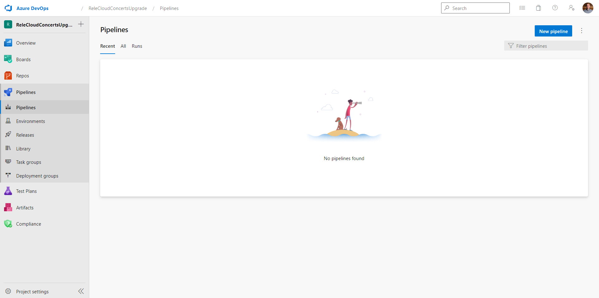
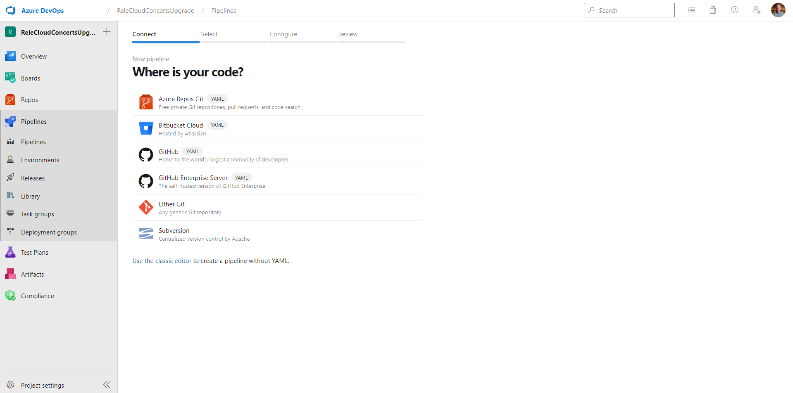
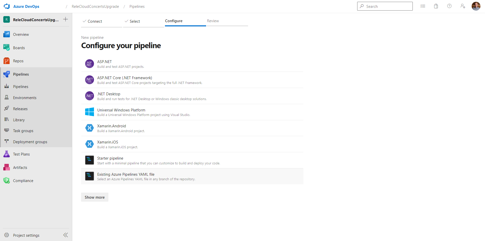
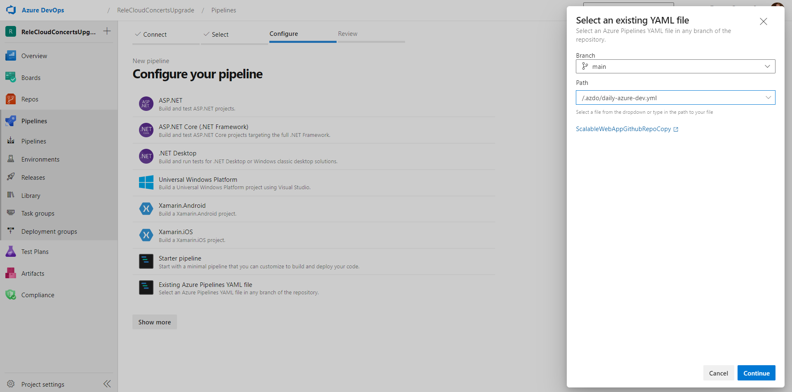
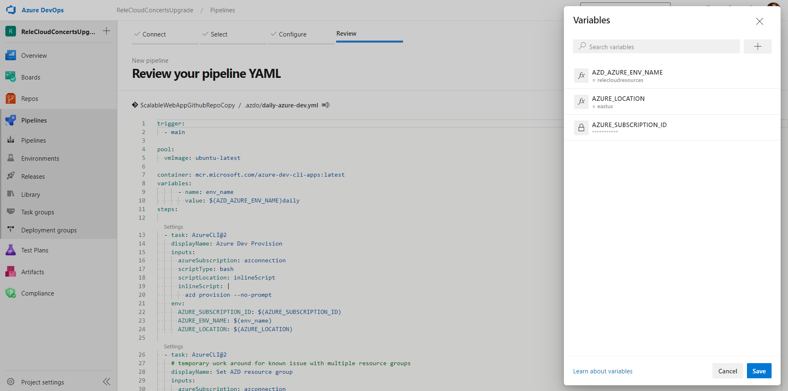

# Azure DevOps Pipeline Configuration

This document will help you create an Azure DevOps pipeline that uses the Azure Developer CLI to deploy this sample.

> This pipeline does not include the QA processes that we recommend, it is included to help you quickstart your learning journey. This pipeline also does not include the Database lifecycle management processes that we recommend. You should review your needs with your team to identify a mature solution for deploying database changes, and versioning your database schema with source control.

You will find a default Azure DevOps pipeline file in `./.azdo/pipelines/azure-dev.yml`. It will provision your Azure resources and deploy your code on a daily schedule.

You are welcome to use the file as-is or modify it to suit your needs.

> First time setup: This pipeline does not ask you to store credentials that can access Azure AD. As such, you will need to run the `create-app-registrations.ps1` script with your account for a first time setup. This process can be added to the pipeline as an idempotent script but will require an Azure AD account to create the App Registrations.

## Getting Started
The following steps are required to get started.

1. Create or Use Existing Azure DevOps Organization
2. Create a Service Connection
3. Create a pipeline

### 1. Create or Use Existing Azure DevOps Organization

To run a pipeline in Azure DevOps, you'll first need an Azure DevOps organization. You must create an organization using the Azure DevOps portal here: https://dev.azure.com.

### 2. Create a Service Connection

To deploy resources to Azure this pipeline uses a service connection. Use this link to create a service connection named `azconnection` so that the pipeline can access your Azure subscription.

[Service connections in Azure Pipelines - Azure Pipelines](https://learn.microsoft.com/en-us/azure/devops/pipelines/library/service-endpoints?view=azure-devops&tabs=yaml)

### 3. Create a pipeline

The following steps walk-through creating the Azure Pipeline.

1. Start by navigating to the Azure DevOps Pipeline page

    

    Image of Azure DevOps Pipeline Page  

2. Click the `New pipeline` button

3. Choose **Azure Repos Git** and the appropriate git repository

    
    
    Azure Pipeline asks where your code is  

4. Choose **Existing Azure Pipelines YAML file**

    
    
    Azure Pipeline asks to pick a template 

5. Select the *daily-azure-dev.yml* file from your repo

    
    
    Pick the daily-azure-dev.yml file 

6. On the next screen you must provide 3 pipeline variables

    
    
    Set Pipeline variables 

    |Variable Name | Value |
    |----|----|
    |AZURE_SUBSCRIPTION_ID| {find this GUID in the Azure Portal} |
    |AZURE_LOCATION| *eastus* |
    |AZD_AZURE_ENV_NAME | *relecloudresources* |

7. Click the `Run` button to start your first pipeline

> Note: Because the pipeline does not configure your Azure AD resources you must configure the Azure AD App Registrations and place those values into Key Vault and App Configuration Service before the application will run successfully. We provide the `createAppRegistration.sh` script to do this one-time setup.

