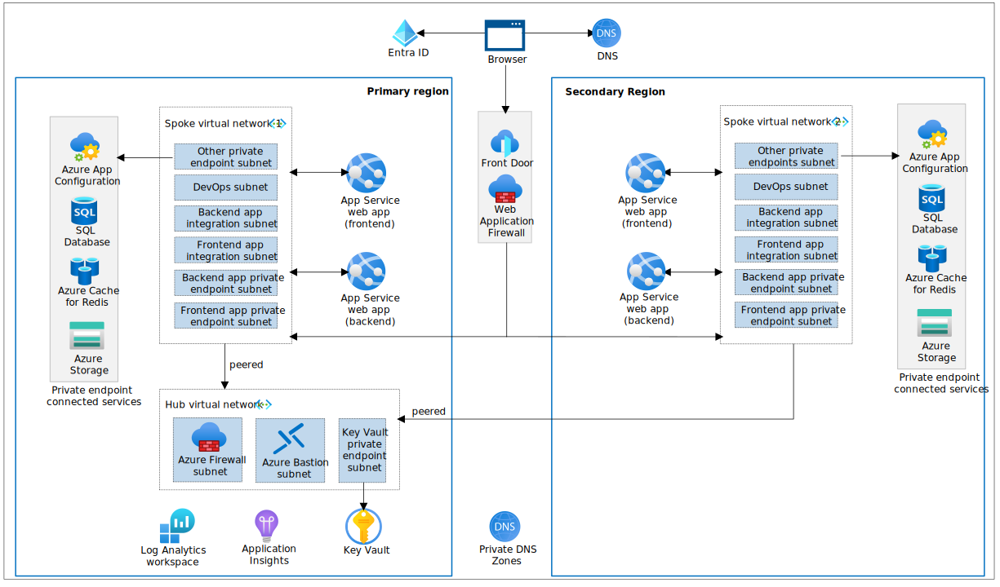

# Reliable web app pattern for .NET

> :mega: **Got feedback?** Fill out [this survey](https://aka.ms/eap/rwa/dotnet/survey) to help us shape the future of Enterprise App Patterns and understand whether we're focusing on the business goals and features important to you. [Microsoft Privacy Statement](https://go.microsoft.com/fwlink/?LinkId=521839)

The reference implementation provides a production-grade web application that uses best practices from our guidance and gives developers concrete examples to build their own Reliable Web Application in Azure. This repository specifically demonstrates a concert ticketing application for the fictional company Relecloud, embodying the reliable web app pattern with a focus on .NET technologies. It guides developers through a simulated migration from an on-premises ASP.NET application to Azure, detailing the architectural changes and enhancements that capitalize on the cloud's strengths during the initial adoption phase. 

This project has [a companion article in the Azure Architecture Center](https://aka.ms/eap/rwa/dotnet/doc) that describes design patterns and best practices and [a six-part video series (YouTube)](https://aka.ms/eap/rwa/dotnet/videos) that details the reliable web app pattern for .NET web app. Here's an outline of the contents in this readme:

- [Architecture](#architecture)
- [Workflow](#workflow)
- [Steps to deploy the reference implementation](#steps-to-deploy-the-reference-implementation)
- [Additional links](#additional-links)
- [Data Collection](#data-collection)

## Architecture

Relecloud aligned to a hub and spoke network topology in the production deployment architecture to centralize common resources. This network topology provided cost savings, enhanced security, and facilitated network integration (platform and hybrid):



This diagram describes the production deployment which is described in the [prod-deployment.md](./prod-deployment.md) file. The following steps below are for a [development deployment](./assets/icons/reliable-web-app-dotnet-dev.svg) which is a simplified version.

-	Cost efficiency: The hub acts as a central point for shared resources, promoting cost-effective resource reuse. For instance, Azure Bastion is a shared service in the hub, providing secure and cost-effective remote access without the need for separate deployments for each application.
-	Traffic control and security: Network traffic is managed and secured using Network Security Groups and Route tables in each subnet, creating secure boundaries for Azure resources. Private endpoints add an extra layer of security, and a jump box allows for deployment within these boundaries, maintaining local IP access to resources.
-	Network integration: The topology supports network integrations for data transfer across applications and hybrid scenarios. While the reference architecture doesn't include ExpressRoute or Azure VPN Gateway, these should be considered for applications requiring hybrid network connections.

## Workflow

This description details the workflow for Relecloud's concert ticketing application. It highlights key components and functionality to help you emulate its design:
 
- Global traffic routing: Azure Front Door acts as a global traffic manager, routing users to the primary region for optimal performance and failing over to a secondary region during outages for uninterrupted service.
- Security inspection: Incoming traffic is inspected by Azure Web Application Firewall to protect against web vulnerabilities before reaching the web app.
- Static and dynamic content delivery: Users receive static content, like the home page, immediately upon request. Dynamic content, such as 'Upcoming Concerts', is generated by making API calls to the backend, which fetches data from Azure SQL Database and returns it in a JSON format.
- Session state management: User sessions, including shopping cart data, are managed by Azure Cache for Redis, ensuring persistence and consistency across scale-out events.
- User authentication: Microsoft Entra ID handles user authentication, suitable for environments where accounts are centrally managed, enhancing security and control.
- API interaction and token management: The front-end web app uses the MSAL library to obtain tokens for authenticated API calls, caching them in Azure Cache for Redis to optimize performance and manageability.
- Payment and checkout flow: While this example doesn't process real payments, the web app captures payment information during checkout, demonstrating how a web app can handle sensitive data.
- Purchase and ticket generation: The backend API processes purchase requests and generates tickets that are immediately accessible to users.
- Networking and access control: Azure Private DNS, Network Security Groups, and Azure Firewall tightly control the flow of traffic within the app's network, maintaining security and isolation.
- Monitoring and telemetry: Application Insights provides monitoring and telemetry capabilities, enabling performance tracking and proactive issue resolution.
- Configuration and secrets management: Initial configuration and sensitive information are loaded from Azure App Configuration and Azure Key Vault into the app's memory upon startup, minimizing access to sensitive data thereafter.

## Steps to deploy the reference implementation

The following detailed deployment steps assume you are using a Dev Container inside Visual Studio Code.

> For your convenience, we use Dev Containers with a fully-featured development environment. If you prefer to use Visual Studio, we recommend installing the necessary [dependencies](./prerequisites.md) and skip to the deployment instructions starting in [Step 3](#3-log-in-to-azure).

### 1. Clone the repo

> For Windows users, we recommend using Windows Subsystem for Linux (WSL) to [improve Dev Container performance](https://code.visualstudio.com/remote/advancedcontainers/improve-performance).

```pwsh
wsl
```

Clone the repository from GitHub into the WSL 2 filesystem using the following command:

```shell
git clone https://github.com/Azure/reliable-web-app-pattern-dotnet.git
cd reliable-web-app-pattern-dotnet
```

### 2. Open Dev Container in Visual Studio Code

If required, ensure Docker Desktop is started and enabled for your WSL terminal [more details](https://learn.microsoft.com/windows/wsl/tutorials/wsl-containers#install-docker-desktop). Open the repository folder in Visual Studio Code. You can do this from the command prompt:

```shell
code .
```

Once Visual Studio Code is launched, you should see a popup allowing you to click on the button **Reopen in Container**.


If you don't see the popup, open the Visual Studio Code Command Palette to execute the command. There are three ways to open the command palette:

- For Mac users, use the keyboard shortcut ⇧⌘P
- For Windows and Linux users, use Ctrl+Shift+P
- From the Visual Studio Code top menu, navigate to View -> Command Palette.

Once the command palette is open, search for `Dev Containers: Rebuild and Reopen in Container`.


### 3. Log in to Azure

Before deploying, you must be authenticated to Azure and have the appropriate subscription selected. Run the following command to authenticate:

If you are not using PowerShell 7+, run the following command (you can use [$PSVersionTable.PSVersion](https://learn.microsoft.com/powershell/module/microsoft.powershell.core/about/about_powershell_editions) to check your version):

```shell
pwsh
```

```pwsh
Import-Module Az.Resources
```

```pwsh
Connect-AzAccount
```

Set the subscription to the one you want to use (you can use [Get-AzSubscription](https://learn.microsoft.com/powershell/module/az.accounts/get-azsubscription?view=azps-11.3.0) to list available subscriptions):

```pwsh
$AZURE_SUBSCRIPTION_ID="<your-subscription-id>"
```

```pwsh
Set-AzContext -SubscriptionId $AZURE_SUBSCRIPTION_ID
```

Use the next command to login with the Azure Dev CLI (AZD) tool:

```pwsh
azd auth login
```


### 4. Create a new environment

Next we provide the AZD tool with variables that it uses to create the deployment. The first thing we initialize is the AZD environment with a name.

The environment name should be less than 18 characters and must be comprised of lower-case, numeric, and dash characters (for example, `dotnetwebapp`).  The environment name is used for resource group naming and specific resource naming.

By default, Azure resources are sized for a development deployment. If doing a production deployment, see the [production deployment](./prod-deployment.md) instructions for more detail.

```pwsh
azd env new <pick_a_name>
```

Select the subscription that will be used for the deployment:

```pwsh
azd env set AZURE_SUBSCRIPTION_ID $AZURE_SUBSCRIPTION_ID
```

Set the `AZURE_LOCATION` (Run `(Get-AzLocation).Location` to see a list of locations):

```pwsh
azd env set AZURE_LOCATION <pick_a_region>
```

### 5. Create the Azure resources and deploy the code

Run the following command to create the Azure resources and deploy the code (about 15-minutes to complete):

```pwsh
azd up
```

> **Errors during provisioning?**  See our [known issues list](./known-issues.md) or file an issue on our [GitHub repo](https://github.com/azure/reliable-web-app-pattern-dotnet/issues).

### 6. Open and use the application

Use the URL displayed in the console output to launch the web application that you have deployed:


You can learn more about the web app by reading the [Pattern Simulations](demo.md) documentation.

### 7. Tear down the deployment

Run the following command to tear down the deployment:

```pwsh
azd down --purge --force
```

## Additional links

- [Known issues](known-issues.md)
- [Troubleshooting](troubleshooting.md)
- [Pattern Simulations](demo.md)
- [Developer Experience](developer-experience.md)
- [Calculating SLA](./assets/sla-calculation.md)
- [Find additional resources](additional-resources.md)
- [Report security concerns](SECURITY.md)
- [Find Support](SUPPORT.md)
- [Contributing](CONTRIBUTING.md)

## Trademarks

This project may contain trademarks or logos for projects, products, or services. Authorized use of Microsoft 
trademarks or logos is subject to and must follow 
[Microsoft's Trademark & Brand Guidelines](https://www.microsoft.com/en-us/legal/intellectualproperty/trademarks/usage/general).
Use of Microsoft trademarks or logos in modified versions of this project must not cause confusion or imply Microsoft sponsorship.
Any use of third-party trademarks or logos are subject to those third-party's policies.

## Data Collection

The software may collect information about you and your use of the software and send it to Microsoft. Microsoft may use this information to provide services and improve our products and services. You may turn off the telemetry as described in the repository. There are also some features in the software that may enable you and Microsoft to collect data from users of your applications. If you use these features, you must comply with applicable law, including providing appropriate notices to users of your applications together with a copy of Microsoft's privacy statement. Our privacy statement is located at https://go.microsoft.com/fwlink/?LinkId=521839. You can learn more about data collection and use in the help documentation and our privacy statement. Your use of the software operates as your consent to these practices.

### Telemetry Configuration

Telemetry collection is on by default.

To opt out, run the following command `azd env set ENABLE_TELEMETRY` to `false` in your AZD environment.
