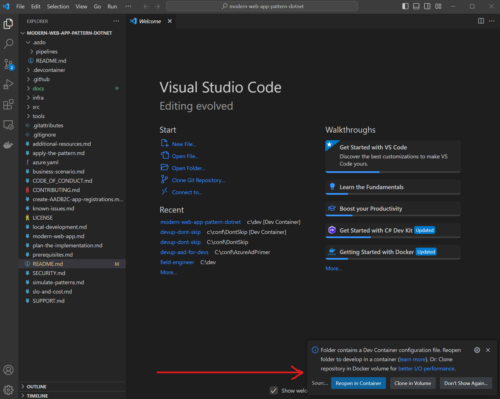
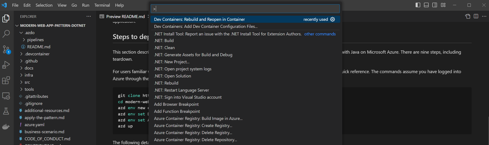
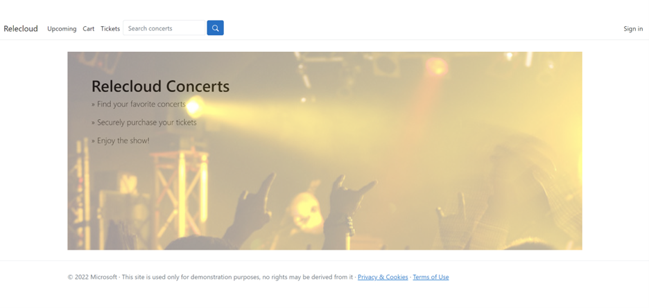

# Reliable web app pattern for .NET

> :mega: **Got feedback?** Fill out [this survey](https://aka.ms/eap/rwa/dotnet/survey) to help us shape the future of Enterprise App Patterns and understand whether we're focusing on the business goals and features important to you. [Microsoft Privacy Statement](https://go.microsoft.com/fwlink/?LinkId=521839)

The reference implementation provides a production-grade web application that uses best practices from our guidance and gives developers concrete examples to build their own Reliable Web Application in Azure. It simulates the journey from an on-premises ASP.NET application to a migration to Azure. It shows you what changes to make to maximize the benefits of the cloud in the initial cloud adoption phase. Here's an outline of the contents in this readme:

- [Azure Architecture Center guidance](#azure-architecture-center-guidance)
- [6 videos on the reliable web app pattern for .NET](#videos)
- [Architecture](#architecture)
- [Workflow](#workflow)
- [Steps to deploy the reference implementation](#steps-to-deploy-the-reference-implementation)
- [Additional links](#additional-links)
- [Data Collection](#data-collection)

## Azure Architecture Center guidance

This project has a [companion article in the Azure Architecture Center](https://aka.ms/eap/rwa/dotnet/doc) that describes design patterns and best practices for migrating to the cloud. We suggest you read it as it will give important context to the considerations applied in this implementation.

## Videos

This project has a six-part video series that details the reliable web app pattern for .NET web app. For more information, see [Reliable web app pattern videos (YouTube)](https://aka.ms/eap/rwa/dotnet/videos).

## Architecture


## Workflow

- Azure Front Door routes traffic based on availability of the primary region. When the primary region is unavailable it will route traffic to the secondary region.
- When Front Door passes the request to the Web App, it will pass-through the Azure Web Application Firewall. The Azure Web Application Firewall will evaluate the request and protect the web app against common security attacks.
- Once the traffic reaches the web front-end users will be shown the home page. They can view these pages without authenticating.
- Navigating to the Concerts on the web app will send a request to the web front-end that tells it to ask the web api app for details about upcoming concerts.
- Details about the upcoming concerts will be retrieved from the Azure SQL Database by the web api app with a SQL query. The results will be formatted as a JSON response and returned to the web front-end.
- When the web front-end receives results from the API it will use razor template engine to render the HTML page shown to the user that asked for a list of concerts.
- Once a user adds a concert ticket to their shopping cart the front-end web app will start interacting with Azure Cache for Redis. Asking the web app to put a concert ticket into the cart tells the web app to save information about that pending purchase as JSON data in Redis as part of a session object for the current user. Saving the session to an external datastore enables the web app to load balance traffic more evenly and to handle horizontal scaling events without losing the customer's intent to buy a ticket. No inventory management is included in this sample so there are no quantities deducted, or placed on reserve, in the backend of the system.
- As the user checks out the front-end web app will ask the user to authenticate with Microsoft Entra ID. This scenario is for a call center that places orders on-behalf of customers so the accounts in-use are managed by Relecloud and are not self-managed.
- After authenticating to Microsoft Entra ID the front-end web app will receive a token from Microsoft Entra ID that represents the current user. This token is saved as a cookie in the user's browser and is not persisted by the front-end web app.
- As the user proceeds with checkout the web app will collect payment data. Payment data is not sent anywhere for this sample.
- When the payment data is submitted for approval the ticket will be purchased. Logic to handle this is located in the web api project so the web app makes a call to the web api project.
- Prior to calling the API, the front-end web app asks the MSAL library for a token it can use to call the web api app as an authenticated user.
- When the MSAL library, in the front-end web app,  has a token it will cache it in Azure Cache for Redis. If it does not have a token it will request one from Microsoft Entra ID and then save it in Azure Cache for Redis.
- Once the ticket purchase request is sent to the web api app the API will render the ticket image and save it to Azure storage.
- After the ticket purchase is completed successfully the user will be directed to their tickets page where they can see a list of the tickets they have purchased. These tickets will be immediately available because rendering the ticket was part of the purchase request.
  - As information flows between services the Azure network handles traffic routing across private endpoints by using Azure Private DNS to lookup the correct IP addresses. This enables the system to block public network traffic and use a single v-net to manage traffic between these systems. This v-net can be connected to others as-needed to allow the app to call other systems in your digital estate or to allow other systems to call the web API so they can access details about ticket purchases.
  - As the front-end, and web api, apps process requests they are sending data to Application Insights so that you can monitor information about processing web requests.
  - When the web app is started for the first time it will load configuration data from App Config Service and Azure Key Vault. This information is saved in the web app's memory and is not accessed afterwards.

## Steps to deploy the reference implementation

The following detailed deployment steps assume you are using a Dev Container inside Visual Studio Code.

### 1. Clone the repo

Clone the repository from GitHub:

```shell
git clone https://github.com/Azure/reliable-web-app-pattern-dotnet.git
cd reliable-web-app-pattern-dotnet
```

### 2. Open Dev Container in Visual Studio Code (optional)

If required, ensure Docker Desktop is started and enabled for your WSL terminal [more details](https://learn.microsoft.com/windows/wsl/tutorials/wsl-containers#install-docker-desktop). Open the repository folder in Visual Studio Code. You can do this from the command prompt:

```shell
code .
```

Once Visual Studio Code is launched, you should see a popup allowing you to click on the button **Reopen in Container**.



If you don't see the popup, open the Visual Studio Code Command Palette to execute the command. There are three ways to open the command palette:

- For Mac users, use the keyboard shortcut ⇧⌘P
- For Windows and Linux users, use Ctrl+Shift+P
- From the Visual Studio Code top menu, navigate to View -> Command Palette.

Once the command palette is open, search for `Dev Containers: Rebuild and Reopen in Container`.



### 3. Create a new environment

Use the VS Code terminal to run the following commands to create a new environment.

The environment name should be less than 18 characters and must be comprised of lower-case, numeric, and dash characters (for example, `dotnetwebapp`).  The environment name is used for resource group naming and specific resource naming. Also, select a password for the admin user of the database.

If not using PowerShell 7+, run the following command:

```shell
pwsh
```

Run the following commands to set these values and create a new environment:

```pwsh
azd env new dotnetwebapp
```

You can substitute the environment name with your own value.

By default, Azure resources are sized for a "development" mode. If doing a Production deployment, set the `AZURE_ENV_TYPE` to `prod` using the following command:

```pwsh
azd env set AZURE_ENV_TYPE prod
```

### 4. Log in to Azure

Before deploying, you must be authenticated to Azure and have the appropriate subscription selected. Run the following command to authenticate:

```pwsh
azd auth login
```

```pwsh
Import-Module Az.Resources
```

```pwsh
Connect-AzAccount
```

Each command will open a browser allowing you to authenticate.  To list the subscriptions you have access to:

```pwsh
Get-AzSubscription
```

To set the active subscription:

```pwsh
$AZURE_SUBSCRIPTION_ID="<your-subscription-id>"
azd env set AZURE_SUBSCRIPTION_ID $AZURE_SUBSCRIPTION_ID
Set-AzContext -SubscriptionId $AZURE_SUBSCRIPTION_ID
```

### 5. Select a region for deployment

The application can be deployed in either a single region or multi-region manner. You can find a list of available Azure regions by running the following Azure CLI command.

> ```pwsh
> (Get-AzLocation).Location
> ```

Set the `AZURE_LOCATION` to the primary region:

```shell
azd env set AZURE_LOCATION westus3
```

If doing a multi-region deployment, set the `AZURE_LOCATION2` to the secondary region:

```shell
azd env set AZURE_LOCATION2 eastus
```

Make sure the secondary region is a paired region with the primary region (`AZURE_LOCATION`). Paired regions are required to support some Azure features; for example, [geo-zone-redundant storage (GZRS) failover](https://learn.microsoft.com/azure/storage/common/storage-disaster-recovery-guidance). For a full list of region pairs, see [Azure region pairs](https://learn.microsoft.com/azure/reliability/cross-region-replication-azure#azure-cross-region-replication-pairings-for-all-geographies). We have validated the following paired regions.

| AZURE_LOCATION | AZURE_LOCATION2 |
| ----- | ----- |
| westus3 | eastus |
| westeurope | northeurope |
| australiaeast | australiasoutheast |

### 6. Provision the application

Run the following command to create the infrastructure (about 15-minutes to provision):

```pwsh
azd provision --no-prompt
```

**Create App Registrations**

Relecloud devs have automated the process of creating Azure
AD resources that support the authentication features of the
web app. They use the following command to create two new
App Registrations within Microsoft Entra ID. The command is also
responsible for saving configuration data to Key Vault and
App Configuration so that the web app can read this data
(about 3-minutes to register).

```sh
./infra/scripts/postprovision/call-create-app-registrations.sh
```

**Set Configuration**

Relecloud devs have automated the process of configuring the environment.

```sh
./infra/scripts/predeploy/call-set-app-configuration.sh
```

### 7. Deploy the application

Run the following command to deploy the code to the created infrastructure (about 4-minutes to deploy):

```shell
azd deploy
```

If you are doing a multi-region deployment, you must also deploy the code to the secondary region (about 4-minutes to deploy):

```shell
SECONDARY_RESOURCE_GROUP=$(azd env get-values --output json | jq -r .secondary_resource_group)
azd env set AZURE_RESOURCE_GROUP $SECONDARY_RESOURCE_GROUP
azd deploy
```

The provisioning and deployment process can take anywhere from 20 minutes to over an hour, depending on system load and your bandwidth.


### 8. Open and use the application

Use the following to find the URL for the Relecloud application that you have deployed:

```shell
azd env get-values --output json | jq -r .WEB_URI
```



### 9. Teardown

To tear down the deployment, run the following command:

```shell
azd down
```

Your Azure subscription will retain your deployment request as a stateful object.
If you would like to change the Azure region for this deployment you will need to
delete the deployment by running the following command.

```
az deployment delete --name $myEnvironmentName
```

> You can list all deployments with the following command
> `az deployment sub list --query "[].name" -o tsv`

## Additional links

- [Known issues](known-issues.md)
- [Developer patterns](simulate-patterns.md)
- [Local Development](local-development.md)
- [Find additional resources](additional-resources.md)
- [Report security concerns](SECURITY.md)
- [Find Support](SUPPORT.md)
- [Contributing](CONTRIBUTING.md)

## Data Collection

The software may collect information about you and your use of the software and send it to Microsoft. Microsoft may use this information to provide services and improve our products and services. You may turn off the telemetry as described in the repository. There are also some features in the software that may enable you and Microsoft to collect data from users of your applications. If you use these features, you must comply with applicable law, including providing appropriate notices to users of your applications together with a copy of Microsoft's privacy statement. Our privacy statement is located at https://go.microsoft.com/fwlink/?LinkId=521839. You can learn more about data collection and use in the help documentation and our privacy statement. Your use of the software operates as your consent to these practices.

### Telemetry Configuration

Telemetry collection is on by default.

To opt out, run the following command `azd env set ENABLE_TELEMETRY` to `false` in your environment.
