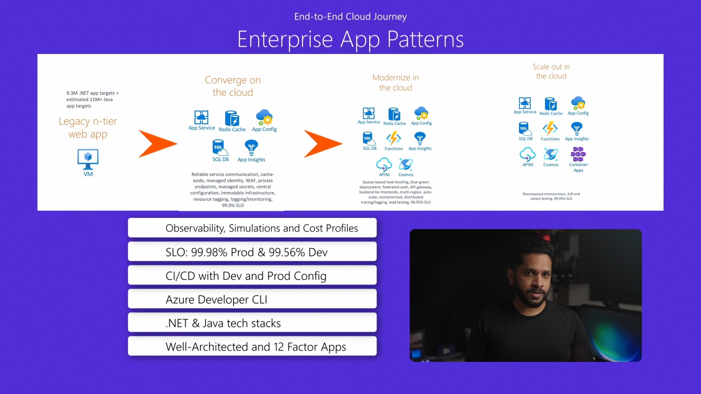

# Reliable Web App Pattern

This repository provides resources to help developers build a Reliable web app on Azure. A Reliable Web App is a set of services, code, and infrastructure deployed in Azure that applies practices from the Well-Architected Framework. This pattern is shared with three components to help you use Azure to build a web app that follows Microsoft's recommended guidance for achieving reliability, scalability, and security in the cloud.

3 components of the Reliable web app are:

* [Reference architecture](ReliableWebApp.md) - the reference architecture illustrates the web application and explains the decisions made.
* [Scripts to deploy](scripts.md) - the scripts provide step-by-step instructions to deploy the reference architecture.
* A starting point deployment pipeline with bicep resources that demonstrate how the infrastructure decisions were implemented

To Get Started on Reliable Web App Patterns, [Watch the Introduction Video (8 mins)](https://microsoftapc-my.sharepoint.com/:v:/g/personal/nanil_microsoft_com/EaFYz80v2W1CoGKwFxbvuIEBLO6xenwwtv03apn3yv6mMg):

## Getting Started

This guidance deploys a sample eCommerce web application that sells concert tickets. It uses the Azure Dev CLI to set up Azure services and deploy the code. Deploying the code requires the creation of Azure services, configuration of permissions,and creating Azure AD App Registrations.
