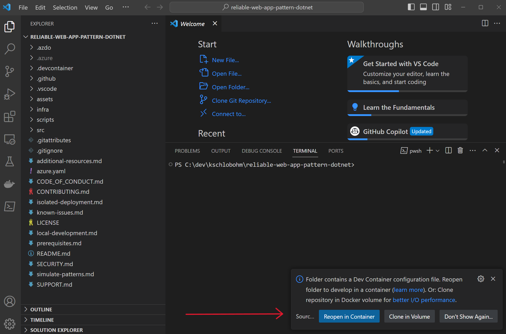
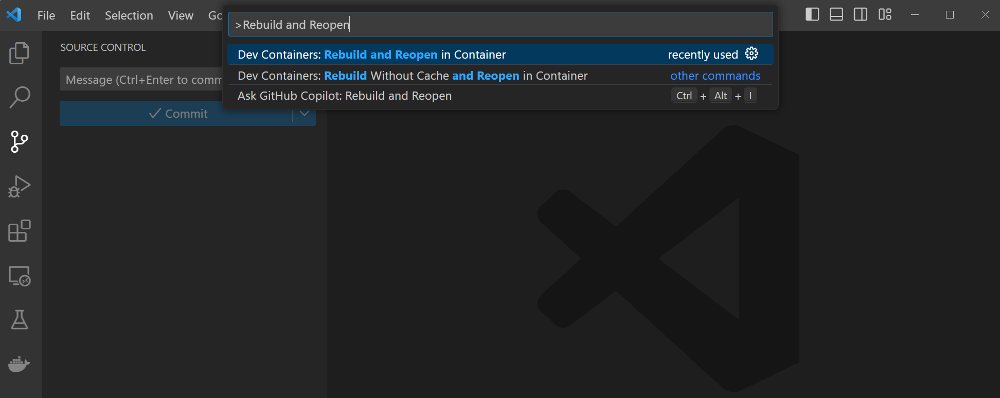

# Reliable web app pattern for .NET

> :mega: **Got feedback?** Fill out [this survey](https://aka.ms/eap/rwa/dotnet/survey) to help us shape the future of Enterprise App Patterns and understand whether we're focusing on the business goals and features important to you. [Microsoft Privacy Statement](https://go.microsoft.com/fwlink/?LinkId=521839)

The reference implementation provides a production-grade web application that uses best practices from our guidance and gives developers concrete examples to build their own Reliable Web Application in Azure. It simulates the journey from an on-premises ASP.NET application to a migration to Azure. It shows you what changes to make to maximize the benefits of the cloud in the initial cloud adoption phase. Here's an outline of the contents in this readme:

- [Azure Architecture Center guidance](#azure-architecture-center-guidance)
- [6 videos on the reliable web app pattern for .NET](#videos)
- [Architecture](#architecture)
- [Workflow](#workflow)
- [Steps to deploy the reference implementation](#steps-to-deploy-the-reference-implementation)
- [Additional links](#additional-links)
- [Data Collection](#data-collection)

## Azure Architecture Center guidance

This project has a [companion article in the Azure Architecture Center](https://aka.ms/eap/rwa/dotnet/doc) that describes design patterns and best practices for migrating to the cloud. We suggest you read it as it will give important context to the considerations applied in this implementation.

## Videos

This project has a six-part video series that details the reliable web app pattern for .NET web app. For more information, see [Reliable web app pattern videos (YouTube)](https://aka.ms/eap/rwa/dotnet/videos).

## Architecture


This diagram describes the production deployment which is described in the [prod-deployment.md](./prod-deployment.md) file. The steps below deploy the simplified [development version](./assets/images/reliable-web-app-dotnet-dev.svg) of the application infrastructure.

## Workflow

- Azure Front Door routes traffic based on availability of the primary region. When the primary region is unavailable, it will route traffic to the secondary region.
- When Front Door passes the request to the Web App, it will pass through the Azure Web Application Firewall. The Azure Web Application Firewall will evaluate the request and protect the web app against common security attacks.
- Once the traffic reaches the front-end web app, users will be shown the home page. They can view these pages without authenticating.
- Navigating to the Upcoming Concerts page on the front-end web app will trigger a request to the backend web API app for details about upcoming concerts.
- The backend web API app will retrieve details about the upcoming concerts from the Azure SQL Database using a SQL query. The results will be formatted as a JSON response and returned to the front-end web app.
- When the front-end web app receives results from the API, it will use the razor template engine to render the HTML page shown to the user requesting a list of concerts.
- Once a user adds a concert ticket to their shopping cart, the front-end web app will start interacting with Azure Cache for Redis. When a concert ticket is added to the cart, the web app will save that information in Redis as part of a session object for the current user. Saving the session to an external datastore enables the web app to load balance traffic more evenly and handle horizontal scaling events without losing the customer's data.
- As the user proceeds to check out, the front-end web app will require authentication with Microsoft Entra ID. This scenario is for a call center that places orders on behalf of customers, so the accounts in use are managed by Relecloud and are not self-managed.
- After authenticating to Microsoft Entra ID, the front-end web app will receive a token that represents the current user.
- As the user proceeds with checkout, the web app will collect payment data. Payment data is not sent anywhere for this sample.
- When the payment data is submitted for approval, the ticket will be purchased. Logic to handle this is located in the backend web API.
- Prior to calling the API, the front-end web app requests a token from the MSAL library to call the backend web API app as an authenticated user.
- When the front-end web app has a token, it will cache it in Azure Cache for Redis. If it does not have a token, it will request one from Microsoft Entra ID and then save it in Azure Cache for Redis.
- Once the ticket purchase request is sent to the backend web API, the API will render the ticket image and save it to Azure storage.
- After the ticket purchase is completed successfully, the user will be redirected to their tickets page where they can see a list of the tickets they have purchased. These tickets will be immediately available because rendering the ticket was part of the purchase request.
- As information flows between services, the Azure network handles traffic routing.
  - Traffic travels between Azure resources across private endpoints by using Azure Private DNS to lookup the correct IP addresses. This enables the system to block public network traffic and use a single v-net to manage traffic between these systems.
  - Traffic into the App Service is only allowed from Azure Front Door. Traffic out of the App Service is sent through Azure Firewall for routing and controlled by subnet with Network security groups.
  - A jump host VM and Azure Bastion are included to provide access to Azure resources that have enabled network isolation.
  - As the front-end and backend web apps process requests, they send data to Application Insights to monitor information about processing web requests.
  - When the web app is started for the first time, it loads configuration data from App Config Service and Azure Key Vault. This information is saved in the web app's memory and is not accessed afterwards.

## Steps to deploy the reference implementation

The following detailed deployment steps assume you are using a Dev Container inside Visual Studio Code.

### 1. Clone the repo

Clone the repository from GitHub:

```shell
git clone https://github.com/Azure/reliable-web-app-pattern-dotnet.git
cd reliable-web-app-pattern-dotnet
```

### 2. Open Dev Container in Visual Studio Code (optional)

> For your convenience, we use DevContainers with a fully-featured development environment. If you prefer to use Visual Studio, we recommend installing the necessary [dependencies](./prerequisites.md) and following the deployment instructions below.

If required, ensure Docker Desktop is started and enabled for your WSL terminal [more details](https://learn.microsoft.com/windows/wsl/tutorials/wsl-containers#install-docker-desktop). Open the repository folder in Visual Studio Code. You can do this from the command prompt:

```shell
code .
```

Once Visual Studio Code is launched, you should see a popup allowing you to click on the button **Reopen in Container**.



If you don't see the popup, open the Visual Studio Code Command Palette to execute the command. There are three ways to open the command palette:

- For Mac users, use the keyboard shortcut ⇧⌘P
- For Windows and Linux users, use Ctrl+Shift+P
- From the Visual Studio Code top menu, navigate to View -> Command Palette.

Once the command palette is open, search for `Dev Containers: Rebuild and Reopen in Container`.



### 3. Create a new environment

Use the VS Code terminal to run the following commands to create a new environment.

The environment name should be less than 18 characters and must be comprised of lower-case, numeric, and dash characters (for example, `dotnetwebapp`).  The environment name is used for resource group naming and specific resource naming. Also, select a password for the admin user of the database.

If not using PowerShell 7+, run the following command:

```shell
pwsh
```


You can substitute the environment name with your own value.

By default, Azure resources are sized for a "development" mode. If doing a Production deployment, see the [prod Deployment](./prod-deployment.md) instructions for more detail.

### 4. Log in to Azure

Before deploying, you must be authenticated to Azure and have the appropriate subscription selected. Run the following command to authenticate:

```pwsh
Import-Module Az.Resources
```

```pwsh
Connect-AzAccount
```

To list the subscriptions you have access to:

```pwsh
Get-AzSubscription
```

```pwsh
$AZURE_SUBSCRIPTION_ID="<your-subscription-id>"
```

```pwsh
Set-AzContext -SubscriptionId $AZURE_SUBSCRIPTION_ID
```

```pwsh
azd auth login
```

Run the following commands to set these values and create a new environment:

```pwsh
azd env new rwa1_1
```

To deploy the dev version:

```pwsh
azd env set ENVIRONMENT dev
```

```pwsh
azd env set AZURE_SUBSCRIPTION_ID $AZURE_SUBSCRIPTION_ID
```

Set the `AZURE_LOCATION` to the primary region:

```pwsh
azd env set AZURE_LOCATION westus3
```

### 6. Provision the app and deploy the code

Run the following command to create the infrastructure (about 15-minutes to provision):

```pwsh
azd up
```

The provisioning and deployment process can take anywhere from 20 minutes to over an hour, depending on system load and your bandwidth.

### 8. Open and use the application

Use the URL displayed in the consol output to launch the Relecloud application that you have deployed:


### 9. Teardown

To tear down the deployment, run the following command:

```pwsh
azd down --purge --force
```

## Additional links

- [Known issues](known-issues.md)
- [Troubleshooting](troubleshooting.md)
- [Developer patterns](simulate-patterns.md)
- [Local Development](local-development.md)
- [Find additional resources](additional-resources.md)
- [Report security concerns](SECURITY.md)
- [Find Support](SUPPORT.md)
- [Contributing](CONTRIBUTING.md)

## Data Collection

The software may collect information about you and your use of the software and send it to Microsoft. Microsoft may use this information to provide services and improve our products and services. You may turn off the telemetry as described in the repository. There are also some features in the software that may enable you and Microsoft to collect data from users of your applications. If you use these features, you must comply with applicable law, including providing appropriate notices to users of your applications together with a copy of Microsoft's privacy statement. Our privacy statement is located at https://go.microsoft.com/fwlink/?LinkId=521839. You can learn more about data collection and use in the help documentation and our privacy statement. Your use of the software operates as your consent to these practices.

### Telemetry Configuration

Telemetry collection is on by default.

To opt out, run the following command `azd env set ENABLE_TELEMETRY` to `false` in your environment.
