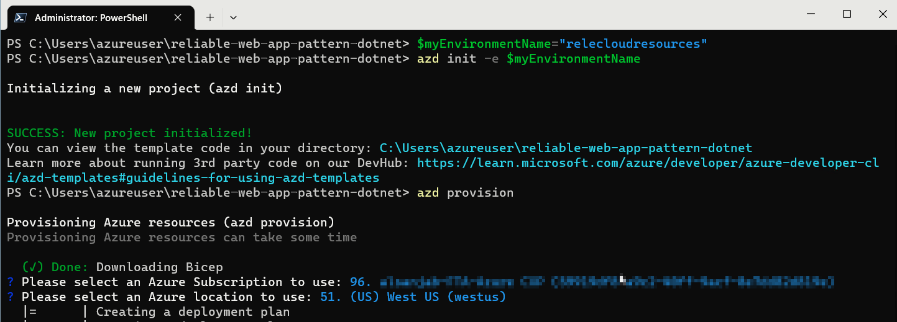

# Reliable web app pattern for .NET

> :mega: **Got feedback?** Fill out [this survey](https://aka.ms/eap/rwa/dotnet/survey) to help us shape the future of Enterprise App Patterns and understand whether we're focusing on the business goals and features important to you. [Microsoft Privacy Statement](https://go.microsoft.com/fwlink/?LinkId=521839)

The reference implementation provides a production-grade web application that uses best practices from our guidance and gives developers concrete examples to build their own Reliable Web Application in Azure. This repository specifically demonstrates a concert ticketing application for the fictional company Relecloud, embodying the reliable web app pattern with a focus on .NET technologies. It guides developers through a simulated migration from an on-premises ASP.NET application to Azure, detailing the architectural changes and enhancements that capitalize on the cloud's strengths during the initial adoption phase. Here's an outline of the contents in this readme:

- [Azure Architecture Center guidance](#azure-architecture-center-guidance)
- [6 videos on the reliable web app pattern for .NET](#videos)
- [Architecture](#architecture)
- [Workflow](#workflow)
- [Steps to deploy the reference implementation](#steps-to-deploy-the-reference-implementation)
- [Additional links](#additional-links)
- [Data Collection](#data-collection)

## Azure Architecture Center guidance

This project has a [companion article in the Azure Architecture Center](https://aka.ms/eap/rwa/dotnet/doc) that describes design patterns and best practices for migrating to the cloud. We suggest you read it as it will give important context to the considerations applied in this implementation.

## Videos

This project has a six-part video series that details the reliable web app pattern for .NET web app. For more information, see [Reliable web app pattern videos (YouTube)](https://aka.ms/eap/rwa/dotnet/videos).

## Architecture

Relecloud aligned to a hub and spoke network topology in the prod deployment architecture to centralize common resources. This network topology provided cost savings, enhanced security, and facilitated network integration (platform and hybrid):


-	Cost efficiency: The hub acts as a central point for shared resources, promoting cost-effective resource reuse. For instance, Azure Bastion is a shared service in the hub, providing secure and cost-effective remote access without the need for separate deployments for each application.
-		Traffic control and security: Network traffic is managed and secured using Network Security Groups and Route tables in each subnet, creating secure boundaries for Azure resources. Private endpoints add an extra layer of security, and a Jump Host within the hub allows for deployment within these boundaries, maintaining local IP access to resources.
-		Network integration: The topology supports network integrations for data transfer across applications and hybrid scenarios. While the reference architecture doesn't include ExpressRoute or Azure VPN Gateway, these should be considered for applications requiring hybrid network connections.

## Workflow

This description details the workflow for Relecloud's concert ticketing application. It highlights key components and functionality to help you emulate its design:
 
- Global traffic routing: Azure Front Door acts as a global traffic manager, routing users to the primary region for optimal performance and failing over to a secondary region during outages for uninterrupted service.
- Security inspection: Incoming traffic is inspected by Azure Web Application Firewall to protect against web vulnerabilities before reaching the web app.
- Static and dynamic content delivery: Users receive static content, like the home page, immediately upon request. Dynamic content, such as 'Upcoming Concerts', is generated by making API calls to the backend, which fetches data from Azure SQL Database and returns it in a JSON format.
- Session state management: User sessions, including shopping cart data, are managed by Azure Cache for Redis, ensuring persistence and consistency across scale-out events.
- User authentication: Microsoft Entra ID handles user authentication, suitable for environments where accounts are centrally managed, enhancing security and control.
- API interaction and token management: The front-end web app uses the MSAL library to obtain tokens for authenticated API calls, caching them in Azure Cache for Redis to optimize performance and manageability.
- Payment and checkout flow: While this example doesn't process real payments, the web app captures payment information during checkout, demonstrating how a web app can handle sensitive data.
- Purchase and ticket generation: The backend API processes purchase requests and generates tickets, which are immediately accessible to users, showcasing the app's responsiveness.
- Networking and access control: Azure Private DNS, Network Security Groups, and Azure Firewall tightly control the flow of traffic within the app's network, maintaining security and isolation.
- Monitoring and telemetry: Application Insights provides monitoring and telemetry capabilities, enabling performance tracking and proactive issue resolution.
- Configuration and secrets management: Initial configuration and sensitive information are loaded from Azure App Configuration and Azure Key Vault into the app's memory upon startup, minimizing access to sensitive data thereafter.

## Steps to deploy the reference implementation

This reference implementation provides you with the instructions and templates you need to deploy this solution. This solution uses the Azure Dev CLI to set up Azure services
and deploy the code.

### Pre-requisites

1. To run the scripts, Windows users require Powershell 7.2 (LTS) or above. Alternatively, you can use a bash terminal using [Windows Subsystem for Linux](https://learn.microsoft.com/en-us/windows/wsl/install). macOS users can use a bash terminal.

   1. PowerShell users - [Install PowerShell](https://learn.microsoft.com/en-us/powershell/scripting/install/installing-powershell-on-windows)
       Run the following to verify that you're running the latest PowerShell
   
       ```ps1
       $PsVersionTable
       ```

1. [Install Git](https://github.com/git-guides/install-git)
    Run the following to verify that git is available
    ```ps1
    git version
    ```

1. [Install the Azure CLI](https://learn.microsoft.com/cli/azure/install-azure-cli).
    Run the following command to verify that you're running version
    2.38.0 or higher.

    ```ps1
    az version
    ```
    
    After the installation, run the following command to [sign in to Azure interactively](https://learn.microsoft.com/cli/azure/authenticate-azure-cli#sign-in-interactively).

    ```ps1
    az login
    ```
1. [Upgrade the Azure CLI Bicep extension](https://learn.microsoft.com/en-us/azure/azure-resource-manager/bicep/install#azure-cli).
    Run the following command to verify that you're running version 0.12.40 or higher.

    ```ps1
    az bicep version
    ```

1. [Install the Azure Dev CLI](https://learn.microsoft.com/azure/developer/azure-developer-cli/install-azd).
    Run the following command to verify that the Azure Dev CLI is installed.

    ```ps1
    azd auth login
    ```

1. [Install .NET 6 SDK](https://dotnet.microsoft.com/download/dotnet/6.0)
    Run the following command to verify that the .NET SDK 6.0 is installed.
    ```ps1
    dotnet --version
    ```

### Get the code

Please clone the repo to get started.

```
git clone https://github.com/Azure/reliable-web-app-pattern-dotnet
```

And switch to the folder so that `azd` will recognize the solution.

```
cd reliable-web-app-pattern-dotnet
```

### Deploying to Azure

Relecloud's developers use the `azd` command line experience to deploy the code. This means their local workflow is the same
experience that runs from the GitHub action. You can use these
steps to follow their experience by running the commands from the folder where this guide is stored after cloning this repo.

Use this command to get started with deployment by creating an
`azd` environment on your workstation.

<table>
<tr>
<td>PowerShell</td>
<td>

```ps1
$myEnvironmentName="relecloudresources"
```

```ps1
azd init -e $myEnvironmentName
```

</td>
</tr>
<tr>
<td>Bash</td>
<td>

```bash
myEnvironmentName="relecloudresources"
```

```bash
azd init -e $myEnvironmentName
```

</td>
</tr>
</table>


#### (Optional Steps) Choose Prod or Non-prod environment

The Relecloud team uses the same bicep templates to deploy
their production, and non-prod, environments. To do this
they set `azd` environment parameters that change the behavior
of the next steps.

> If you skip the next two optional steps, and change nothing,
> then the bicep templates will default to non-prod settings.

*Step: 1*

Relecloud devs deploy the production environment by running the
following command to choose the SKUs they want in production.

```ps1
azd env set IS_PROD true
```

*Step: 2*

Relecloud devs also use the following command to choose a second
Azure location because the production environment is
multiregional.

```ps1
azd env set SECONDARY_AZURE_LOCATION westus3
```

> You can find a list of available Azure regions by running
> the following Azure CLI command.
> 
> ```ps1
> az account list-locations --query "[].name" -o tsv
> ```

#### Provision the infrastructure

Relecloud uses the following command to deploy the Azure
services defined in the bicep files by running the provision
command.

> This step will take several minutes based on the region
> and deployment options you selected.

```ps1
azd provision
```
When prompted, select the preferred Azure Subscription and the Location:



> When the command finishes you have deployed Azure App
> Service, SQL Database, and supporting services to your
> subscription. If you log into the the
> [Azure Portal](http://portal.azure.com) you can find them
> in the resource group named `$myEnvironmentName-rg`.

#### Create App Registrations

Relecloud devs have automated the process of creating Azure
AD resources that support the authentication features of the
web app. They use the following command to create two new
App Registrations within Azure AD. The command is also
responsible for saving configuration data to Key Vault and
App Configuration so that the web app can read this data.

<table>
<tr>
<td>PowerShell</td>
<td>

```ps1
pwsh -c "Set-ExecutionPolicy Bypass Process; .\infra\createAppRegistrations.ps1 -g '$myEnvironmentName-rg'"
```

</td>
</tr>
<tr>
<td>Bash</td>
<td>

```bash
chmod +x ./infra/createAppRegistrations.sh
./infra/createAppRegistrations.sh -g "$myEnvironmentName-rg"
```

</td>
</tr>
</table>

> Known issue: [/bin/bash^M: bad interpreter](known-issues.md#troubleshooting)

#### Deploy the code

To finish the deployment process the Relecloud devs run the
folowing `azd` commands to build, package, and deploy the dotnet
code for the front-end and API web apps.

```ps1
 azd env set AZURE_RESOURCE_GROUP "$myEnvironmentName-rg"
```

```ps1
 azd deploy
```

When finished the console will display the URI for the web app. You can use this URI to view the deployed solution in a browser.


> If you face any issues with the deployment, see the [Known issues document](known-issues.md) below for possible workarounds. There could be interim issues while deploying to Azure, and repeating the steps after a few minutes should fix most of them. Azure deployments are incremental by default, and only failed actions will be retired.

#### Clean up Azure Resources

1. Unprovision the Azure Resources
2. Clean up App Registrations
3. Delete the Deployment

##### 1. Unprovision the Azure Resources
To tear down an enviroment, and clean up the Azure resource group, use the folloing command:

```ps1
azd down --force --purge --no-prompt
```

> You can also use the Azure Portal to delete the "relecloudresources" resource groups. This approach will not purge the Key Vault or App Configuration services and they will remain in your subscription for 7 days in a deleted state that does not charge your subscription. This feature enables you to recover the data if the configuration was accidentally deleted. You can purge these in the _Manage deleted stores_ section of each service in the portal. 

 

##### 2. Clean up App Registrations
You will also need to delete the two Azure AD app registrations that were created. You can find them in Azure AD by searching for their environment name. 
 
 **Delete App Registrations** 

 
 
 You will also need to purge the App Configuration Service instance that was deployed.


##### 3. Delete the Deployment

Your Azure subscription will retain your deployment request as a stateful object.
If you would like to change the Azure region for this deployment you will need to
delete the deployment by running the following command.

```
az deployment delete --name $myEnvironmentName
```

> You can list all deployments with the following command
> `az deployment sub list --query "[].name" -o tsv`

### Local Development

Relecloud developers use Visual Studio to develop locally and they co-share
an Azure SQL database for local dev. The team chooses this workflow to
help them practice early integration of changes as modifying the
database and other shared resources can impact multiple workstreams.

To connect to the shared database the dev team uses connection strings
from Key Vault and App Configuration Service. Devs use the following
script to retrieve data and store it as
[User Secrets](https://learn.microsoft.com/aspnet/core/security/app-secrets?view=aspnetcore-6.0&tabs=windows)
on their workstation.

Using the `secrets.json` file helps the team keep their credentials
secure. The file is stored outside of the source control directory so
the data is never accidentally checked-in. And the devs don't share
credentials over email or other ways that could compromise their
security.

Managing secrets from Key Vault and App Configuration ensures that only
authorized team members can access the data and also centralizes the
administration of these secrets so they can be easily changed.

New team members should setup their environment by following these steps.

1. Open the Visual Studio solution `./src/Relecloud.sln`
1. Setup the **Relecloud.Web** project User Secrets
    1. Right-click on the **Relecloud.Web** project
    1. From the context menu choose **Manage User Secrets**
    1. From a command prompt run the bash command

        <table>
        <tr>
        <td>PowerShell</td>
        <td>

        ```ps1
        pwsh -c "Set-ExecutionPolicy Bypass Process; .\infra\localDevScripts\getSecretsForLocalDev.ps1 -g '$myEnvironmentName-rg' -Web"
        ```

        </td>
        </tr>
        <tr>
        <td>Bash</td>
        <td>
                
        ```bash
        chmod +x ./infra/localDevScripts/getSecretsForLocalDev.sh
        ./infra/localDevScripts/getSecretsForLocalDev.sh -g "$myEnvironmentName-rg" --web
        ```

        </td>
        </tr>
        </table>

    1. Copy the output into the `secrets.json` file for the **Relecloud.Web**
    project.

1. Setup the **Relecloud.Web.Api** project User Secrets
    1. Right-click on the **Relecloud.Web.Api** project
    1. From the context menu choose **Manage User Secrets**
    1. From a command prompt run the bash command

        <table>
        <tr>
        <td>PowerShell</td>
        <td>

        ```ps1
        pwsh -c "Set-ExecutionPolicy Bypass Process; .\infra\localDevScripts\getSecretsForLocalDev.ps1 -g '$myEnvironmentName-rg' -Api"
        ```

        </td>
        </tr>
        <tr>
        <td>Bash</td>
        <td>
                
        ```bash
        ./infra/localDevScripts/getSecretsForLocalDev.sh -g "$myEnvironmentName-rg" --api
        ```

        </td>
        </tr>
        </table>

    1. Copy the output into the `secrets.json` file for the 
    **Relecloud.Web.Api** project.

1. Right-click the **Relecloud** solution and pick **Set Startup Projects...**
1. Choose **Multiple startup projects**
1. Change the dropdowns for *Relecloud.Web* and *Relecloud.Web.Api* to the action of **Start**.
1. Click **Ok** to close the popup
1. Add your IP address to the SQL Database firewall as an allowed connection by using the following script

    <table>
    <tr>
    <td>PowerShell</td>
    <td>

    ```ps1
    pwsh -c "Set-ExecutionPolicy Bypass Process; .\infra\localDevScripts\addLocalIPToSqlFirewall.ps1 -g '$myEnvironmentName-rg'"
    ```

    </td>
    </tr>
    <tr>
    <td>Bash</td>
    <td>
            
    ```bash
    chmod +x ./infra/localDevScripts/addLocalIPToSqlFirewall.sh
    ./infra/localDevScripts/addLocalIPToSqlFirewall.sh -g "$myEnvironmentName-rg"
    ```

    </td>
    </tr>
    </table>

1. When connecting to Azure SQL database you'll connect with your Azure AD account.
Run the following command to give your Azure AD account permission to access the database.

    <table>
    <tr>
    <td>PowerShell</td>
    <td>

    ```ps1
    pwsh -c "Set-ExecutionPolicy Bypass Process; .\infra\localDevScripts\makeSqlUserAccount.ps1 -g '$myEnvironmentName-rg'"
    ```

    </td>
    </tr>
    <tr>
    <td>Bash</td>
    <td>
            
    ```bash
    chmod +x ./infra/localDevScripts/makeSqlUserAccount.sh
    ./infra/localDevScripts/makeSqlUserAccount.sh -g "$myEnvironmentName-rg"
    ```

    </td>
    </tr>
    </table>

1. Press F5 to start debugging the website

> These steps grant access to SQL server in the primary resource group.
> You can use the same commands if you want to test with the secondary resource
> group by changing the ResourceGroup parameter "-g" to "$myEnvironmentName-secondary-rg"

## Additional links

- [Known issues](known-issues.md)
- [Developer patterns](simulate-patterns.md)
- [Find additional resources](additional-resources.md)
- [Report security concerns](SECURITY.md)
- [Find Support](SUPPORT.md)
- [Contributing](CONTRIBUTING.md)

## Data Collection

The software may collect information about you and your use of the software and send it to Microsoft. Microsoft may use this information to provide services and improve our products and services. You may turn off the telemetry as described in the repository. There are also some features in the software that may enable you and Microsoft to collect data from users of your applications. If you use these features, you must comply with applicable law, including providing appropriate notices to users of your applications together with a copy of Microsoft's privacy statement. Our privacy statement is located at https://go.microsoft.com/fwlink/?LinkId=521839. You can learn more about data collection and use in the help documentation and our privacy statement. Your use of the software operates as your consent to these practices.

### Telemetry Configuration

Telemetry collection is on by default.

To opt out, run the following command `azd env set ENABLE_TELEMETRY` to `false` in your environment.
