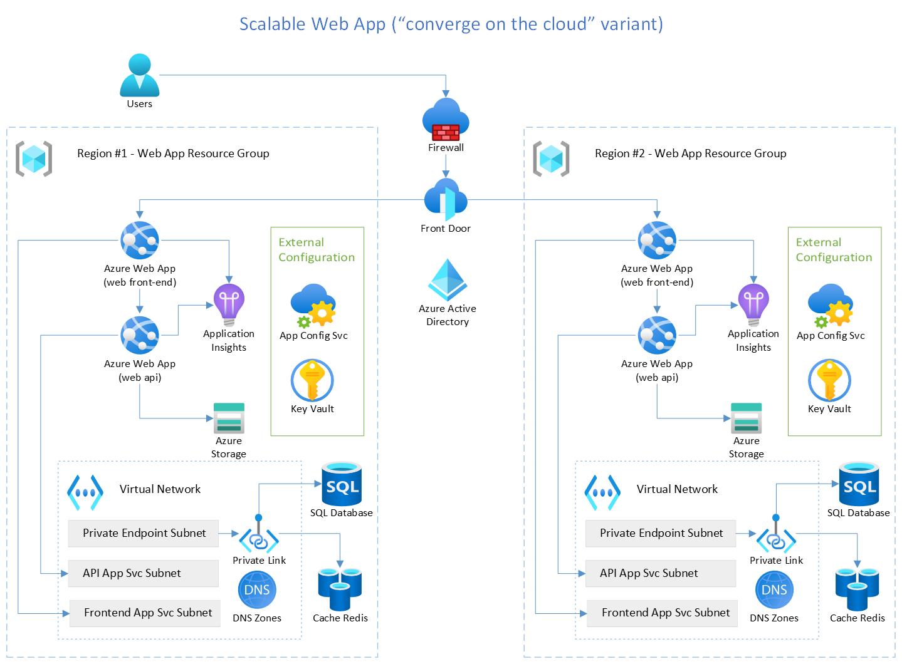

# Introduction

This guide demonstrates how principles from the [Well-Architected
Framework](https://docs.microsoft.com/azure/architecture/framework/)
and [Twelve-Factor Applications](https://12factor.net/) can be applied
to migrate and modernize a legacy, line-of-business (LOB) web app to the
cloud. A reference architecture is included to showcase a production
ready solution which can be easily deployed for learning and
experimentation.

The reference scenario discussed in this guide is for Relecloud
Concerts, a fictional company that sells concert tickets. Their website,
currently employee-facing, is an illustrative example of an LOB
eCommerce application historically used by call center operators to buy
tickets on behalf of their offline (telephone) customers. Relecloud has
experienced increased sales volume over the last quarter with continued
increases projected, and senior leadership has decided to invest more in
direct customer sales online instead of expanding call center capacity.

Their call center employee website is a monolithic ASP.NET application
with a Microsoft SQL Server database which suffers from common legacy
challenges including extended timelines to build and ship new features
and difficulty scaling different components of the application under
higher load. Relecloud\'s near-term objective is to modernize the
application to sustain additional volume while maturing development team
practices for modern development and operations. Intermediate and
longer-term goals include opening the application directly to online 
customers through multiple web and mobile experiences, improving
availability targets, significantly reducing the time required to
deliver new features to the application, and scaling different
components of the system independently to handle traffic spikes
without compromising security. They have chosen Azure as the
destination for their application due to its robust global platform and
tremendous managed service capabilities that will support Relecloud's
growth objectives for years to come.

The reference that follows demonstrates the first phase of their
journey - a modernized LOB web application that has improved
reliability, security, performance, and more mature operational
practices at a predictable cost. This phase also provides a foundation
upon which they will achieve their longer-term objectives in later
phases. The following solution diagram shows the reference architecture
that we'll discuss for the rest of the guide.



## Well Architected Scalable Web Application Pillars

The five pillars of the Azure Well-Architected Framework provide guiding
tenets that improve the quality of cloud applications. The five pillars
are:

1. Reliability
2. Security
3. Cost Optimization
4. Operational Excellence
5. Performance Efficiency

The following sections examine how the Relecloud web app has been
implemented to align with these guiding principles and, consequently,
what benefits are realized.

- Demonstrates end-to-end (E2E) application architecture and solutions, composed of several products (instead of individual or small combinations of products)

- Includes outcome-oriented recommendations, principles, and benefits (e.g., the why) including ROI benefits of increased confidence, improved productivity, optimized cost, etc. before deliving into what and how

- Demonstrates one stage in a modernization journey as a starting point and destination, as opposed to the common snapshot, final destination approach. More phases will accompany this guidance in the future.

## Reliability

A reliable workload is one that is both resilient and available.
Resiliency is the ability of the system to recover from failures and
continue to function. The goal of resiliency is to return the
application to a fully functioning state after a failure occurs.
Availability is whether your users can access your workload when they
need to. These patterns are used by the Relecloud sample to improve
reliability.

### Service to Service Communication and Retry

Given the distributed nature of cloud applications, they must be
designed to operate under the assumption of unreliable communications.
An application that communicates with elements running in the cloud must
be sensitive to the transient faults that can occur in this environment.
Faults include the momentary loss of network connectivity to components
and services, the temporary unavailability of a service, or timeouts
that occur when a service is busy.

The Relecloud web app handles this with the [Retry Pattern](https://docs.microsoft.com/azure/architecture/patterns/retry)
because these faults are typically self-correcting and if a service call
is retried after a short delay, then it is likely to succeed. Adding the
Retry Pattern helped the team build a web app that insulates the user
experience from these transient errors.

To implement the Retry Pattern in ASP.NET Core they use the
[Polly](https://github.com/App-vNext/Polly) library. This enables them to
use fluent APIs that describe the behavior they want in one central
location of the app. In the following screenshot you can see that the
Retry Pattern is setup for all service calls made to the concert search
service.

```cs
private void AddConcertSearchService(IServiceCollection services)
{
    var baseUri = Configuration["App:RelecloudApi:BaseUri"];
    if (string.IsNullOrWhiteSpace(baseUri))
    {
        services.AddScoped<IConcertSearchService, DummyConcertSearchService>();
    }
    else
    {
        services.AddHttpClient<IConcertSearchService, RelecloudApiConcertSearchService>(httpClient =>
        {
            httpClient.BaseAddress = new Uri(baseUri);
            httpClient.DefaultRequestHeaders.Add(HeaderNames.Accept, "application/json");
            httpClient.DefaultRequestHeaders.Add(HeaderNames.UserAgent, "Relecloud.Web");
        })
        .AddPolicyHandler(GetRetryPolicy())
        .AddPolicyHandler(GetCircuitBreakerPolicy());
    }
}

private static IAsyncPolicy<HttpResponseMessage> GetRetryPolicy()
{
    var delay = Backoff.DecorrelatedJitterBackoffV2(TimeSpan.FromMilliseconds(500), retryCount: 3);
    return HttpPolicyExtensions
      .HandleTransientHttpError()
      .OrResult(msg => msg.StatusCode == System.Net.HttpStatusCode.NotFound)
      .WaitAndRetryAsync(delay);
}
```

<sup>Sample code demonstrates how to use **Polly** to retry api calls to the
Concert Search Service. [Link to Startup.cs](https://github.com/Azure/scalable-web-app-pattern-dotnet/blob/4b486d52bccc54c4e89b3ab089f2a7c2f38a1d90/src/Relecloud.Web/Startup.cs#L85)</sup>

In this sample we see that the dependency injection for the
`IConcertSearchService` object is configured so that whenever a class,
or controller, makes a service call to the web service we will apply the
Retry Pattern for all of the requests that are made through this object.

In the `GetRetryPolicy()` method we also see how to create the
behavior with the Polly library. To build this we use an
`HttpPolicyExtensions` object and whenever a transient error is detected
the Polly library will wait and retry after a delay. This built-in
backoff method will retry the error up to three times with increasingly
larger delays. For example, if this service call fails then after
about half a second the same method will be retried. An advantage to
using this built-in method is that the next request is made after a delay
that includes some randomness to help smooth out bursts of traffic that
could be sent to the API if an error happens.

### Circuit Breaker

In the previous section we saw how the Retry Pattern can help users
bypass errors in our web app by retrying operations that are likely to
succeed. But what if a real error happens? In that scenario we don't
want our users to keep waiting because the operation is not likely to
succeed when we retry. This is why the Relecloud web app pairs the
Retry Pattern with the
[Circuit Breaker pattern](https://docs.microsoft.com/azure/architecture/patterns/circuit-breaker).
The purpose of the Circuit breaker is to provide the best experience for
the web app users. If the database is unavailable then we don't want every
user to wait up to 3 seconds for every API call just to find out that the
web app is not properly working.

In the same `Startup.cs` class you can see the method that adds this
behavior is named `GetCircuitBreakerPolicy()`. This behavior is also
provided by the Polly library and the behavior we want is described with
the same fluent method extensions.

```cs
private static IAsyncPolicy<HttpResponseMessage> GetCircuitBreakerPolicy()
{
    return HttpPolicyExtensions
        .HandleTransientHttpError()
        .CircuitBreakerAsync(5, TimeSpan.FromSeconds(30));
}
```

<sup>Sample code shows how to use Polly to add Circuit Breaker behavior to
web API calls. [Link to Startup.cs](https://github.com/Azure/scalable-web-app-pattern-dotnet/blob/4b486d52bccc54c4e89b3ab089f2a7c2f38a1d90/src/Relecloud.Web/Startup.cs#L115)</sup>

In the Polly library the `HandleTransientHttpError()` will trigger the policy
if the web app receives a 5XX or 408 HTTP status code. And, if the front-end
web app observes more than five errors it will stop the retry behavior that
was previously described and immediately return an error to the user. This
"fail fast" behavior will last for 30 seconds before the next API service call
is made so that the web app is less likely to be immediately overloaded
with requests as it is trying to startup after an error.

## Security

Security design principles describe a securely architected system hosted
on cloud or on-premises datacenters (or a combination of both).
Application of these principles dramatically increases the likelihood
your security architecture assures confidentiality, integrity, and
availability. These patterns are used by the Relecloud sample to improve
security.

### Use identity-based authentication

To achieve their goal of improving security the Relecloud team developed
the web app to connect to Key Vault and App Configuration with the
`DefaultAzureCredential` object. This is the recommended approach to
developing code that uses Managed Identity because Managed Identity only
works in the cloud. Instead, when this code runs on a dev's box it will
default to trying to authenticate with the Azure AD account used in
Visual Studio.

Since our app connects as the developer, we needed to grant developers
permission to both Key Vault and App Configuration so that they can run
the app locally. We recommend using Security Groups to make this
administration easier to manage.

### Endpoint security

The Relecloud team also manages their security risk by applying networking
constraints on their Azure resources. By default, Azure SQL Database, Azure
Cache for Redis, and Azure App Service are all publicly accessible resources.

The team secures their data, their secrets, and ensures the integrity of the
system by using Azure Private Endpoints and blocking public network access.
Azure Private Link is a service that enables Azure resources to connect
directly to an Azure Virtual Network where they receive a private IP address.
Since these resources have private IP addresses this enables the team to
block all public internet connections.

Using this Virtual Network approach also enables the team to prepare for
future network scenarios including hybrid networking if the web app ever
needs to access on-prem resources.

The team also uses Azure Front Door with Web Application Firewall. The Web
Application Firewall provides an additional layer of security to protect
the web app from attackers that exploit common security scenarios. 

> Read the [Best practices for endpoint security](https://docs.microsoft.com/azure/architecture/framework/security/design-network-endpoints)
> if you would like to learn more about how to secure traffic to and from your Azure resources


## Cost Optimization

Cost optimization principles balance business goals with budget
justification to create a cost-effective workload while avoiding
capital-intensive solutions. Cost optimization is about looking at ways
to reduce unnecessary expenses and improve operational efficiencies.
These patterns are used by the Relecloud sample to improve cost
optimization.

### Cache-Aside Pattern

The [Cache-Aside Pattern](https://docs.microsoft.com/azure/architecture/patterns/cache-aside)
is a performance optimization pattern that can be used to manage costs. When the Relecloud
team identified that one of the most frequently visited pages in the app is the Upcoming Concerts
Page. This page produces a well-known output for every user and the team identified that they could
cache the data for this page to reduce their load on Azure SQL. Reducing their load on Azure SQL
enables the team to select a smaller compute SKU for Azure SQL so the team can manage their costs.

Another cost optimization the team used in this solution is to share the single Azure Cache for
Redis instance for multiple types of data. In this solution Redis handles the web front-end session
for carts, MSAL authentication tokens, and the UpcomingConcerts data managed by the web API app.
The smallest Redis SKU is capable of handling all of these requirements and the team has decided
that they can manage the risk of overwriting data by reusing Redis keys to achieve a lower operating cost.

Adding an Azure Cache for Redis service helped us address the following
requirements:

- Reduce database costs by reducing the number of operations performed
- Reduce the impact that bursts of traffic can have on Azure SQL
- Improve service availability by reducing database scaling events

The caching process begins when the web app starts as we connect to the
cache and register it with the ASP.NET Core dependency injection
container. You can see this in Startup.cs

```cs
private void AddAzureCacheForRedis(IServiceCollection services)
{
    if (!string.IsNullOrWhiteSpace(Configuration["App:RedisCache:ConnectionString"]))
    {
        services.AddStackExchangeRedisCache(options =>
        {
            options.Configuration = Configuration["App:RedisCache:ConnectionString"];
        });
    }
    else
    {
        services.AddDistributedMemoryCache();
    }
}
```

<sup>Sample code demonstrates how the web app connects to Azure Cache for
Redis. [Link to Startup.cs](https://github.com/Azure/scalable-web-app-pattern-dotnet/blob/4b486d52bccc54c4e89b3ab089f2a7c2f38a1d90/src/Relecloud.Web/Startup.cs#L50)</sup>

Once the app is started, the cache is empty until the first request is
made to the page that displays the upcoming concerts. When this page is
loaded ASP.NET Core will use the SqlDatabaseConcertRepository to
retrieve data from Azure SQL so it can be shown on the page. Let's
examine the method GetUpcomingConcertsAsync from this repository.

```cs
public async Task<ICollection<Concert>> GetUpcomingConcertsAsync(int count)
{
    IList<Concert>? concerts;
    var concertsJson = await this.cache.GetStringAsync(CacheKeys.UpcomingConcerts);
    if (concertsJson != null)
    {
        // We have cached data, deserialize the JSON data.
        concerts = JsonSerializer.Deserialize<IList<Concert>>(concertsJson);
    }
    else
    {
        // There's nothing in the cache, retrieve data from the repository and cache it for one hour.
        concerts = await this.database.Concerts.AsNoTracking()
            .Where(c => c.StartTime > DateTimeOffset.UtcNow && c.IsVisible)
            .OrderBy(c => c.StartTime)
            .Take(count)
            .ToListAsync();
        concertsJson = JsonSerializer.Serialize(concerts);
        var cacheOptions = new DistributedCacheEntryOptions {
            AbsoluteExpirationRelativeToNow = TimeSpan.FromHours(1)
        };
        await this.cache.SetStringAsync(CacheKeys.UpcomingConcerts, concertsJson, cacheOptions);
    }
    return concerts ?? new List<Concert>();
}
```
<sup>Sample code demonstrates how to use Redis with Azure SQL. [Link to SqlDatabaseConcertRepository.cs](https://github.com/Azure/scalable-web-app-pattern-dotnet/blob/4b486d52bccc54c4e89b3ab089f2a7c2f38a1d90/src/Relecloud.Web.Api/Services/SqlDatabaseConcertRepository/SqlDatabaseConcertRepository.cs#L67)</sup>

The main purpose of this method is to access the database and retrieve
the ten latest Concerts. We filter by time, sort, and return data to the
Controller that will render the results. But this method is a little
longer. Before we ask the database for those Concerts, we'll ask Azure
Cache for Redis if it knows what the latest concerts should be. We do
this by using the IDistributedCache that's injected by ASP.NET Core's
dependency injection. If we don't find data, that's when we ask Azure
SQL. And, since we had to ask SQL, we store the answer in cache so that
we don't have to ask again. In this example the information will only be
cached for 1 hour. We do this to keep the information in cache relevant
but the right duration for the cache will vary for every scenario.

> In this sample the Concerts are not editable. Remember that when you
> use a cache you will want to invalidate it whenever the data is
> modified. You can achieve this with an event driven system or by
> ensuring that the cached data is only accessed directly from the
> repository class that is responsible for the create and edit events.
> When using the Repository Pattern, you can manage stale data by
> clearing the cache key as shown in the CreateConcertAsync method.
> 
> ```cs
> public async Task<CreateResult> CreateConcertAsync(Concert newConcert)
> {
>     database.Add(newConcert);
>     await this.database.SaveChangesAsync();
>     this.cache.Remove(CacheKeys.UpcomingConcerts);
>     return CreateResult.SuccessResult(newConcert.Id);
> }
> ```
> <sup>Sample code demonstrates how to invalidate cache when using Repository Pattern.
> [Link to SqlDatabaseConcertRepository.cs](https://github.com/Azure/scalable-web-app-pattern-dotnet/blob/4b486d52bccc54c4e89b3ab089f2a7c2f38a1d90/src/Relecloud.Web.Api/Services/SqlDatabaseConcertRepository/SqlDatabaseConcertRepository.cs#L28)</sup>

## Operational Excellence

Operational excellence is about the operations processes that keep an
application running in production. Deployments must be reliable and
predictable. Automated deployments reduce the chance of human error.
Fast and routine deployment processes won\'t slow down the release of
new features or bug fixes. These patterns are used by the Relecloud
sample to improve operational excellence.

### Emergency Access Accounts

<!-- https://docs.microsoft.com/en-us/azure/active-directory/roles/security-planning#define-at-least-two-emergency-access-accounts -->

During the creation of the Azure SQL Database the bicep templates will
deploy the server and create a SQL Admin user account. This account
has administrative permission to maintain the database and also has the
power to drop tables.

Keeping the SQL Administrator account helped us address the following
requirements:

- If an admin forgets their password, or goes on vacation, we need
to be able to access the system
- If an outage is detected, we need to connect with an account that
is guaranteed to have the permissions we need to do any operations
necessary to restore system health
- If someone leaves the team, we need to ensure that we can still
access the database backups no matter who created them.

One of the risks with having this break glass account is that it could
create a security concern. The team addresses these risks in two ways.

1. The account is stored in a separate Azure Key Vault and access is
not granted to any other resources. Admins are the only users that
can access the vault during an outage scenario and the credentials are
not shared with other teams.

2. The production Azure SQL Database is configured to block network
connections unless they come through the Private Endpoint. And the
database is also configured only to allow Azure AD connections. These
two settings must be modified before the SQL Admin account in Key
Vault can be used.

<!-- https://docs.microsoft.com/en-us/azure/defender-for-cloud/recommendations-reference#identityandaccess-recommendations -->
> This practice is not automated but is recommended for
other areas such as Azure Subscriptions and
[Azure AD administration](https://docs.microsoft.com/en-us/azure/active-directory/roles/security-planning#define-at-least-two-emergency-access-accounts).

### Repeatable Infrastructure

Relecloud achieves their goal of being able to rapidly innovate on Azure
by using the Azure Dev CLI to deploy their solution and their code. The 
Azure Dev CLI uses bicep templates to create Azure resources,
setup configuration, and deploy the web app from a GitHub Action.

Automating the deployment helped achieve the following goals
- The team needs to ensure consistency between environments. This leads
to more predictable behaviors in production and helps the dev team troubleshoot
production issues by being able to recreate the environment.
- The team needs to ensure that when a mistake is fixed that it is deployed
to every environment. Using a GitHub action to create a deployment pipeline
ensures that when a change is deployed to the dev environment that the same
change will be applied to other environments including production.
- The team needs to maximize productivity. Automation helps new team
members quickly set up a new environment and reduces the operational toil
related to maintaining production.

Saving the infrastructure definitions as code also enables Relecloud to
audit and review all production changes deployed to Azure because they
are each part of a specific commit specific release to Azure.

> Read [Repeatable Infrastructure](https://docs.microsoft.com/azure/architecture/framework/devops/automation-infrastructure)
> to learn more about improving operational efficiency with automation.

### Monitoring

To see how our application is behaving we're integrating with
Application Insights. The setup for monitoring request throughput,
average request duration, errors, and monitoring dependencies is
accomplished by adding a NuGet package reference to
*Microsoft.ApplicationInsights.AspNetCore* and registering it with the
ASP.NET Core Dependency Injection container.

```cs
public void ConfigureServices(IServiceCollection services)
{
   ...
   services.AddApplicationInsightsTelemetry(Configuration["App:Api:ApplicationInsights:ConnectionString"]);
   ...
}
```

<sup>Abbreviated sample code shows how to set up Application Insights.
[Link to Startup.cs](https://github.com/Azure/scalable-web-app-pattern-dotnet/blob/4b486d52bccc54c4e89b3ab089f2a7c2f38a1d90/src/Relecloud.Web/Startup.cs#L38)</sup>

Adding this setting enables us to see the following types of dashboards
in the Azure Portal.


<sup>Screenshot of Azure Portal shows real time metrics for requests being
made to the web app</sup>

Adding Application Insights also helps us address other requirements for
Relecloud:

- Must be able to set alerts if no orders have been placed in the past few hours
- Must be able to see if more (or fewer) tickets are added to cart for A/B testing
- Must be able to measure response times to ensure a positive user experience
- Must be able to see and diagnose application errors

Relecloud uses the baseline metrics and three business metrics that are
recorded in Application Insights as Events. The three custom events are:

- Add to Cart
- Remove from Cart
- Checkout Cart

To track these Events, we use the TelemetryClient object provided through
Dependency Injection. Here's an example from the CartController of how
we track the AddToCart event. You can also see that we capture
additional details about the event, the concertId and the number of
tickets, that we can use for more complex reporting and monitoring needs
in Azure.

```cs
this.telemetryClient.TrackEvent("AddToCart", new Dictionary<string, string> {
    { "ConcertId", concertId.ToString() },
    { "Count", count.ToString() }
});
```

<sup>Sample code show how to track a business event with additional data for
reporting [Link to CartController.cs](https://github.com/Azure/scalable-web-app-pattern-dotnet/blob/4b486d52bccc54c4e89b3ab089f2a7c2f38a1d90/src/Relecloud.Web/Controllers/CartController.cs#L81)</sup>

These custom events can be found in the Azure Portal on the Events tab
for the Application Insights resource.


<sup>Screenshot of Azure Portal shows custom events</sup>

Using the Azure Log Analytics Workspace you can create custom queries so
that you can make dashboards and charts that reflect how your business
monitors the application.


<sup>Screenshot of Azure Portal shows that details for AddToCart event
includes ConcertId and ticket Count</sup>

## Performance Efficiency

Performance efficiency is the ability of your workload to scale to meet
the demands placed on it by users in an efficient manner. You need to
anticipate increases in cloud environments to meet business
requirements. These patterns are used by the Relecloud sample to improve
performance efficiency.

### Queue-Based Load Leveling

A key measure of success for the Relecloud web app is its ability to
help customers buy tickets. As more tickets are purchased, the web app
will become more cost efficient. But helping customers buy tickets is
only one of the responsibilities for the web app. In this scenario the
website must also render the ticket.

Rendering the ticket is an example of a task that could overwhelm the
web server if it were performed at scale due to memory and relatively
high compute cost. It's also something that doesn't help the web app
achieve its goal of selling tickets.

The Relecloud web app offloads the rendering of tickets to achieve the
following business goals:

1. The web app should only scale when doing so will help sell more tickets
2. The team would like to update Ticket rendering without impacting the web app
3. The team would like to ensure that every purchased ticket is saved eventually
4. The number of tickets purchased should not impact web app response time

**Event Flow**

Separating the generation of tickets into a background process requires
some setup and orchestration. The following diagram shows each of the
steps involved with generating a ticket.

1. The customer uses the web app to buy a ticket

2. The web app puts a ticket purchased event on the queue

3. The function app pulls an event from the queue

4. The function creates a ticket image

5. The function app saves the ticket image to blob storage

6. The customer visits the Tickets page to see their ticket


<sup>Reference diagram shows how the user's request becomes a Ticket Image</sup>

**Writing to Azure Queue Storage**

The process for generating a ticket starts with the
StorageAccountEventSenderService that we registered with ASP.NET Core's
dependency injection to send events to the queue.

We use Managed Identity to securely connect with the
`DefaultAzureCredential` as shown here:

```cs
public StorageAccountEventSenderService(string serviceUri, string queueName)
{
    var queueUri = new Uri(serviceUri+queueName);
    this.queue = new QueueClient(queueUri, new DefaultAzureCredential(), new QueueClientOptions
    {
        MessageEncoding = QueueMessageEncoding.Base64
    });
}
```

<sup>Sample code demonstrates how to connect to the Azure Storage Queue.
[Link to StorageAccountEventSenderService.cs](https://github.com/Azure/scalable-web-app-pattern-dotnet/blob/4b486d52bccc54c4e89b3ab089f2a7c2f38a1d90/src/Relecloud.Web.Api/Services/StorageAccountEventSenderService/StorageAccountEventSenderService.cs#L13)</sup>


And we use the QueueClient object to send the event.

```cs
public async Task SendEventAsync(Event eventData)
{
    var options = new JsonSerializerOptions
    {
        WriteIndented = true,
        Converters =
        {
            new JsonStringEnumConverter(JsonNamingPolicy.CamelCase)
        }
    };
    var body = JsonSerializer.Serialize(eventData, options);
    await this.queue.SendMessageAsync(body);
}
```
<sup>Sample code demonstrates how to send events to the Azure Storage Queue.
[Link to StorageAccountEventSenderService.cs](https://github.com/Azure/scalable-web-app-pattern-dotnet/blob/4b486d52bccc54c4e89b3ab089f2a7c2f38a1d90/src/Relecloud.Web.Api/Services/StorageAccountEventSenderService/StorageAccountEventSenderService.cs#L28)</sup>

**Reading from Azure Queue Storage**

In this section the event that was sent from the web app is now being
received by a different app. We use an Azure Function project and an
Azure Function input binding to retrieve data from the queue.

 ```cs
 [FunctionName("EventProcessor")]
 public async Task Run(
     [QueueTrigger("relecloudconcertevents", Connection = "App:StorageAccount:ConnectionString")]
     Event eventInfo,
     ILogger log)
 {
   ...
 }
```

<sup>Sample code from EventProcessorFunction.cs in Azure Functions project.
[Link to EventProcessorFunction.cs](https://github.com/Azure/scalable-web-app-pattern-dotnet/blob/4b486d52bccc54c4e89b3ab089f2a7c2f38a1d90/src/Relecloud.FunctionApp/EventProcessor/EventProcessorFunction.cs#L35)
</sup>

In this scenario the function uses the Azure Storage Account's
connection string to connect. For most operations we recommend Managed
Identity to reduce the number of secrets that must be rotated but the
Connection String option provides different options in this scenario
that we'll discuss when talking about the Shared Access Signature in the
next section.

**Writing to Azure Blob Storage**

Within the Function app we save the generated image as a blob to Azure
storage.

```cs
var storageAccountConnStr = this.configuration["App:StorageAccount:ConnectionString"];
var blobServiceClient = new BlobServiceClient(storageAccountConnStr);

//  Gets a reference to the container.
var blobContainerClient = blobServiceClient.GetBlobContainerClient(StorageContainerName);

//  Gets a reference to the blob in the container
var blobClient = blobContainerClient.GetBlobClient(BlobNameFormatString.Replace($"{{{nameof(Event.EntityId)}}}", ticketId.ToString()));
var blobInfo = await blobClient.UploadAsync(ticketImageBlob, overwrite: true);

log.LogInformation("Successfully wrote blob to storage.");
```

<sup>Sample code from EventProcessorFunction.cs in Azure Functions project.
[Link to EventProcessorFunction.cs](https://github.com/Azure/scalable-web-app-pattern-dotnet/blob/4b486d52bccc54c4e89b3ab089f2a7c2f38a1d90/src/Relecloud.FunctionApp/EventProcessor/EventProcessorFunction.cs#L151)
</sup>

In this section we see the second way that Shared Access Signatures
changed our code. First, we used the Connection String to connect to
Azure Storage, and now we're using the BlobServiceClient instead of the
Azure Function output binding.

The purpose of the [Shared Access Signature](https://docs.microsoft.com/en-us/azure/storage/common/storage-sas-overview)
(often called SAS) is to secure each of the tickets that we've rendered but also make those
images directly available to users that have purchased tickets. A Shared
Access Signature is a component that can be added to the URL for each
blob to grant access to the private resource. And you can only generate
a signature from a set of valid credentials such as an Azure AD account,
or the storage account key. Microsoft recommends that you use Azure AD
credentials, when possible, to secure data as a security best practice.
But we needed the Storage Account Key in this scenario because the
maximum duration for a Shared Access Signature from a user token is only
7 days.

Here's how we use C# to automate the generation of Shared Access
Signatures.

```cs
//  Defines the resource being accessed and for how long the access is allowed.
var blobSasBuilder = new BlobSasBuilder
{
    StartsOn = DateTime.UtcNow.AddMinutes(-5),
    ExpiresOn = DateTime.UtcNow.Add(TimeSpan.FromDays(30)),
};

//  Defines the type of permission.
blobSasBuilder.SetPermissions(BlobSasPermissions.Read);

//  Builds the Sas URI.
var queryUri = blobClient.GenerateSasUri(blobSasBuilder);
```

<sup>Sample code from EventProcessorFunction.cs in Azure Functions project.
[Link to EventProcessorFunction.cs](https://github.com/Azure/scalable-web-app-pattern-dotnet/blob/4b486d52bccc54c4e89b3ab089f2a7c2f38a1d90/src/Relecloud.FunctionApp/EventProcessor/EventProcessorFunction.cs#L166)
</sup>

After generating the Shared Access Signature, the code will update the
database so the tickets can be displayed in the web app's Tickets page.


<sup>Screenshot of Relecloud web app shows a sample ticket that was rendered by Azure Functions</sup>

# Deploying the solution and local development

This solution uses the Azure Dev CLI to set up Azure services
and deploy the code. [Follow the guidelines in the ReadMe](README.md#deploy-to-azure) of the repository to deploy the code to Azure and local development.

# Choosing the right services

Choosing the right Azure services is an important part of the planning
phase before moving your app to Azure. Understanding the level of
performance and availability you need for your app will have an impact
on the total cost to run your solution. You should start by defining a
target SLO for your solution and use that information to determine which
products and SKUs you should be using.

We have chosen a set of services based on the following criteria:

- Our target SLA is 99.9%

- We expect an average daily user load will be around 1,000 users

**Summary of services used**

- [App Services - Web Apps](https://www.microsoft.com/azure/app-service/app-service-web-overview) hosts
    web applications allowing autoscaling and high availability without
    having to manage infrastructure. This is where the Relecloud
    Concerts web app will be deployed.

- [Azure Active Directory](https://docs.microsoft.com/en-us/azure/active-directory/fundamentals/active-directory-whatis)
    Azure Active Directory (Azure AD) is a cloud-based identity and access management service. This service helps your
    employees access external resources, such as Microsoft 365, the Azure portal, and thousands of other SaaS applications.

- [Azure SQL Database](https://docs.microsoft.com/azure/azure-sql/azure-sql-iaas-vs-paas-what-is-overview?view=azuresql) is
    a general-purpose relational database managed service in Microsoft
    Azure that supports structures such as relational data, JSON,
    spatial, and XML.

- [Application Insights](https://docs.microsoft.com/azure/azure-monitor/app/app-insights-overview)
    is a feature of Azure Monitor that provides extensible application
    performance management (APM) and monitoring for live web apps,

- [Azure Cache for Redis](https://docs.microsoft.com/azure/azure-cache-for-redis/cache-overview)
    provides an in-memory data store based on the Redis software.

- [Azure Application Gateway](https://docs.microsoft.com/azure/application-gateway/overview)
    is a web traffic load balancer that enables you to manage traffic to
    your web applications.

- [Azure Web Application Firewall](https://docs.microsoft.com/azure/web-application-firewall/overview)
    provides centralized protection of your web applications from common
    exploits and vulnerabilities.

- [Azure Key Vault](https://docs.microsoft.com/azure/key-vault/general/overview)
    provides centralized storage of application secrets to control their
    distribution

- [Azure App Configuration](https://docs.microsoft.com/azure/azure-app-configuration/overview)
    is a service to centrally manage application settings and feature
    flags

- [Azure Functions](https://docs.microsoft.com/azure/azure-functions/functions-overview)
    is a serverless solution that runs on demand. It provides triggers
    and bindings that enable devs to quickly build code to process
    events.

- [Azure Storage](https://docs.microsoft.com/azure/storage/common/storage-introduction)
    provides storage for files and queue storage for message driven
    communication.

- [Azure Private DNS](https://docs.microsoft.com/azure/dns/private-dns-overview)
    provides a reliable and secure DNS service for your virtual network.
    Azure Private DNS manages and resolves domain names in the virtual
    network without the need to configure a custom DNS solution.

- [Azure Private Link](https://docs.microsoft.com/azure/private-link/private-link-overview)
    enables you to access Azure PaaS Services over a Private Endpoint in
    your virtual network. A Private Endpoint is a network interface that
    uses a private IP address from your virtual network. This connects
    you privately and securely to a service such as Azure SQL Database.

### App Service

App Service is a key piece of our hosting infrastructure. App Service
Web Apps meets the following requirements for hosting our app:

- the service provides a 99.95% uptime SLA for our app

- we want a fully managed hosting platform where we are not
    responsible for maintaining the underlying operating system

- we want support for the latest version of .NET

- we want a solution that allows us to deploy without containerizing
    our app, but that gives us a path to do so when we are ready

- we want to have the web app very rapidly scale up/down and in/out
    based on user traffic

App Service meets our requirements. We are free to choose whether we
want to host our app using App Service running Windows or Linux.

<br />

### Azure Active Directory

Azure Active Directory (AAD) was chosen as our identity platform for
this app. We need to be able to both authenticate a user's identity and
authorize them based on roles that our app understands. We have the
following requirements that were satisfied by choosing Azure AD:

- we want to authenticate and authorize users

- we want to leverage the power of a well-known solution that has
    proven it can scale to support larger scenarios for millions of users

- we do not allow users to choose their identity, or create their own accounts

- we do not want to be responsible for managing forgotten passwords
    and password resets for our users

- we want our identity solution to conform to OpenID Connect and
    OAuth 2.0

Identity is a broad topic, and getting it right is important. If you
think Azure AD B2C might be a good fit for your app, review your
requirements and compare them against the [technical and feature
overview](https://docs.microsoft.com/azure/active-directory-b2c/technical-overview)
of Azure AD B2C.

<br />

### SQL Database

When we decided to move Relecloud Concerts to Azure, we wanted to keep
our current database schema, stored procedures, and functions. Azure SQL
Database met all our requirements:

- the general-purpose tier provides a 99.99% uptime SLA for our app

- a fully managed SQL database instance

- scalable to support high user load

- high availability and multi-region redundancy

- supports database migration from on-premises SQL Server

- supports our existing stored procedures and functions as-is

- supports our existing views as-is

- provides backups and point-in-time restore

There are different SQL products in Azure. Make note of your current
system capabilities and what requirements you have for your new app
running in Azure, then [select the best Azure SQL
deployment](https://cloudblogs.microsoft.com/sqlserver/2020/03/17/tips-to-select-the-best-azure-sql-deployment-option/)
option for your app.

<br />

### Azure Storage

Many solutions hosted on Azure make at least some use of Azure Storage.
Our app processes ticket purchases by processing purchase messages off a
queue, then generating a printable ticket to a concert. We chose to use
Storage Queues to hold purchases that are pending PDF generation and
Blob Storage for the resulting PDFs.

We have the following requirements for our queue:

- we do not need to ensure a specific order for message delivery

- message consumption will be idempotent, so at-most-once delivery is
    not required

- we want to be able to pull a batch of a dozen work items from the
    queue each operation

- we need to be able to audit server-side transaction logs

- we want to authenticate to our queue using Managed Identity

These requirements lead us to use Azure Storage Queues for our queuing
needs. If you have a queue scenario in your app,
[review the messaging options available](https://docs.microsoft.com/azure/service-bus-messaging/service-bus-azure-and-service-bus-queues-compared-contrasted)
in both Storage Queues and Azure Service Bus and determine which is the
best fit for your app.

We have the following requirements for storing images of tickets:

- endpoints for accessing storage should not be exposed to the public internet

- we want to manage our encryption keys using our own certificates

- data should be encrypted at rest

- data should be encrypted in transit

- our data should be extremely resilient against loss

For Blob Storage, we chose Zone-redundant storage (ZRS). Zone-redundant
storage replicates data synchronously across three Azure availability
zones in the primary region. Each availability zone is in a separate
physical location with independent power, cooling, and networking.

We can use Key Vault to manage our certificate used to encrypt our
storage account, and 
[private endpoints](https://docs.microsoft.com/azure/private-link/private-endpoint-overview)
to allow clients to securely access data over a
[Private Link](https://docs.microsoft.com/azure/private-link/private-link-overview).

<br />

### Azure Functions

When users purchase tickets, they're placed in a Storage Queue for
processing. Azure Functions provides us with a simple mechanism to bind
to the queue and trigger our business logic as orders are completed and
need to have their admission tickets rendered for printing.

- our ticket generation app should be event-driven and not require polling

- our ticket generation app should scale to handle demand without user interaction

- we want communication with our queues to avoid the public internet

- we only want to pay for the compute time that we are using

- we want to avoid any cold start penalties

We chose Azure Functions to host our ticket generation logic. Because we
have a no cold start requirement, we will choose the Premium SKU for
Functions.

<br />

### Azure Cache for Redis

Our app is expected to attract more than a million daily users. We
expect tens of thousands of those users to purchase concert tickets. Our
load is heavily skewed toward viewing concerts and venue details. We
want to implement a cache that provides us with:

- a managed service

- high data throughput

- low latency reads for commonly accessed, slow changing data

- a unified cache location for all instances of our web app to use

<br />

### Application Insights / Azure Monitor

Application Insights is a feature of Azure monitor that provides
extensible application performance management (APM) and monitoring for
web apps. We chose to incorporate Application Insights because it:

- automatically detects performance anomalies

- helps diagnose issues in our running app

- surfaces information about how users are using the app

- allows us to easily send custom events we want to track in our app

Azure Monitor is a comprehensive suite of monitoring tools collects
data from a variety of Azure services. Review the following
concepts to quickly come up to speed on its capabilities:

- [Smart detection in application insights](https://docs.microsoft.com/azure/azure-monitor/app/proactive-diagnostics)

- [Application Map: Triaging Distributed Applications](https://docs.microsoft.com/azure/azure-monitor/app/app-map?tabs=net)

- [Profile live App Service apps with Application Insights](https://docs.microsoft.com/azure/azure-monitor/app/profiler)

- [Usage analysis with Application Insights](https://docs.microsoft.com/azure/azure-monitor/app/usage-overview)

- [Getting started with Azure Metrics Explorer](https://docs.microsoft.com/azure/azure-monitor/essentials/metrics-getting-started)

- [Application Insights Overview dashboard](https://docs.microsoft.com/azure/azure-monitor/app/overview-dashboard)

- [Log queries in Azure Monitor](https://docs.microsoft.com/azure/azure-monitor/logs/log-query-overview)

<br />

### App Configuration

We chose to take a dependency on Azure App Configuration to manage our
configuration data. Our configuration requirements are:

- we want a central store for our **configuration** data (not secrets,
    which belong in Key Vault)

- we want to take advantage of **Feature Flags** to allow users to
    opt-in and opt-out of early preview features in a production
    environment without redeploying the app

- we want to use a tool that will allow us to store our configuration
    data **centrally**

- we want our source of truth for configuration data to be a **git
    repository**, and that data to be updated in our central
    configuration store as part of our pipeline

- we want to use [Managed Identity](https://docs.microsoft.com/azure/active-directory/managed-identities-azure-resources/overview)
    to simplify and secure our connection to our configuration store

[App Configuration](https://docs.microsoft.com/azure/azure-app-configuration/overview)
meets these needs and is easy to incorporate in your existing app using
the
[ConfigurationBuilder](https://docs.microsoft.com/azure/azure-app-configuration/quickstart-dotnet-core-app)
object. Review App Configuration capabilities and [best practices](https://docs.microsoft.com/azure/azure-app-configuration/howto-best-practices#app-configuration-bootstrap)
to decide if this service is a fit for your app.

<br />

### Key Vault

Our solution requires use of X.509 certificates, connection strings and
API keys for integration with third party services. We favor the use of
Managed Identity for intra-Azure service communication but there are
still secrets that must be managed. We chose to use Key Vault for the
following capabilities:

- data is encrypted at rest

- data is encrypted in transit

- authentication to our secret store should support Managed Identity

- our secret store must support logging to allow us to audit access

- our secret store needs to be able to alert us when changes are made
    to stored secrets

- we should be able to import PFX and PEM formatted certificates


Key Vault meets this need, and like App Configuration is easy to
incorporate in .NET apps using the
[ConfigurationBuilder](https://docs.microsoft.com/dotnet/api/overview/azure/extensions.aspnetcore.configuration.secrets-readme)
object.

<br />

# Simulating the patterns

Here are some things you can try to see how these patterns support the availability and scalability of this solution in Azure.

### Queue-based load leveling

This pattern offloads the ticket rendering process from our web app to
the Azure function. We can easily see this in action by navigating
through the checkout process.


Try buying a ticket, then do it again and try buying twenty tickets. The
value of this pattern is that our web app will remain performant and
highly available no matter how many tickets you purchase so that we can
always accept more customer orders.

Here's how that looks from Application Insights where the response times
are similar for both checkout processes.

> Note that App Insights graphs can take a couple of minutes to aggregate the
> latest information. To see your events and data as they happen use the
> [Live Metric stream](https://docs.microsoft.com/en-us/azure/azure-monitor/app/live-stream)


In the screenshot above we can see the checkout flow for the first
request with one ticket as 588ms and the checkout for the second request
with twenty tickets was 162ms.

### Retry and Circuit Breakers

These patterns improve the reliability of the solution by attempting to
resolve transient errors that can surface when making an API call. To
observe this, we'll change the baseUri setting in App Configuration and
examine the App Insights logs to observe that API calls were retried and
when the circuit is open that we can also observe the "fail fast"
behavior.

First, open the Azure App Configuration blade in the Azure Portal.
Scroll down through the tabs and find the "Configuration Explorer" so
you can see the settings that the web app uses.


Based on the bicep templates provided this setting
`App:RelecloudApi:BaseUri` is automatically set to the correct URL so
that your web app will work every time you deploy to a new environment.
But what if this was a manual step? Let's replace the ".net" value in
this configuration with ".com" and observe the behavior. Click save and
use the Azure Portal to restart the front-end App Service so that this
value is reloaded.


After the web app is restarted, we can click on the "Upcoming" menu link
and see that all of the concert data has disappeared. Even though our
data is cached in Redis we can see that the web front-end needs access
to the web API app to receive that data.


And in App Insights we can see that this is not an error the web app
could recover from so the Circuit Breaker pattern allowed the user to
see a "fail fast" experience because the circuit was open.


Let's re-open the Azure App Configuration Explorer and fix that setting
before moving to the next step. Edit the `App:RelecloudApi:BaseUri`
and replace the ".com" part of the Uri with ".net" as it was originally
configured.


And we must also restart the web app again for this new setting to take effect.


### Cache Aside Pattern

The cache aside pattern enables us to offload read queries to SQL server
and it also provides a layer of redundancy that can keep parts of our
application running in the event of issue with Azure SQL Database. We
can observe this behavior in App Insights by testing two different
pages.

First, visit the "Upcoming Concerts" page and refresh the page a couple
of times. The first time the page is loaded the web API app will send a
request to SQL server, but the following requests will go to Azure Cache
for Redis.


In this screenshot above we see a connection was made to SQL server and
that this request took 742ms.


In the next request we see that the API call was only 55ms because it
didn't have to connect to SQL Server and instead used the data from
Azure Cache for Redis.


Using the (PREVIEW) Redis Console we can see this data stored in Redis.


<br />

# Resulting service level and cost

Relecloud's solution has a 99.98% availability SLO and has a
minimum estimated cost of $2,039.60 per month when deployed to
the East US and West US 2 Azure regions.

## Service Level Objective
Relecloud uses multiple Azure Services to achieve a composite
availability SLO of 99.98%.

To calculate this they reviewed their business scenario and
defined that the system is considered *available* when customers
can purchase tickets. This means that we can determine the
solution's availbility by finding the availability of the
Azure services that must be functioning to complete the checkout
process.

> This also means that the team *does not* consider Azure
> Monitor a part of their scope for an available web app. This
> means the team accepts that the web app might miss an alert
> or scaling event if there is an issue with Azure Monitor. If
> this were unacceptable then the team would have to add that
> as an additional Azure service for their availability
> calculations.

The next step to calculate the availability was to identify
the SLA of the services that must each be available to complete
the checkout process.

| Azure Service | SLA |
| --- | --- |
| [Azure Active Directory](https://azure.microsoft.com/support/legal/sla/active-directory/v1_1/) | 99.99% |
| [Azure App Configuration](<https://azure.microsoft.com/support/legal/sla/app-configuration/v1_0/>) | 99.9% |
| [Azure App Service: Front-end](https://azure.microsoft.com/support/legal/sla/app-service/) | 99.95% |
| [Azure App Service: API](https://azure.microsoft.com/support/legal/sla/app-service/) | 99.95% |
| [Azure Cache for Redis](https://azure.microsoft.com/support/legal/sla/cache/) |99.9% |
| [Azure Key Vault](https://azure.microsoft.com/support/legal/sla/key-vault/v1_0/) | 99.99% |
| [Azure Private Link](https://azure.microsoft.com/support/legal/sla/private-link/v1_0/) | 99.99%|
| [Azure Storage Accounts](https://azure.microsoft.com/support/legal/sla/storage/v1_5/) |  99.9% |
| [Azure SQL Database](https://azure.microsoft.com/support/legal/sla/azure-sql-database/v1_8/) |  99.99% |

To understand the impact that one of these services has to our
availability [we multiply each of these SLAs](https://docs.microsoft.com/en-us/azure/architecture/framework/resiliency/business-metrics#composite-slas)
to find the percentage of time that all services are available.

When combined the SLAs assert that tickets could be sold
99.56% of the time. This availability meant there could be as
much as 38 hours of downtime in a year.

This availability, and risk to brand damage, were unacceptable
for Relecloud so they deploy their web app to two regions. Using
two regions changes the calculation to use the
[multiregional availability formula](https://docs.microsoft.com/en-us/azure/architecture/framework/resiliency/business-metrics#slas-for-multiregion-deployments)
which is 
`(1 - (1 − N) ^ R)` to reach 99.99% availability. But, to use two
regions the team must also add Azure Front Door which has an
availibility SLA of 99.99% so the composite availability for
this solution is 99.98%.

## Cost
The Relecloud team wants to use lower price SKUs for non-prod
workloads to manage costs while building testing environments.
To do this they added conditionals to their bicep templates
so they could choose different SKUs and optionally choose to
deploy to multiple regions when targeting production.

### Production
Relecloud's solution has an estimated minimum cost of $2,039.60
per month to run the production environment from two Azure
regions. Additional costs will vary as the web apps scale based
on load and the solution will also have additional costs for the
data transmitted from the Azure data center. The primary forces
driving this estimate are Azure SQL Database and Azure App
Service.

Their solution deploys an Azure SQL Database Premium SKU that
uses the DTU pricing model. The selected SKU provides 500gB for
database storage and 125 DTU of capacity for SQL compute tasks.

> The compute configuration for this solution is specific to
> this sample. Azure SQL provides many options to choose the
> right fit for your solution. In this deployment the Azure SQL
> Database represents about 45% of the estimated costs. We
> recommend that you review how your solution behaves in
> production as changing your database SKU can provide
> significant cost savings or performance gains.

Their solution also deploys a minimum of two Azure App Services
to run the front-end and API tier websites for this solution.
These web apps target the P1V2 SKU which enables the website to
use horizontal scaling rules to reduce costs when there are
fewer users on the website. Together, these components represent
about 29% of the estimated hosting costs.

Azure Cache for Redis represents about 10% of the estimated
cost. To reduce costs the Relecloud team chooses to share this
resource between the front-end web app and the API backend. The
team found that C1 SKU is more than enough capacity to handle
the responsibilities of session management and data caching.

> We recommend that customers review these prices with their
> account team. Prices vary by region and can be impacted by
> Enterprise Agreements, Dev/Test Pricing, or Reserved capacity
> pricing.

### Non-prod environments
For non-production environments Relecloud devs target different
SKUs for Dev/Test and their non-prod environments have an
estimated minimum cost of $244 for each environment.

The primary drivers of cost for non-production environments are
the App Service Plans which represent 44% of the total cost.
Customers that want to manage these costs for non-production
workloads should examine if they can use one
[App Service Plan](https://docs.microsoft.com/en-us/azure/app-service/overview-hosting-plans)
to host both the front-end and API web apps.

> We recommend that customers review these prices with their
> account team. Prices vary by region and non-production pricing
> can be impacted by Dev/Test pricing as well as other factors.

<br/>

# Starting your modernization journey

In this guide we provided the content to build a web app based on other resources such as the Azure Architecture Center. In this section we'll highlight those source materials that you can use to learn more about Azure and modernization.

## Additional sources for Azure Best Practices

Use the following resources to learn more about Microsoft's best practices and recommendations for building solutions on Azure.

For further guidance on how to build Azure solutions that align with Microsoft's best practices and recommendations 
* [Cloud Adoption Framework](https://docs.microsoft.com/en-us/azure/cloud-adoption-framework/overview) - Helps an organization prepare and execute their strategy to build solutions on Azure.
* [Azure Architecture Center fundamentals](https://docs.microsoft.com/en-us/azure/architecture/guide/) - Provides a library of content that presents a structured approach for designing applications on Azure that are scalable, secure, resilient, and highly available.
* [Well Architected Framework](https://docs.microsoft.com/en-us/azure/architecture/framework/) - Describes the best practices and design principles that should be applied when designing Azure solutions that align with Microsoft's recommended best practices.
* [Azure Architectures](https://docs.microsoft.com/en-us/azure/architecture/browse/) - Provides architecture diagrams and technology descriptions for reference architectures, real world examples of cloud architectures, and solution ideas for common workloads on Azure.

## Additional sources for Azure Migration

The following tools and resources can help you with migrating on-prem resources to Azure.

* [Azure Migrate](https://docs.microsoft.com/en-us/azure/migrate/migrate-services-overview) - Azure Migrate provides a simplified migration, modernization, and optimization service for Azure that handles assessment, migration of web apps, SQL server, and Virtual Machines.
* [Azure Database Migration Guides](https://docs.microsoft.com/en-us/data-migration/) - Provides resources for different database types, and different tools designed for your migration scenario.
* [Azure App Service Landing Zone Accelerator](https://docs.microsoft.com/en-us/azure/cloud-adoption-framework/scenarios/app-platform/app-services/landing-zone-accelerator) - Deployment architecture guidance for hardening and scaling Azure App Service deployments.

## Additional sources for upgrading .NET Framework apps

This solution includes a dotnet web app capable of running on Linux that was deployed to an App Service running Windows.
The Azure App Service windows platform enables customers to move .NET Framework web apps to Azure without upgrading to newer framework versions.
For customers wanting Linux App Service plans, or new features and performance improvements added to the latest versions of dotnet, we recommend the following resources.

* [Overview of porting from .NET Framework to .NET](https://docs.microsoft.com/en-us/dotnet/core/porting/) - A starting point for finding additional guidance based on your specific type of .NET app.
* [Overview of the .NET Upgrade Assistant](https://docs.microsoft.com/en-us/dotnet/core/porting/upgrade-assistant-overview) - A console tool that can help automate many of the tasks associated with upgrading .NET framework projects.
* [Migrating from ASP.NET to ASP.NET Core in Visual Studio](https://devblogs.microsoft.com/dotnet/introducing-project-migrations-visual-studio-extension/) - The ASP.NET Core team is developing a Visual Studio extension that can assist with incremental migrations of web apps.


## References

- [Well-Architected Framework](https://docs.microsoft.com/azure/architecture/framework/)
- [12 Factor Application](https://12factor.net/)
- [Retry Pattern](https://docs.microsoft.com/azure/architecture/patterns/retry)
