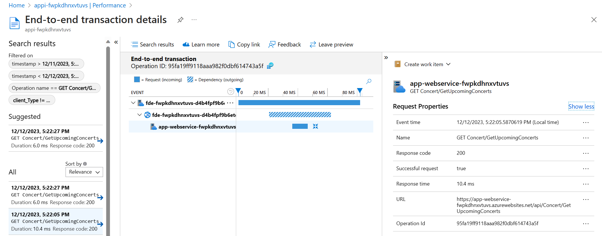
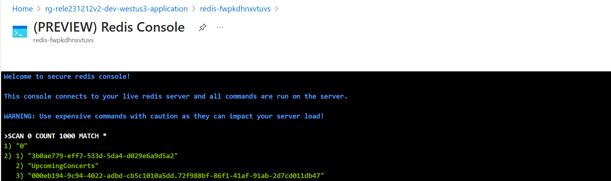

# Pattern Simulations

You can test and configure the three code-level design patterns with this implementation: retry, circuit-breaker, and cache-aside. The following paragraphs detail steps to test the three code-level design patterns.

## Retry pattern

We built an app configuration setting that lets you simulate and test a transient failure from the Web API. The setting is called `Api:App:RetryDemo`. We've included this configuration in the deployable code. The `Api:App:RetryDemo` setting throws a 503 error when the end user sends an HTTP request to the web app API. `Api:App:RetryDemo` has an editable setting that determines how many back-to-back exceptions should be thrown. A value of 1 generates one error after returning one successful response. This is disabled by default.  Removing the setting, or changing the value to 0 will disable the feature.

Follow these steps to set up this test:

1. Create a new key-value in App Configuration.
    - Go to App Configuration in the Azure Portal
    - Select your app configuration resource
    - Navigate to the "Configuration explorer" by clicking the link in the left-hand blade under "Operations"
    - Click the "+ Create" button and choose "Key-value"
    - Enter the following data:

    |Name|Value|
    |-----|-----|
    |*Key*|Api:App:RetryDemo|
    |*Value*|1|

1. Restart the API web app App Service
    - Go to the API web app App Service
    - Navigate to the "Overview" blade
    - Click the "Restart" button at the top of the page.
  
  > It will take a few minutes for the App Service to restart. When it restarts, the application will use the `Api:App:RetryDemo` configuration. You need to restart the App Service any time you update a configuration value unless you're using the [sentinal key](https://learn.microsoft.com/azure/azure-app-configuration/enable-dynamic-configuration-aspnet-core) approach.

We recommend collecting telemetry for this test. We've configured Application Insights to collect telemetry. When the value of `Api:App:RetryDemo` is 1, the first request to the application API generates a 503 error. But the retry pattern sends a second request that is successful and generates a 200 response. We recommend using the Application Insights Live Metrics features to view the HTTP responses in near real-time.

> App Insights can take up to a minute to aggregate the data it receives, and failed requests might not appear right away in the Failures view.

To see the Retry Pattern in action you can click throughout the Relecloud website and should not see any impact to the user's ability to purchase a concert ticket. However, in App Insights you should see the 503 error happens for 50% of the requests sent to the Web API.

For more information, see:

- [Application Insights Live Metrics](/azure/azure-monitor/app/live-stream)
- [Visual Studio and Application Insights live telemetry](/azure/azure-monitor/app/visual-studio)

> We recommend you cleanup by deleting the `Api:App:RetryDemo` setting. And restart both web apps to resume from a known state.

### Circuit Breaker pattern

We built an app configuration setting that lets you simulate and test a failure from the Web API. The setting is called `Api:App:RetryDemo`. We've included this configuration in the deployable code. The `Api:App:RetryDemo` setting throws a 503 error when the end user sends an HTTP request to the web app API. `Api:App:RetryDemo` has an editable setting that determines the number of back-to-back errors between a successful request. A value of 5 generates five errors after returning one successful response. This is disabled by default.  Removing the setting, or changing the value to 0 will disable the feature.

Following these steps to set up this test:

1. Create a new key-value in App Configuration.
    - Go to App Configuration in the Azure Portal
    - Select your app configuration resource
    - Navigate to the "Configuration explorer" by clicking the link in the left-hand blade under "Operations"
    - Click the "+ Create" button and choose "Key-value"
    - Enter the following data:

    |Name|Value|
    |-----|-----|
    |*Key*|Api:App:RetryDemo|
    |*Value*|5|

1. Restart the API web app App Service
    - Go to the API web app App Service
    - Navigate to the "Overview" blade
    - Click the "Restart" button at the top of the page.
  
  > It will take a few minutes for the App Service to restart. When it restarts, the application will use the `Api:App:RetryDemo` configuration. You need to restart the App Service any time you update a configuration value unless you're using the [sentinal key](https://learn.microsoft.com/azure/azure-app-configuration/enable-dynamic-configuration-aspnet-core) approach.

To see these recommendations in action you can click on the "Upcoming Concerts" page in the Relecloud web app. Since the Web API is returning an error for every request you will see that the front-end applied the Retry Pattern up to three times to request the data for this page. If you reload the "Upcoming Concernts" page you can see that the Circuit Breaker has detected these errors and that the circuit is now open. When the circuit is open there are no new requests sent to the Web API web app for 30 seconds. This presents a fail-fast behavior to our users and also reduces the number of requests sent to the unhealthy Web API web app so it has more time to recover.

> Note that App Insights can take up to a minute to aggregate the data it receives, and failed requests might not appear right away in the Failures view.

For more information, see:

- [Application Insights Live Metrics](/azure/azure-monitor/app/live-stream)
- [Visual Studio and Application Insights live telemetry](/azure/azure-monitor/app/visual-studio)

> We recommend you cleanup by deleting the `Api:App:RetryDemo` setting. And restart both web apps to resume from a known state.

### Cache-Aside pattern

The Cache-Aside pattern enables us to reduce read queries to SQL server. It also provides a layer of redundancy that can keep parts of our application running in the event of issue with Azure SQL Database.

For more information, see [Cache-Aside pattern](https://learn.microsoft.com/azure/architecture/patterns/cache-aside).

We can observe this behavior in App Insights by testing two different pages. First, visit the "Upcoming Concerts" page and refresh the page a couple of times. The first time the page is loaded the web API app will send a request to SQL server, but the following requests will go to Azure Cache for Redis.


In this screenshot above we see a connection was made to SQL server and that retrieving the data took 131.1 ms.



In the next request we see that the total duration of the API call was only 10.4 ms because it didn't have to connect to SQL Server and instead used the data from Azure Cache for Redis.

Using the (PREVIEW) Redis Console we can see this data stored in Redis.

Open the Redis Console by navigating to the Azure Cache for Redis resource in the Azure Portal and clicking the "Console" link above the overview details for this resource.


Run the following command to see all cached keys:

```
SCAN 0 COUNT 1000 MATCH *
```



Run the next command to see the concert data cached from the database:

```
HGETALL UpcomingConcerts
```


> You can use the command `DEL UpcomingConcerts` to delete this data from Redis and see the cache rebuild.