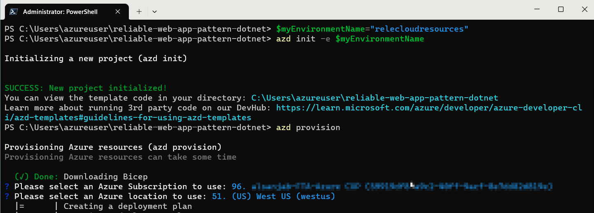
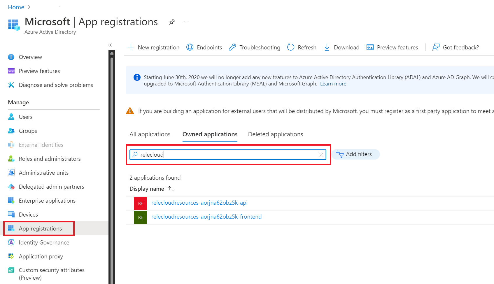

# Deploy the solution

This reference implementation provides you with the instructions and templates you need to deploy this solution. This solution uses the Azure Dev CLI to set up Azure services
and deploy the code.

## Pre-requisites

1. To run the scripts, Windows users require [Powershell 7.2 (LTS)](https://learn.microsoft.com/en-us/powershell/scripting/install/installing-powershell-on-windows) or above. Alternatively, you can use a bash terminal using [Windows Subsystem for Linux](https://learn.microsoft.com/en-us/windows/wsl/install). macOS users can use a bash terminal.

1. [Install the Azure CLI](https://docs.microsoft.com/cli/azure/install-azure-cli).
    Run the following command to verify that you're running version
    2.38.0 or higher.

    ```ps1
    az version
    ```
    
    After the installation, run the following command to [sign in to Azure interactively](https://learn.microsoft.com/cli/azure/authenticate-azure-cli#sign-in-interactively).

    ```ps1
    az login
    ```
1. [Upgrade the Azure CLI Bicep extension](https://learn.microsoft.com/en-us/azure/azure-resource-manager/bicep/install#azure-cli).
    Run the following command to verify that you're running version 0.12.40 or higher.

    ```ps1
    az bicep version
    ```

1. [Install the Azure Dev CLI](https://learn.microsoft.com/azure/developer/azure-developer-cli/install-azd).
    Run the following command to verify that the Azure Dev CLI is installed.

    ```ps1
    azd version
    ```

1. [Install .NET 6 SDK](https://dotnet.microsoft.com/download/dotnet/6.0)
    Run the following command to verify that the .NET SDK 6.0 is installed.
    ```ps1
    dotnet --version
    ```

## Get the code

Please clone the repo to get started.

```
git clone https://github.com/Azure/reliable-web-app-pattern-dotnet
```

*If you try this sample with WSL you may encounter issues with line endings that differ between Windows and Linux.*

And switch to the folder so that `azd` will recognize the solution.

```
cd reliable-web-app-pattern-dotnet
```

## Deploying to Azure

Relecloud's developers use the `azd` command line experience to deploy the code. This means their local workflow is the same
experience that runs from the GitHub action. You can use these
steps to follow their experience by running the commands from the folder where this guide is stored after cloning this repo.

Use this command to get started with deployment by creating an
`azd` environment on your workstation.

<!-- TODO - Expecting this to change for new version https://github.com/Azure/azure-dev/issues/502 -->

<table>
<tr>
<td>PowerShell</td>
<td>

```ps1
$myEnvironmentName="relecloudresources"
```

```ps1
azd init -e $myEnvironmentName
```

</td>
</tr>
<tr>
<td>Bash</td>
<td>

```bash
myEnvironmentName="relecloudresources"
```

```bash
azd init -e $myEnvironmentName
```

</td>
</tr>
</table>

When prompted, select the preferred Azure Subscription and the Location:



### (Optional Steps) Choose Prod or Non-prod environment

The Relecloud team uses the same bicep templates to deploy
their production, and non-prod, environments. To do this
they set `azd` environment parameters that change the behavior
of the next steps.

> If you skip the next two optional steps, and change nothing,
> then the bicep templates will default to non-prod settings.

*Step: 1*

Relecloud devs deploy the production environment by running the
following command to choose the SKUs they want in production.

```ps1
azd env set IS_PROD true
```

*Step: 2*

Relecloud devs also use the following command to choose a second
Azure location because the production environment is
multiregional.

```ps1
azd env set SECONDARY_AZURE_LOCATION westus3
```

> You can find a list of available Azure regions by running
> the following Azure CLI command.
> 
> ```ps1
> az account list-locations --query "[].name" -o tsv
> ```

### Provision the infrastructure

Relecloud uses the following command to deploy the Azure
services defined in the bicep files by running the provision
command.

> This step will take several minutes based on the region
> and deployment options you selected.

```ps1
azd provision
```

> When the command finishes you have deployed Azure App
> Service, SQL Database, and supporting services to your
> subscription. If you log into the the
> [Azure Portal](http://portal.azure.com) you can find them
> in the resource group named `$myEnvironmentName-rg`.

### Create App Registrations

Relecloud devs have automated the process of creating Azure
AD resources that support the authentication features of the
web app. They use the following command to create two new
App Registrations within Azure AD. The command is also
responsible for saving configuration data to Key Vault and
App Configuration so that the web app can read this data.

<table>
<tr>
<td>PowerShell</td>
<td>

```ps1
.\infra\createAppRegistrations.ps1 -g "$myEnvironmentName-rg"
```

</td>
</tr>
<tr>
<td>Bash</td>
<td>

```bash
bash ./infra/createAppRegistrations.sh -g "$myEnvironmentName-rg"
```

</td>
</tr>
</table>

> Known issue: [/bin/bash^M: bad interpreter](known-issues.md#cannot-execute-shellscript-binbashm-bad-interpreter)

### Deploy the code

To finish the deployment process the Relecloud devs run the
folowing `azd` commands to build, package, and deploy the dotnet
code for the front-end and API web apps.

```ps1
 azd env set AZURE_RESOURCE_GROUP "$myEnvironmentName-rg"
```

```ps1
 azd deploy
```

When finished the console will display the URI for the web app. You can use this URI to view the deployed solution in a browser.


> If you face any issues with the deployment, see the [Known issues document](known-issues.md) below for possible workarounds. There could be interim issues while deploying to Azure, and repeating the steps after a few minutes should fix most of them. Azure deployments are incremental by default, and only failed actions will be retired.

### Clean up Azure Resources

1. Unprovision the Azure Resources
2. Clean up App Registrations
3. Delete the Deployment

#### 1. Unprovision the Azure Resources
To tear down an enviroment, and clean up the Azure resource group, use the folloing command:

```ps1
azd down --force --purge --no-prompt
```

> You can also use the Azure Portal to delete the "relecloudresources" resource groups. This approach will not purge the Key Vault or App Configuration services and they will remain in your subscription for 7 days in a deleted state that does not charge your subscription. This feature enables you to recover the data if the configuration was accidentally deleted.

#### 2. Clean up App Registrations
You will also need to delete the two Azure AD app registrations that were created. You can find them in Azure AD by searching for their environment name. 
 
 **Delete App Registrations** 

 
 
 You will also need to purge the App Configuration Service instance that was deployed.

#### 3. Delete the Deployment

Your Azure subscription will retain your deployment request as a stateful object.
If you would like to change the Azure region for this deployment you will need to
delete the deployment by running the following command.

```
az deployment delete --name $myEnvironmentName
```

> You can list all deployments with the following command
> `az deployment sub list --query "[].name" -o tsv`


## Local Development

Relecloud developers use Visual Studio to develop locally and they co-share
an Azure SQL database for local dev. The team chooses this workflow to
help them practice early integration of changes as modifying the
database and other shared resources can impact multiple workstreams.

To connect to the shared database the dev team uses connection strings
from Key Vault and App Configuration Service. Devs use the following
script to retrieve data and store it as
[User Secrets](https://docs.microsoft.com/en-us/aspnet/core/security/app-secrets?view=aspnetcore-6.0&tabs=windows)
on their workstation.

Using the `secrets.json` file helps the team keep their credentials
secure. The file is stored outside of the source control directory so
the data is never accidentally checked-in. And the devs don't share
credentials over email or other ways that could compromise their
security.

Managing secrets from Key Vault and App Configuration ensures that only
authorized team members can access the data and also centralizes the
administration of these secrets so they can be easily changed.

New team members should setup their environment by following these steps.

1. Grant your account access to Azure App Configuration Service

    <table>
    <tr>
    <td>PowerShell</td>
    <td>

    ```ps1
    .\infra\localDevScripts\giveCurrentUserAccessToReadAppConfigSvc.ps1 -g "$myEnvironmentName-rg"
    ```

    </td>
    </tr>
    <tr>
    <td>Bash</td>
    <td>
            
    ```bash
    bash ./infra/localDevScripts/giveCurrentUserAccessToReadAppConfigSvc.sh -g "$myEnvironmentName-rg"
    ```

    </td>
    </tr>
    </table>

1. Open the Visual Studio solution `./src/Relecloud.sln`
1. Setup the **Relecloud.Web** project User Secrets
    1. Right-click on the **Relecloud.Web** project
    1. From the context menu choose **Manage User Secrets**
    1. From a command prompt run the bash command

        <table>
        <tr>
        <td>PowerShell</td>
        <td>

        ```ps1
        .\infra\localDevScripts\getSecretsForLocalDev.ps1 -g "$myEnvironmentName-rg" -Web
        ```

        </td>
        </tr>
        <tr>
        <td>Bash</td>
        <td>
                
        ```bash
        bash ./infra/localDevScripts/getSecretsForLocalDev.sh -g "$myEnvironmentName-rg" --web
        ```

        </td>
        </tr>
        </table>

        > Known issue: [/bin/bash^M: bad interpreter](known-issues.md#cannot-execute-shellscript-binbashm-bad-interpreter)
    1. Copy the output into the `secrets.json` file for the **Relecloud.Web** project.

1. Setup the **Relecloud.Web.Api** project User Secrets
    1. Right-click on the **Relecloud.Web.Api** project
    1. From the context menu choose **Manage User Secrets**
    1. From a command prompt run the bash command

        <table>
        <tr>
        <td>PowerShell</td>
        <td>

        ```ps1
        .\infra\localDevScripts\getSecretsForLocalDev.ps1 -g "$myEnvironmentName-rg" -Api
        ```

        </td>
        </tr>
        <tr>
        <td>Bash</td>
        <td>
                
        ```bash
        bash ./infra/localDevScripts/getSecretsForLocalDev.sh -g "$myEnvironmentName-rg" --api
        ```

        </td>
        </tr>
        </table>

    1. Copy the output into the `secrets.json` file for the 
    **Relecloud.Web.Api** project.

1. Right-click the **Relecloud** solution and pick **Set Startup Projects...**
1. Choose **Multiple startup projects**
1. Change the dropdowns for *Relecloud.Web* and *Relecloud.Web.Api* to the action of **Start**.
1. Click **Ok** to close the popup
1. Add your IP address to the SQL Database firewall as an allowed connection by using the following script

    <table>
    <tr>
    <td>PowerShell</td>
    <td>

    ```ps1
    .\infra\localDevScripts\addLocalIPToSqlFirewall.ps1 -g "$myEnvironmentName-rg"
    ```

    </td>
    </tr>
    <tr>
    <td>Bash</td>
    <td>
            
    ```bash
    bash ./infra/localDevScripts/addLocalIPToSqlFirewall.sh -g "$myEnvironmentName-rg"
    ```

    </td>
    </tr>
    </table>

1. When connecting to Azure SQL database you'll connect with your Azure AD account.
Run the following command to give your Azure AD account permission to access the database.

    <table>
    <tr>
    <td>PowerShell</td>
    <td>

    ```ps1
    .\infra\localDevScripts\makeSqlUserAccount.ps1 -g "$myEnvironmentName-rg"
    ```

    </td>
    </tr>
    <tr>
    <td>Bash</td>
    <td>
            
    ```bash
    bash ./infra/localDevScripts/makeSqlUserAccount.sh -g "$myEnvironmentName-rg"
    ```

    </td>
    </tr>
    </table>

    > These steps grant access to SQL server in the primary resource group.
    > You can use the same commands if you want to test with the secondary resource
    > group by changing the ResourceGroup parameter "-g" to "$myEnvironmentName-secondary-rg"

1. Press F5 to start debugging the website


## Next Step
- [Developer patterns](patterns.md)