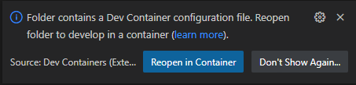
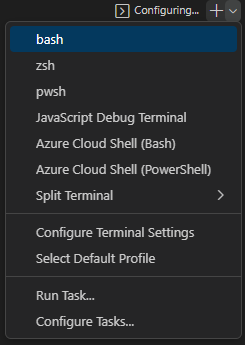
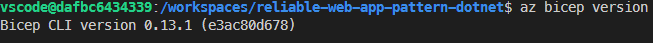
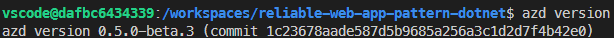

# Overview
The Visual Studio Code Dev Containers extension lets you use a Docker container as a full-featured development environment. It delivers all tooling required to deploy the application enivrionment and deploy the application code. For more information on Dev Containers, please refer to this [tutorial](https://code.visualstudio.com/docs/devcontainers/tutorial)

# Pre-requisites
* Docker
    * If using Windows Subsystem for Linux, docker needs to be inside WSL
    * If using Windows, Docker for Desktop needs to be installed
* Visual Studio Code 
    * Visual Code for the Web can not be used. There is an issue deploying Azure AD resources when using DevContainers.
* [Dev Container Extenstion](vscode:extension/ms-vscode-remote.remote-containers)

> **_NOTE:_** Access to a Github Codespace fullfills all the pre-requisites

# Dev Container Setup
1. git clone https://github.com/Azure/reliable-web-app-pattern-dotnet
1. Open the folder reliable-web-app-pattern-dotnet in Visual Studio Code
1. A prompt to open the folder in Dev Containers will appear in the lower right. 
    * 
1. Click `Reopen in Container`
1. The container will start to build
    * 
1. When the container is built, open a new shell in the upper right hand corner of the integrated terminal
    * 
1. Confirm that `azd` and `az bicep` are install correctly 
    * 
    * 
1. Continue on deploying the environment as before.
    * [Steps to deploy the reference implementation](README.md#steps-to-deploy-the-reference-implementation)
