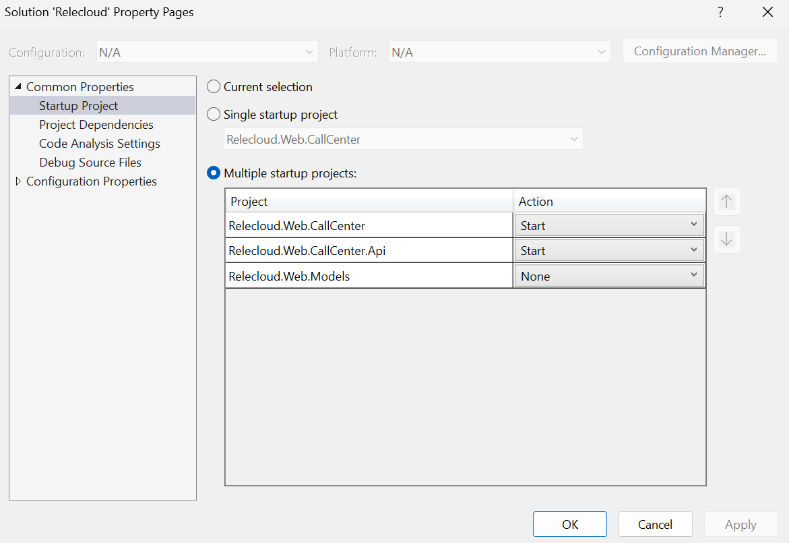

# Developer Experience

The dev team uses Visual Studio and they integrate directly with Azure resources when building the code. The team chooses this workflow to so they can integration test with Azure before their code reaches the QA team.

> **NOTE**
>
> This developer experience is only supported for development deployments. Production deployments
> use network isolation and do not allow devs to connect from their workstation.

Most configurations in the project are stored in Azure App Configuration with secrets saved into Azure Key Vault. To connect to these resources from a developer workstation you need to complete the following steps.

1. Add your identity to the Azure SQL resource
1. Set up front-end web app configuration
1. Set up back-end web app configuration

To support this workflow the following steps will store data in [User Secrets](https://learn.microsoft.com/aspnet/core/security/app-secrets?view=aspnetcore-6.0&tabs=windows) because the code is configured so that these values override configurations and secrets saved in Azure.

> Note that `secrets.json` file is stored relative to the tooling that supports them. Use the Windows Terminal to execute the following commands instead of the Dev Container if you want to use Visual Studio to launch the project. Read [How the Secret Manager tool works](https://learn.microsoft.com/aspnet/core/security/app-secrets?view=aspnetcore-8.0&tabs=linux#how-the-secret-manager-tool-works) to learn more.

## Authenticate with Azure

1.  If you are not using PowerShell 7+, run the following command (you can use [$PSVersionTable.PSVersion](https://learn.microsoft.com/powershell/module/microsoft.powershell.core/about/about_powershell_editions) to check your version):

    ```sh
    pwsh
    ```

1. Connect to Azure

    ```pwsh
    Import-Module Az.Resources
    ```

    ```pwsh
    Connect-AzAccount
    ```

1. Set the subscription to the one you want to use (you can use [Get-AzSubscription](https://learn.microsoft.com/powershell/module/az.accounts/get-azsubscription?view=azps-11.3.0) to list available subscriptions):

    ```pwsh
    $AZURE_SUBSCRIPTION_ID="<your-subscription-id>"
    ```

    ```pwsh
    Set-AzContext -SubscriptionId $AZURE_SUBSCRIPTION_ID
    ```

## 1. Add your identity to the Azure SQL resource

1. Run the following script to automate the process in docs [Configure and manage Microsoft Entra authentication with Azure SQL](https://learn.microsoft.com/en-us/azure/azure-sql/database/authentication-aad-configure?view=azuresql&tabs=azure-powershell)

    ```pwsh
    ./infra/scripts/devexperience/call-make-sql-account.ps1
    ```

## 2. Set up front-end web app configuration

1. Get the Azure App Configuration URI
    ```pwsh
    $appConfigurationUri = ((azd env get-values --output json | ConvertFrom-Json).APP_CONFIG_SERVICE_URI)
    ```

1. Switch to the front-end web app directory
    ```pwsh
    cd src/Relecloud.Web.CallCenter
    ```
1. Clear any existing user secrets
    ```pwsh
    dotnet user-secrets clear
    ```
1. Set the Relecloud API base URI
    ```pwsh
    dotnet user-secrets set "App:RelecloudApi:BaseUri" "https://localhost:7242"
    ```

1. Set the Azure App Configuration URI
    ```pwsh
    dotnet user-secrets set "App:AppConfig:Uri" $appConfigurationUri
    ```

1. Switch back to the root of the repository
    ```pwsh
    cd ../..
    ```

## 3. Set up back-end web app configuration

    ```pwsh
    cd src/Relecloud.Web.CallCenter.Api
    ```

    ```pwsh
    dotnet user-secrets clear
    ```
    
    ```pwsh
    dotnet user-secrets set "App:AppConfig:Uri" $appConfigurationUri
    ```

## 4. Launch the project with Visual Studio

1. Open the project in Visual Studio
1. Configure the solution to start both the front-end and back-end web apps
    1. Right-click the **Relecloud** solution and pick **Set Startup Projects...**
    1. Choose **Multiple startup projects**
    1. Change the dropdowns for *Relecloud.Web.CallCenter* and *Relecloud.Web.CallCenter.Api* to the action of **Start**.
    1. Click **Ok** to close the popup

        

1. Run the project (F5)
1. Open the browser and navigate to `https://localhost:7227/`

    

## Next steps
You can learn more about the web app by reading the [Pattern Simulations](demo.md) documentation.