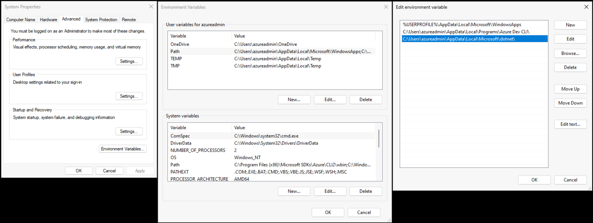

# Steps to deploy the Network Isolated implementation
This section describes the deployment steps for the reference implementation of a reliable web application pattern with .NET on Microsoft Azure. These steps guide you through using the jump host that is deployed when performing a network isolated deployment because access to resources will be restricted from public network access and must be performed from a machine connected to the vnet.

## Prerequisites

We recommend that you use a Dev Container to deploy this application.  The requirements are as follows:

- [Azure Subscription](https://azure.microsoft.com/pricing/member-offers/msdn-benefits-details/).
- [Visual Studio Code](https://code.visualstudio.com/).
- [Docker Desktop](https://www.docker.com/get-started/).
- [Permissions to register an application in Microsoft Entra ID](https://learn.microsoft.com/azure/active-directory/develop/quickstart-register-app).
- Visual Studio Code [Dev Containers extension](https://marketplace.visualstudio.com/items?itemName=ms-vscode-remote.remote-containers).

If you do not wish to use a Dev Container, please refer to the [prerequisites](prerequisites.md) for detailed information on how to set up your development system to build, run, and deploy the application.

> ⚠️ We are using version 1.3.0 for AZD while awaiting feedback on a known bicep issue.

## Steps to deploy the reference implementation

For users familiar with the deployment process, you can use the following list of the deployments commands as a quick reference. The commands assume you have selected a suitable subscription and have logged into both the [Azure Developer CLI](https://learn.microsoft.com/azure/developer/azure-developer-cli/reference#azd-auth-login) and a PowerShell 7+ [AzContext](https://learn.microsoft.com/powershell/azure/authenticate-interactive):

```pwsh
git clone https://github.com/Azure/reliable-web-app-pattern-dotnet.git
cd reliable-web-app-pattern-dotnet
azd env new dotnetwebapp
azd env set NETWORK_ISOLATION true
azd env set DEPLOY_HUB_NETWORK true
azd env set COMMON_APP_SERVICE_PLAN false
azd env set OWNER_NAME <a name listed as resource owner in Azure tags>
azd env set OWNER_EMAIL <an email address alerted by Azure budget>
azd env set AZURE_LOCATION westus3
```

If doing a multi-region deployment, set the `SECONDARY_AZURE_LOCATION` to the secondary region:

```pwsh
azd env set SECONDARY_AZURE_LOCATION eastus
```

Make sure the secondary region is a paired region with the primary region (`AZURE_LOCATION`). Paired regions are required to support some Azure features; for example, [geo-zone-redundant storage (GZRS) failover](https://learn.microsoft.com/azure/storage/common/storage-disaster-recovery-guidance). For a full list of region pairs, see [Azure region pairs](https://learn.microsoft.com/azure/reliability/cross-region-replication-azure#azure-cross-region-replication-pairings-for-all-geographies). We have validated the following paired regions.

| AZURE_LOCATION | SECONDARY_AZURE_LOCATION |
| ----- | ----- |
| westus3 | eastus |
| westeurope | northeurope |
| australiaeast | australiasoutheast |

Provision the Azure resources (about 35-minutes to provision):

```pwsh
azd provision
```

> **WARNING**
>
> Your organization may not allow the creation of Entra ID application registrations unless the host is joined
> to a domain, InTune managed, or meets other security requirements.  If your organization has such security
> requirements, be sure to run the create-app-registrations from your dev workstation.
>
> Microsoft employees:
>
> - Create the Entra application registrations from the same system that you used to initially provision resources.
> - The other actions (such as azd deploy) should be run from the jump host.

Create the app registration in Microsoft Entra ID:

```shell
./infra/scripts/postprovision/call-create-app-registrations.ps1
```
- Wait approximately 5 minutes for the registration to propagate.

### Login

> **WARNING**
>
> When the network isolated deployment is performed the Key Vault resource will be deployed with public network access enabled. This allows the reader to access the Key Vault to retrieve the username and password for the jump host. This also allows you to save data created by the create-app-registration script directly to the Key Vault. We recommend reviewing this approach with your security team as you may want to change this approach. One option to consider is adding the jump host to the domain, disabling public network access for Key Vault, and running the create app-registration script from the jump host.

The default username for the jump host is `azureadmin` and the password was set earlier. If you did not set an ADMIN_PASSWORD, then one is generated for you.  To retrieve the generated password:

1. Retrieve the username and password for your jump host:

    - Select **Secrets** from the menu sidebar.
    - Select **Jumphost--AdministratorPassword**.
    - Select the currently enabled version.
    - Press **Show Secret Value**.
    - Note the secret value for later use.
    - Repeat the proecess for the **Jumphost--AdministratorUsername** secret.

Now that you have the username and password:

- Open the [Azure Portal](https://portal.azure.com)
- Select the SPOKE resource group, then select the jump host virtual machine resource.  The resource name starts with `vm-jump`.
- In the menu sidebar, select **Bastion**.
- Enter the username and password in the fields provided.
- Press **Connect** to connect to the jump host.


### First time setup

From the jump host, launch Windows Terminal to setup required tools:

1. Install the [Azure Developer CLI](https://learn.microsoft.com/azure/developer/azure-developer-cli/install-azd):

    ```shell
    powershell -ex AllSigned -c "Invoke-RestMethod 'https://aka.ms/install-azd.ps1' | Invoke-Expression"
    ```

1. Install the [dotnet SDK](https://learn.microsoft.com/dotnet/core/tools/dotnet-install-script):

    ```shell
    powershell -ex AllSigned -c "Invoke-RestMethod 'https://dotnet.microsoft.com/download/dotnet/scripts/v1/dotnet-install.ps1' -OutFile dotnet-install.ps1"
    ```

    ```shell
    .\dotnet-install.ps1 -Version 7.0.100
    ```

1. Add dotnet to the path environment variable

    

    Add the path: `%USERPROFILE%\AppData\Local\Microsoft\dotnet`.

1. Add Nuget source

    ```shell
    dotnet nuget add source https://api.nuget.org/v3/index.json -n nuget.org
    ```

### Download the code

Use the Windows Terminal to get the code:

```shell
mkdir \dev
cd \dev
git clone https://github.com/Azure/reliable-web-app-pattern-dotnet
cd .\reliable-web-app-pattern-dotnet
```

### Authenticate to Azure

1. [Sign in to Azure PowerShell interactively](https://learn.microsoft.com/powershell/azure/authenticate-interactive):

    ```pwsh
    Install-Module Az
    Connect-AzAccount
    ```

    This will open a browser to complete the authentication process.  See [the documentation](https://learn.microsoft.com/powershell/azure/authenticate-interactive) for instructions on other mechanisms to sign in to Azure.

1. [Sign in to azd](https://learn.microsoft.com/azure/developer/azure-developer-cli/reference#azd-auth-login):

    ```shell
    azd auth login
    ```

    This will also open a browser to complete the authentication process.

### Recreate the Azure Developer CLI environment on the jump host

Set up the required Azure Developer CLI environment:

```shell
azd env new <Name of created environment>
azd env set AZURE_LOCATION <Location>
azd env set AZURE_RESOURCE_GROUP <name of application resource group from from azd environment>
azd env set AZURE_SUBSCRIPTION_ID "<Azure subscription ID>"
Set-AzContext -Subscription "<Azure Subscription ID>"
azd env set NETWORK_ISOLATION "true"
azd env set SECONDARY_RESOURCE_GROUP <name of secondary application resource group from azd environment>
```

Ensure you use the same configuration you used when provisioning the services.

### Deploy from the jump host

Deploy the configuration from the jump host:

```shell
$resourceGroupName = ((azd env get-values --output json) | ConvertFrom-Json).AZURE_RESOURCE_GROUP
```

```shell
./infra/scripts/predeploy/set-app-configuration.ps1 -ResourceGroupName $resourceGroupName -NoPrompt
```

Deploy the code from the jump host:

```shell
azd deploy
```

It takes approximately 5 minutes to deploy the code.

If you are doing a multi-region deployment, you must also deploy the code to the secondary region following these same steps on the secondary jump host.

> **WARNING**
> In some scenarios, the DNS entries for resources secured with Private Endpoint may have been cached incorrectly. It can take up to 10-minutes for the DNS cache to expire.

###  Open and use the application

From your Dev Container, use the following to find the URL for the Relecloud application that you have deployed:

```pwsh
(azd env get-values --output json | ConvertFrom-Json).WEB_URI
```

