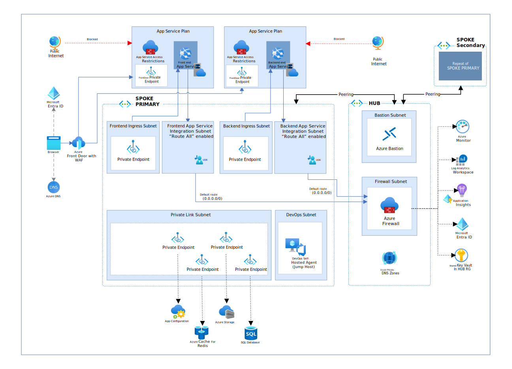

# Steps to deploy the Network Isolated implementation
This section describes the deployment steps for the reference implementation of a reliable web application pattern with .NET on Microsoft Azure. These steps guide you through using the jump host that is deployed when performing a network isolated deployment because access to resources will be restricted from public network access and must be performed from a machine connected to the vnet.



## Prerequisites

We recommend that you use a Dev Container to deploy this application.  The requirements are as follows:

- [Azure Subscription](https://azure.microsoft.com/pricing/member-offers/msdn-benefits-details/).
- [Visual Studio Code](https://code.visualstudio.com/).
- [Docker Desktop](https://www.docker.com/get-started/).
- [Permissions to register an application in Microsoft Entra ID](https://learn.microsoft.com/azure/active-directory/develop/quickstart-register-app).
- Visual Studio Code [Dev Containers extension](https://marketplace.visualstudio.com/items?itemName=ms-vscode-remote.remote-containers).

If you do not wish to use a Dev Container, please refer to the [prerequisites](prerequisites.md) for detailed information on how to set up your development system to build, run, and deploy the application.

> **Note**
>
> These steps are used to connect to a Linux jump host where you can deploy the code. The jump host is not designed to be a build server. You should use a devOps pipeline to manage build agents and deploy code into the environment. Also note that for this content the jump host is a Linux VM. This can be swapped with a Windows VM based on your organization's requirements.

## Steps to deploy the reference implementation

The following detailed deployment steps assume you are using a Dev Container inside Visual Studio Code.

### 1. Log in to Azure

1. Start a powershell session in the dev container terminal:

    ```sh
    pwsh
    ```

1. Import the Azure cmdlets:

    ```pwsh
    Import-Module Az.Resources
    ```

1. Log in to Azure:
    
    ```pwsh
    Connect-AzAccount
    ```

1. Set the subscription to the one you want to use (can use [Get-AzSubscription](https://learn.microsoft.com/powershell/module/az.accounts/get-azsubscription?view=azps-11.3.0) to list available subscriptions):

        
    ```pwsh
    $AZURE_SUBSCRIPTION_ID="<your-subscription-id>"
    ```

    ```pwsh
    Set-AzContext -SubscriptionId $AZURE_SUBSCRIPTION_ID
    ```

1. Azure Developer CLI (azd) has its own authentication context. Run the following command to authenticate to Azure:

    ```pwsh
    azd auth login
    ```


### 2. Provision the app

1. Create a new AZD environment to store your deployment configuration values:

    ```pwsh
    azd env new <pick_a_name>
    ```
    
1. Set the default subscription for the azd context:

    ```pwsh
    azd env set AZURE_SUBSCRIPTION_ID $AZURE_SUBSCRIPTION_ID
    ```

1. To create the prod deployment:

    ```pwsh
    azd env set ENVIRONMENT prod
    ```

1. Production is a multi-region deployment. Choose an Azure region for the primary deployment:

    ```pwsh
    azd env set AZURE_LOCATION <pick_a_region>
    ```

1. Choose an Azure region for the secondary deployment:

    ```pwsh
    azd env set AZURE_SECONDARY_LOCATION <pick_a_region>
    ```

1. Run the following command to create the Azure resources (about 45-minutes to provision):

    ```pwsh
    azd provision
    ```

### 3. Upload the code to the jump host

> **WARNING**
>
> When the prod deployment is performed the Key Vault resource will be deployed with public network access enabled. This allows the reader to access the Key Vault to retrieve the username and password for the jump host. This also allows you to save data created by the `create-app-registration` script directly to the Key Vault. We recommend reviewing this approach with your security team as you may want to change this approach. One option to consider is adding the jump host to the domain, disabling public network access for Key Vault, and running the `create-app-registration` script from the jump host.

To retrieve the generated password:

1. Retrieve the username and password for your jump host:

    - Locate the Hub resource group in the Azure Portal.
    - Open the Azure Key Vault from the list of resources.
    - Select **Secrets** from the menu sidebar.
    - Select **Jumphost--AdministratorPassword**.
    - Select the currently enabled version.
    - Press **Show Secret Value**.
    - Note the secret value for later use.
    - Repeat the proecess for the **Jumphost--AdministratorUsername** secret.

1. Start a new terminal from your dev container. We use the [Azure CLI](https://learn.microsoft.com/en-us/cli/azure/) to create a bastion tunnel that allows us to connect to the jump host:

    <!-- requires AZ cli login -->

    ```shell
    az login
    ```
    
    ```shell
    AZURE_SUBSCRIPTION_ID=$(azd env get-values -o json | jq -r ".AZURE_SUBSCRIPTION_ID")
    az account set --subscription $AZURE_SUBSCRIPTION_ID
    ```


1. Run the following to set the environment variables for the bastion tunnel:

    ```shell
    bastionName=$(azd env get-values -o json | jq -r .BASTION_NAME)
    resourceGroupName=$(azd env get-values -o json | jq -r .BASTION_RESOURCE_GROUP)
    targetResourceId=$(azd env get-values -o json | jq -r .JUMPHOST_RESOURCE_ID)
    ```

1. Run the following command to create a bastion tunnel to the jump host:
    ```shell
    az network bastion tunnel --name $bastionName --resource-group $resourceGroupName --target-resource-id $targetResourceId --resource-port 22 --port 50022
    ```
    
    > **NOTE**
    >
    > Now that the tunnel is open, change back to use the original PowerShell session.

    <!-- todo might need to remove previously used key -->
    <!--
    ```shell
    ssh-keygen -R [127.0.0.1]:50022
    ```
    -->

1. From PowerShell use the following SCP command to upload the code to the jump host (use the password you retrieved from Key Vault to authenticate the SCP command):
    ```shell
    scp -r -P 50022 * azureadmin@127.0.0.1:web-app-pattern/
    ```

1. From PowerShell use the SCP command to upload the AZD environment to the jump host:
    ```shell
    scp -r -P 50022 ./.azure azureadmin@127.0.0.1:web-app-pattern/
    ```

1. Run the following command to start a shell session on the jump host:

    ```shell
    ssh azureadmin@127.0.0.1 -p 50022
    ```

### 4. Deploy code from the jump host

1. Change to the directory where you uploaded the code:

    ```shell
    cd web-app-pattern
    ```

1. Change the exeuatable permissions on the scripts:
    <!-- set script permissions is required when running from windows. not required from Dev Container experience -->

    ```shell
    chmod +x ./infra/scripts/predeploy/call-set-app-configuration.sh
    ```

    ```shell
    chmod +x ./infra/scripts/postdeploy/show-webapp-uri.sh
    ```

1. Start a PowerShell session:

    ```shell
    pwsh
    ```

1. Install the Azure PowerShell module:

    ```pwsh
    Install-Module -Name Az -Force
    ```

1. [Sign in to Azure PowerShell interactively](https://learn.microsoft.com/powershell/azure/authenticate-interactive):

    ```pwsh
    Connect-AzAccount -UseDeviceAuthentication
    ```

    ```pwsh
    Set-AzContext -SubscriptionId ((azd env get-values --output json | ConvertFrom-Json).AZURE_SUBSCRIPTION_ID)
    ```

1. [Sign in to azd](https://learn.microsoft.com/azure/developer/azure-developer-cli/reference#azd-auth-login):

    ```shell
    azd auth login --use-device-code
    ```

1. Deploy the code from the jump host:

    <!--  from PowerShell use the following command to deploy the code to the secondary region:
    azd env set AZURE_RESOURCE_GROUP ((azd env get-values --output json | ConvertFrom-Json).SECONDARY_RESOURCE_GROUP) -->

    ```shell
    azd deploy
    ```

    It takes approximately 5 minutes to deploy the code.

    For a multi-region deployment, you must also deploy the code to the secondary region following these same steps on the secondary jump host using secondary region settings.

    > **WARNING**
    >
    > In some scenarios, the DNS entries for resources secured with Private Endpoint may have been cached incorrectly. It can take up to 10-minutes for the DNS cache to expire.

1. Use the URL displayed in the console output to launch the Relecloud application that you have deployed:

    

### 5. Teardown

1. Close the PowerShell session on the jump host:

    ```shell
    exit
    ```

1. Close your SSH session:

    ```shell
    exit
    ```

1. Close your background shell that opened the bastion tunnel with the interrupt command Ctrl+C.

1. To tear down the deployment, run the following command from your dev container to remove all resources from Azure:

    ```pwsh
    azd down --purge --force
    ```