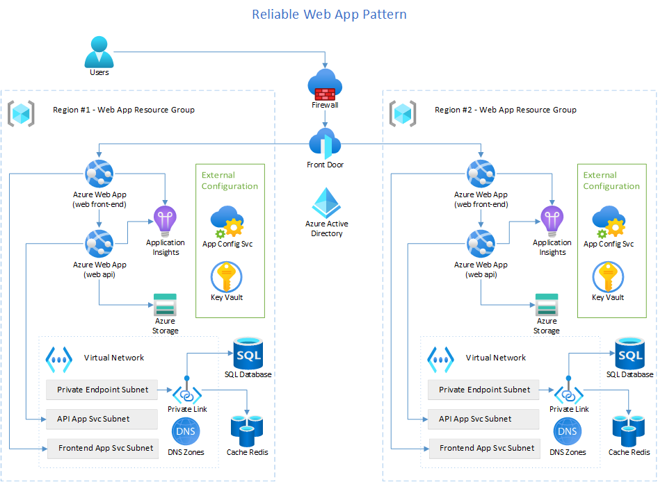

# Reliable web application

The guidance simulates a common developer journey. It applies the principles of the [Well-Architected Framework](https://docs.microsoft.com/azure/architecture/framework/) and [Twelve-Factor Applications](https://12factor.net/) to migrate and modernize a legacy, line-of-business (LOB) web app to the cloud. The guidance addresses the challenges in refactoring a monolithic ASP.NET application with a Microsoft SQL Server database and developing a modern, reliable, and scalable ASP.NET Core application. We provide guidance and deployable artifacts with this guidance. The deployable artifacts create a modernized LOB web application that has improved reliability, security, performance, and more mature operational practices at a predictable cost. It provides a foundation upon which you can achieve longer-term objectives.

## Use cases

The guidance and deployable serves multiple needs. It provides a pattern for running a cost-efficient web application and provides guidance to meet key objectives.

**Cost-efficient web application** - The solution provides two cost-optimized environments. The production environment costs between $2,000 and $3,000 per month with SLAs of 99.98%. The non-prod environments cost between $200-$300 per month per environment with SLAs of 99.56%.

**Key objectives** - Short-term goals include (1) modernizing a web application to sustain additional volume and (2) maturing development team practices for modern development and operations. You'll want to use this guidance if you're looking to open an application to online customers with web and mobile experiences, improve application availability, reduce the time required to deliver new features to the application, and scale different components of the system independently to handle traffic spikes without compromising security

## Architecture

The diagram depicts the web application solution that you can deploy with the implementation guidance.



## Considerations

The five pillars of the Azure Well-Architected Framework provide guiding
tenets that improve the quality of cloud applications.

### Reliability

A reliable workload is one that is both resilient and available.
Resiliency is the ability of the system to recover from failures and
continue to function. The goal of resiliency is to return the
application to a fully functioning state after a failure occurs.
Availability is whether your users can access your workload when they
need to. These patterns are used by the Relecloud sample to improve
reliability.

#### Service to Service Communication and Retry

Given the distributed nature of cloud applications, they must be
designed to operate under the assumption of unreliable communications.
An application that communicates with elements running in the cloud must
be sensitive to the transient faults that can occur in this environment.
Faults include the momentary loss of network connectivity to components
and services, the temporary unavailability of a service, or timeouts
that occur when a service is busy.

Many [Azure SDKs include a retry mechanism](https://learn.microsoft.com/en-us/azure/architecture/best-practices/retry-service-specific)
and can be configured when used in the solution. In this code Entity Framework is configured to retry transient errors.

```cs
services.AddDbContextPool<ConcertDataContext>(options => options.UseSqlServer(sqlDatabaseConnectionString,
    sqlServerOptionsAction: sqlOptions =>
    {
        sqlOptions.EnableRetryOnFailure(
        maxRetryCount: 5,
        maxRetryDelay: TimeSpan.FromSeconds(3),
        errorNumbersToAdd: null);
    }));
```

<sup>Sample code demonstrates how to configure Entity Framework for transient fault handling.
    [Link to Startup.cs](https://github.com/Azure/reliable-web-app-pattern-dotnet/blob/911f841d4b721bef1d9021d487745f873464d11d/src/Relecloud.Web.Api/Startup.cs#L101)</sup>

In other scenarios, with HttpClient, Relecloud uses the [Retry Pattern](https://docs.microsoft.com/azure/architecture/patterns/retry)
because these faults are typically self-correcting and if a service call
is retried after a short delay, then it is likely to succeed. Adding the
Retry Pattern helped the team build a web app that insulates the user
experience from these transient errors.

To implement the Retry Pattern in ASP.NET Core, they use the
[Polly](https://github.com/App-vNext/Polly) library. This enables them to
use fluent APIs that describe the behavior they want in one central
location of the app. In the following screenshot, you can see that the
Retry Pattern is setup for all service calls made to the concert search
service.

```cs
private void AddConcertSearchService(IServiceCollection services)
{
    var baseUri = Configuration["App:RelecloudApi:BaseUri"];
    if (string.IsNullOrWhiteSpace(baseUri))
    {
        services.AddScoped<IConcertSearchService, DummyConcertSearchService>();
    }
    else
    {
        services.AddHttpClient<IConcertSearchService, RelecloudApiConcertSearchService>(httpClient =>
        {
            httpClient.BaseAddress = new Uri(baseUri);
            httpClient.DefaultRequestHeaders.Add(HeaderNames.Accept, "application/json");
            httpClient.DefaultRequestHeaders.Add(HeaderNames.UserAgent, "Relecloud.Web");
        })
        .AddPolicyHandler(GetRetryPolicy())
        .AddPolicyHandler(GetCircuitBreakerPolicy());
    }
}

private static IAsyncPolicy<HttpResponseMessage> GetRetryPolicy()
{
    var delay = Backoff.DecorrelatedJitterBackoffV2(TimeSpan.FromMilliseconds(500), retryCount: 3);
    return HttpPolicyExtensions
      .HandleTransientHttpError()
      .OrResult(msg => msg.StatusCode == System.Net.HttpStatusCode.NotFound)
      .WaitAndRetryAsync(delay);
}
```

<sup>Sample code demonstrates how to use **Polly** to retry api calls to the
Concert Search Service. [Link to Startup.cs](https://github.com/Azure/reliable-web-app-pattern-dotnet/blob/4b486d52bccc54c4e89b3ab089f2a7c2f38a1d90/src/Relecloud.Web/Startup.cs#L85)</sup>

In this sample we see that the dependency injection for the `IConcertSearchService` object is configured so that whenever a class, or controller, makes a service call to the web service the Retry Pattern applies to all the requests that are made through this object.

In the `GetRetryPolicy()` method we also see how to create the behavior with the Polly library. To build this, we use an `HttpPolicyExtensions` object and whenever a transient error is detected the Polly library will wait and retry after a delay. This built-in backoff method will retry the error up to three times with increasingly
larger delays. For example, if this service call fails then after about half a second the same method will be retried. An advantage to using this built-in method is that the next request is made after a delay that includes some randomness to help smooth out bursts of traffic that could be sent to the API if an error happens.

#### Circuit Breaker

In the previous section, we saw how the Retry Pattern can help users
bypass errors in our web app by retrying operations that are likely to
succeed. But what if a real error happens? In that scenario we don't
want our users to keep waiting because the operation is not likely to
succeed when we retry. This is why the Relecloud web app pairs the
Retry Pattern with the
[Circuit Breaker pattern](https://docs.microsoft.com/azure/architecture/patterns/circuit-breaker).
The purpose of the Circuit breaker is to provide the best experience for
the Relecloud web app users. If the database is unavailable then users
should not be forced to wait up to 3 seconds for every API call just to
find out that the web app is not properly working.

In the same `Startup.cs` class you can see the method that adds this
behavior is named `GetCircuitBreakerPolicy()`. This behavior is also
provided by the Polly library and the behavior we want is described with
the same fluent method extensions.

```cs
private static IAsyncPolicy<HttpResponseMessage> GetCircuitBreakerPolicy()
{
    return HttpPolicyExtensions
        .HandleTransientHttpError()
        .CircuitBreakerAsync(5, TimeSpan.FromSeconds(30));
}
```

<sup>Sample code shows how to use Polly to add Circuit Breaker behavior to
web API calls. [Link to Startup.cs](https://github.com/Azure/reliable-web-app-pattern-dotnet/blob/4b486d52bccc54c4e89b3ab089f2a7c2f38a1d90/src/Relecloud.Web/Startup.cs#L115)</sup>

In the Polly library the `HandleTransientHttpError()` will trigger the policy
if the web app receives a 5XX or 408 HTTP status code. And, if the front-end
web app observes more than five errors it will stop the retry behavior that
was previously described and immediately return an error to the user. This
"fail fast" behavior will last for 30 seconds before the next API service call
is made so that the web API app is less likely to be immediately overloaded
with requests if it is restarting to recover from an error.

### Security

Security design principles describe a securely architected system hosted
on cloud or on-premises datacenters (or a combination of both).
Application of these principles dramatically increases the likelihood
your architecture assures confidentiality, integrity, and
availability. These patterns are used by the Relecloud sample to improve
security.

#### Use identity-based authentication

The web app uses a managed identity to access Key Vault, App Configuration, and Azure SQL Database. There are two types of managed identities to choose from. The web app uses a system-assigned managed identity that is tied to lifecycle of the web app. You can also use a user-assigned managed-identity that has a lifecycle independent and is reusable across resources with the same access requirements.

For more information, see:

- [Managed identity](https://learn.microsoft.com/en-us/azure/active-directory/managed-identities-azure-resources/overview)
- [Web app managed identity](https://learn.microsoft.com/en-us/azure/active-directory/develop/multi-service-web-app-access-storage?tabs=azure-portal%2Cprogramming-language-csharp#enable-managed-identity-on-an-app)

To achieve their goal of improving security the Relecloud team developed
the web app to connect to Key Vault and App Configuration with the
`DefaultAzureCredential` object. This is the recommended approach to
developing code that uses Managed Identity because Managed Identity only
works in the cloud. Instead, when this code runs on a dev's box it will
default to trying to authenticate with the Azure AD account used in
Visual Studio.

Since our app connects as the developer, we needed to grant developers
permission to both Key Vault and App Configuration so that they can run
the app locally. We recommend using Security Groups to make this
administration easier to manage.

#### Endpoint security

The Relecloud team also manages their security risk by applying networking
constraints to their Azure resources. By default, Azure SQL Database, Azure
Cache for Redis, and Azure App Service are all publicly accessible resources.

The team secures their data, their secrets, and ensures the integrity of the
system by using Azure Private Endpoints and blocking public network access.
Azure Private Link is a service that enables Azure resources to connect
directly to an Azure Virtual Network where they receive a private IP address.
Because these resources have private IP addresses the team can block all
public internet connections.

Using this Virtual Network approach also enables the team to prepare for
future network scenarios, including hybrid networking, if the web app
needs to access on-prem resources.

The team also uses Azure Front Door with Web Application Firewall. The Web
Application Firewall provides an additional layer of security to protect
the web app from attackers that exploit common security scenarios.

> Read the [Best practices for endpoint security](https://docs.microsoft.com/azure/architecture/framework/security/design-network-endpoints)
> doc if you would like to learn more about how to secure traffic to and
> from your Azure resources

### Cost Optimization

Cost optimization principles balance business goals with budget
justification to create a cost-effective workload. Cost optimization is about
looking at ways to reduce unnecessary expenses and improve operational
efficiencies. The Relecloud team applies cost optimization principles from
the Well-Architected Framework.

#### Choose the correct resources

For prod environments the team chooses the SKU options that provide
the SLA, features, and scale necessary for production. For non-production
environments the team chooses different SKUs with lower capacity and
availability to manage costs.

In the Azure Cache for Redis deployment we can see that the `isProd` parameter controls the selection of the SKU for an environment.

```bicep
var redisCacheSkuName = isProd ? 'Standard' : 'Basic'
var redisCacheFamilyName = isProd ? 'C' : 'C'
var redisCacheCapacity = isProd ? 1 : 0
```

<sup>Sample code shows how to choose Azure Cache for Redis SKU. [Link to azureRedisCache.bicep](https://github.com/Azure/reliable-web-app-pattern-dotnet/blob/4704f6f43bb9669ebd97716e9e7b6e8ba97d6ebf/infra/azureRedisCache.bicep#L21)</sup>

In production the StandardC1 offers:

- 1GB cache
- Dedicated service
- 99.9% Availability SLA
- Up to 1,000 connections

*Costs: 102.67 per month*

For non-prod environments the BasicC0 SKU offers:

- 250MB cache
- Shared infrastructure
- No SLA
- Up to 256 connections

*Costs: 16.37 per month*

This provides behavior similar to production so that devs can perform
integration testing while costing only 16% as much as prod by adjusting
the requirements to align with non-prod usage patterns.

> Microsoft recommends that customers evaluate
> [Dev/Test pricing](https://azure.microsoft.com/en-au/pricing/dev-test/)
> options that can provide significant savings for non-prod environments.
> Microsoft also recommends that customers work with their account team to
> understand reserved pricing options that can reduce the cost of production
> workloads.

<!-- todo - add budgets - https://github.com/Azure/reliable-web-app-pattern-dotnet/issues/78

### Set up budgets and maintain cost constraints
After estimating the initial cost, set budgets and alerts at different scopes to measure the cost. One cost driver can be unrestricted resources. These resources typically need to scale and consume more cost to meet demand.
-->

#### Optimize workloads, aim for scalable costs

A key benefit of the cloud is the ability to scale dynamically. The workload cost should scale linearly with demand.

The Relecloud team uses autoscale rules with Azure Monitor to horizontally
scale the number of Azure App Services based on CPU percentage.

```bicep
resource webAppScaleRule 'Microsoft.Insights/autoscalesettings@2021-05-01-preview' = if (isProd) {
  name: '${resourceToken}-web-plan-autoscale'
  location: location
  tags: tags
  properties: {
    targetResourceUri: webAppServicePlan.id
    enabled: true
    profiles: [
      {
        name: 'Auto created scale condition'
        capacity: {
          maximum: '10'
          default: '1'
          minimum: '1'
        }
        rules: [
          ...
        ]
      }
    ]
  }
}
```

<sup>Abbreviated sample code shows autoscalesettings for web apps. [Link to resources.bicep](https://github.com/Azure/reliable-web-app-pattern-dotnet/blob/4704f6f43bb9669ebd97716e9e7b6e8ba97d6ebf/infra/resources.bicep#L343)</sup>

Adding these rules, to production only, enables the web app to scale from 1 instance up to 10 instances. As demand decreases the web app will also scale
back down to 1 instance so that the cost of the website is not based on the
peak volume of users.

Using this feature enables the Relecloud web app to choose smaller
instances of Azure App Service and align with a highly variable workload.

#### Dynamically allocate and de-allocate resources

To match performance needs customers should dynamically allocate and
de-allocate resources. Relecloud applies this principal by
choosing a single region deployment for non-prod environments and
a multiregional deployment for the Relecloud production environment.

```bicep
var isMultiLocationDeployment = secondaryAzureLocation == '' ? false : true

...

module secondaryResources './resources.bicep' = if (isMultiLocationDeployment) {
  name: 'secondary-${primaryResourceToken}'
  scope: secondaryResourceGroup
  params: {
    devOpsManagedIdentityId: devOpsIdentitySetup.outputs.devOpsManagedIdentityId
    isProd: isProdBool
    location: secondaryAzureLocation
    principalId: principalId
    resourceToken: secondaryResourceToken
    tags: tags
  }
}
```

<sup>Abbreviated sample code shows dynamically choosing multiregional deploment. [Link to main.bicep](https://github.com/Azure/reliable-web-app-pattern-dotnet/blob/4704f6f43bb9669ebd97716e9e7b6e8ba97d6ebf/infra/main.bicep#L53)</sup>

The Relecloud team uses this `secondaryAzureLocation` parameter to dynamically
choose the correct Azure region and understand if the deployment should align
with the production SLA of 99.98% or the non-prod SLA of 99.56% availability.

Infrastructure as code, often listed as an operational best practice, is
also a way the team manages costs. Since the team can create
an entire environment from scratch they can also delete non-production
environments when they're not in use. This enables the team to reduce costs
as the QA team only tests during business hours and the non-prod environments
can be completely removed during company holidays.

### Operational Excellence

Operational excellence is about the operations processes that keep an
application running in production. Deployments must be reliable and
predictable. Automated deployments reduce the chance of human error.
Fast and routine deployment processes won't slow down the release of
new features or bug fixes. These patterns are used by the Relecloud
sample to improve operational excellence.

#### Rotating Secrets

The Relecloud web app uses Key Vault to store secrets. These secrets
are used to grant authorization and create connections between resources.
To protect that authorization process we recommend that you operationalize
the rotation of secrets.

> Note: This sample does not currently include the automation to address this
> responsibility. The following changes discuss the tasks that should be addressed.

In the sample there are three secrets that should be maintained.

1. Azure AD client secret
1. Azure Cache for Redis connection string
1. Azure Storage Account key

*Azure AD Client Secret*
To rotate the Azure AD client secret you should generate a new client secret
and then save the new value to Key Vault. With this sample, the team must
restart the web app so the code will start using the new secret. After
the web app has been restarted, the team can delete the previous client secret.

*Azure Cache for Redis connection string*
To rotate the connection string you should change the value in Key Vault
to the secondary connection string for Azure Cache for Redis. After changing
the value you will need to restart the web app so the new setting can be used.
Once the web app has restarted you can use the azure cli or the Azure portal
to regenerate the access key for Azure Cache for Redis.

*Azure Storage Account key*
Rotating the connection string secret for Azure Storage is the same process
described for Azure Cache for Redis with an additional step. In this solution
the code makes ticket images available directly from Azure storage. If you
choose to do this then you must be prepared to regnerate the shared access
signature URLs that were generated for each ticket. When the shared access
signature URL is generated it uses the primary access key to generate a token
that grants access to the ticket image for a limited time of 30-days.

#### Repeatable Infrastructure

Relecloud achieves their goal of being able to rapidly innovate on Azure
by using the Azure Dev CLI to deploy their solution and their code. The
Azure Dev CLI uses bicep templates to create Azure resources,
setup configuration, and deploy the web app from a GitHub Action.

Automating the deployment helped achieve the following goals:

- The team needs to ensure consistency between environments. This leads
to more predictable behaviors in production and helps the dev team troubleshoot
production issues by being able to recreate the environment.
- The team needs to ensure that when a mistake is fixed that it is deployed
to every environment. Using a GitHub action to create a deployment pipeline
ensures that when a change is deployed to the dev environment that the same
change will be applied to other environments including production.
- The team needs to maximize productivity. Automation helps new team
members quickly set up a new environment and reduces the operational toil
related to maintaining production.

Defining the infrastructure as code also enables Relecloud to
audit and review all production changes deployed to Azure because they
are deployed with the code by the GitHub action.

> Read [Repeatable Infrastructure](https://docs.microsoft.com/azure/architecture/framework/devops/automation-infrastructure)
> to learn more about improving operational efficiency with automation.

#### Monitoring

To see how our application is behaving we're integrating with
Application Insights. The setup for monitoring request throughput,
average request duration, errors, and monitoring dependencies is
accomplished by adding a NuGet package reference to
**Microsoft.ApplicationInsights.AspNetCore** and registering it with the
ASP.NET Core Dependency Injection container.

```cs
public void ConfigureServices(IServiceCollection services)
{
   ...
   services.AddApplicationInsightsTelemetry(Configuration["App:Api:ApplicationInsights:ConnectionString"]);
   ...
}
```

<sup>Abbreviated sample code shows how to set up Application Insights.
[Link to Startup.cs](https://github.com/Azure/reliable-web-app-pattern-dotnet/blob/4b486d52bccc54c4e89b3ab089f2a7c2f38a1d90/src/Relecloud.Web/Startup.cs#L38)</sup>

Adding this setting enables us to see the following types of dashboards
in the Azure Portal.


<sup>Screenshot of Azure Portal shows real time metrics for requests being
made to the web app</sup>

Adding Application Insights also helps us address other requirements for
Relecloud:

- Must be able to set alerts if no orders have been placed in the past few hours
- Must be able to see if more (or fewer) tickets are added to cart for A/B testing
- Must be able to measure response times to ensure a positive user experience
- Must be able to see and diagnose application errors

Relecloud uses the baseline metrics and three business metrics that are
recorded in Application Insights as Events. The three custom events are:

- Add to Cart
- Remove from Cart
- Checkout Cart

To track these Events, we use the `TelemetryClient` object provided through
Dependency Injection. Here's an example from the CartController of how
the code tracks the AddToCart event. You can also see additional details
captured with the event such as concertId and the number of tickets. Using
[Kusto Query Language (KQL)](https://learn.microsoft.com/en-us/azure/data-explorer/kusto/query/)
we can examine this data for reporting and monitoring in Azure.

```cs
this.telemetryClient.TrackEvent("AddToCart", new Dictionary<string, string> {
    { "ConcertId", concertId.ToString() },
    { "Count", count.ToString() }
});
```

<sup>Sample code show how to track a business event with additional data for
reporting [Link to CartController.cs](https://github.com/Azure/reliable-web-app-pattern-dotnet/blob/4b486d52bccc54c4e89b3ab089f2a7c2f38a1d90/src/Relecloud.Web/Controllers/CartController.cs#L81)</sup>

These custom events can be found in the Azure Portal on the **Events** tab
for the Application Insights resource.


<sup>Screenshot of Azure Portal shows custom events</sup>

Using the Azure Log Analytics Workspace you can create KQL queries to find
and organize data for dashboards and charts that reflect the business metrics
that should be monitored to understand how the application is behaving.


<sup>Screenshot of Azure Portal shows that details for **AddToCart** event
includes **ConcertId** and ticket **Count**</sup>

### Performance Efficiency

Performance efficiency is the ability of a workload to scale and meet
the demands placed on it by users in an efficient manner. A workload should
anticipate increases in cloud environments to meet business
requirements. These patterns are used by the Relecloud sample to improve
performance efficiency.

#### Cache-Aside Pattern

The [Cache-Aside Pattern](https://docs.microsoft.com/azure/architecture/patterns/cache-aside)
is a performance optimization pattern that can be used to manage costs. The
Relecloud team applied this pattern after identified that the top query on
their Azure SQL Database comes from **Upcoming Concerts Page**. This page
produces a well-known output for every user and the team identified that they
could cache the data for this page to reduce their load on Azure SQL. Reducing
their load on Azure SQL enables the team to select a smaller Azure SQL SKU so
the team can manage their costs.

Another cost optimization the team used in this solution is the decision to
share the single Azure Cache for Redis instance for multiple types of data.
In this solution Redis handles the web front-end session for carts, MSAL
authentication tokens, and the UpcomingConcerts data managed by the web API.

The smallest Redis SKU is capable of handling all of these requirements so
the team has decided to resuse the Redis Cache to achieve a lower operating
costs.

Adding an Azure Cache for Redis service helped us address the following
requirements:

- Reduce database costs by reducing the number of operations performed
- Reduce the impact that bursts of traffic can have on Azure SQL
- Improve service availability by reducing database scaling events

The caching process begins when the web app starts. As the app starts it
connects to the cache and registers with the ASP.NET Core dependency injection
container. You can see this in Startup.cs

```cs
private void AddAzureCacheForRedis(IServiceCollection services)
{
    if (!string.IsNullOrWhiteSpace(Configuration["App:RedisCache:ConnectionString"]))
    {
        services.AddStackExchangeRedisCache(options =>
        {
            options.Configuration = Configuration["App:RedisCache:ConnectionString"];
        });
    }
    else
    {
        services.AddDistributedMemoryCache();
    }
}
```

<sup>Sample code demonstrates how the web app connects to Azure Cache for
Redis. [Link to Startup.cs](https://github.com/Azure/reliable-web-app-pattern-dotnet/blob/4b486d52bccc54c4e89b3ab089f2a7c2f38a1d90/src/Relecloud.Web/Startup.cs#L50)</sup>

Once the app is started, the cache is empty until the first request is
made to the **Upcoming Concerts Page**. ASP.NET Core uses the `SqlDatabaseConcertRepository` to retrieve data from Azure SQL so it can be
shown on the page. Here's what the `GetUpcomingConcertsAsync` method looks
like from this repository.

```cs
public async Task<ICollection<Concert>> GetUpcomingConcertsAsync(int count)
{
    IList<Concert>? concerts;
    var concertsJson = await this.cache.GetStringAsync(CacheKeys.UpcomingConcerts);
    if (concertsJson != null)
    {
        // We have cached data, deserialize the JSON data.
        concerts = JsonSerializer.Deserialize<IList<Concert>>(concertsJson);
    }
    else
    {
        // There's nothing in the cache, retrieve data from the repository and cache it for one hour.
        concerts = await this.database.Concerts.AsNoTracking()
            .Where(c => c.StartTime > DateTimeOffset.UtcNow && c.IsVisible)
            .OrderBy(c => c.StartTime)
            .Take(count)
            .ToListAsync();
        concertsJson = JsonSerializer.Serialize(concerts);
        var cacheOptions = new DistributedCacheEntryOptions {
            AbsoluteExpirationRelativeToNow = TimeSpan.FromHours(1)
        };
        await this.cache.SetStringAsync(CacheKeys.UpcomingConcerts, concertsJson, cacheOptions);
    }
    return concerts ?? new List<Concert>();
}
```

<sup>Sample code demonstrates how to use Redis with Azure SQL. [Link to SqlDatabaseConcertRepository.cs](https://github.com/Azure/reliable-web-app-pattern-dotnet/blob/4b486d52bccc54c4e89b3ab089f2a7c2f38a1d90/src/Relecloud.Web.Api/Services/SqlDatabaseConcertRepository/SqlDatabaseConcertRepository.cs#L67)</sup>

The purpose of this method is to access the database and retrieve
the ten latest Concerts. It filters by time, sorts, and returns data to the
Controller that will display the results.

But this method is a little longer. Before asking the database for those Concerts, it asks Azure Cache for Redis if it knows what the latest concerts
should be. It uses the IDistributedCache that was injected by ASP.NET Core's
dependency injection. If we don't find data, that's when we ask Azure
SQL. And, since we had to ask SQL, we save the answer in cache so that
we don't have to ask again. In this example the information will only be
cached for 1 hour. We do this to keep the information in cache relevant
but the right duration for the cache will vary for every scenario.

> In this sample the Concerts are not editable. Remember that when you
> use a cache you will want to change cached data whenever a user makes
> an update. You can achieve this with an event driven system or by
> ensuring that the cached data is only accessed directly from the
> repository class that is responsible for handling the create and edit
> events. When using the Repository Pattern, you can manage stale data by
> clearing the cache key as shown in the CreateConcertAsync method.
>
> ```cs
> public async Task<CreateResult> CreateConcertAsync(Concert newConcert)
> {
>     database.Add(newConcert);
>     await this.database.SaveChangesAsync();
>     this.cache.Remove(CacheKeys.UpcomingConcerts);
>     return CreateResult.SuccessResult(newConcert.Id);
> }
> ```
>
> <sup>Sample code demonstrates how to invalidate cache when using Repository Pattern.
> [Link to SqlDatabaseConcertRepository.cs](https://github.com/Azure/reliable-web-app-pattern-dotnet/blob/4b486d52bccc54c4e89b3ab089f2a7c2f38a1d90/src/Relecloud.Web.Api/Services/SqlDatabaseConcertRepository/SqlDatabaseConcertRepository.cs#L28)</sup>


## Deploy the solution

This solution uses the Azure Dev CLI to set up Azure services and deploy the code. Deploying the code requires the creation of Azure services, configuration of permissions,and creating Azure AD App Registrations. [Follow the implementation guidelines](implementation.md) to deploy the code to Azure and local development.

## Components

- [App Services - Web Apps](https://www.microsoft.com/azure/app-service/app-service-web-overview) hosts
    web applications allowing autoscaling and high availability without
    having to manage infrastructure. This is where the Relecloud
    Concerts web app will be deployed.

- [Azure Active Directory](https://docs.microsoft.com/en-us/azure/active-directory/fundamentals/active-directory-whatis)
    Azure Active Directory (Azure AD) is a cloud-based identity and access management service. This service helps your
    employees access external resources, such as Microsoft 365, the Azure portal, and thousands of other SaaS applications.

- [Azure SQL Database](https://docs.microsoft.com/azure/azure-sql/azure-sql-iaas-vs-paas-what-is-overview?view=azuresql) is
    a general-purpose relational database managed service in Microsoft
    Azure that supports structures such as relational data, JSON,
    spatial, and XML.

- [Application Insights](https://docs.microsoft.com/azure/azure-monitor/app/app-insights-overview)
    is a feature of Azure Monitor that provides extensible application
    performance management (APM) and monitoring for live web apps,

- [Azure Cache for Redis](https://docs.microsoft.com/azure/azure-cache-for-redis/cache-overview)
    provides an in-memory data store based on the Redis software.

- [Azure Front Door](https://learn.microsoft.com/en-us/azure/frontdoor/front-door-overview) is an OSI Layer 7 global load balancer that can manage traffic to your web applications.

- [Azure Web Application Firewall](https://docs.microsoft.com/azure/web-application-firewall/overview)
    provides centralized protection of your web applications from common
    exploits and vulnerabilities.

- [Azure Key Vault](https://docs.microsoft.com/azure/key-vault/general/overview)
    provides centralized storage of application secrets to control their
    distribution

- [Azure App Configuration](https://docs.microsoft.com/azure/azure-app-configuration/overview)
    is a service to centrally manage application settings and feature
    flags

- [Azure Storage](https://docs.microsoft.com/azure/storage/common/storage-introduction)
    provides storage for files and queue storage for message driven
    communication.

- [Azure Private DNS](https://docs.microsoft.com/azure/dns/private-dns-overview)
    provides a reliable and secure DNS service for your virtual network.
    Azure Private DNS manages and resolves domain names in the virtual
    network without the need to configure a custom DNS solution.

- [Azure Private Link](https://docs.microsoft.com/azure/private-link/private-link-overview)
    enables you to access Azure PaaS Services over a Private Endpoint in
    your virtual network. A Private Endpoint is a network interface that
    uses a private IP address from your virtual network. This connects
    you privately and securely to a service such as Azure SQL Database.

## Component decisions

Choosing the right Azure services is an important part of the planning phase before moving your app to Azure. Understanding the level of performance and availability you need for your app will have an impact on the total cost to run your solution. You should start by defining a target SLO for your solution and use that information to determine which products and SKUs you should be using.

For our architecture, we have chosen a set of services based on the following criteria:

- Our target SLA is 99.9%
- We expect an average daily user load will be around 1,000 users

**App Service** - App Service is a key piece of our hosting infrastructure. App Service
Web Apps meets the following requirements for hosting our app:

- the service provides a 99.95% uptime SLA for our app
- we want a fully managed hosting platform where we are not
    responsible for maintaining the underlying operating system
- we want support for the latest version of .NET
- we want a solution that allows us to deploy without containerizing
    our app, but that gives us a path to do so when we are ready
- we want to have the web app very rapidly scale up/down and in/out
    based on user traffic

App Service meets our requirements. We are free to choose whether we
want to host our app using App Service running Windows or Linux.

**Azure Active Directory** - Azure Active Directory (AAD) was chosen as our identity platform for this app. We need to be able to both authenticate a user's identity and
authorize them based on roles that our app understands. We have the
following requirements that were satisfied by choosing Azure AD:

- we want to authenticate and authorize users
- we want to leverage the power of a well-known solution that has
    proven it can scale to support larger scenarios for millions of users
- we do not allow users to choose their identity, or create their own accounts
- we do not want to be responsible for managing forgotten passwords
    and password resets for our users
- we want our identity solution to conform to OpenID Connect and
    OAuth 2.0

Identity is a broad topic, and getting it right is important. If you
think Azure AD B2C might be a good fit for your app, review your
requirements and compare them against the [technical and feature
overview](https://docs.microsoft.com/azure/active-directory-b2c/technical-overview)
of Azure AD B2C.

**SQL Database** - When we decided to move Relecloud Concerts to Azure, we wanted to keep
our current database schema, stored procedures, and functions. Azure SQL
Database met all our requirements:

- the general-purpose tier provides a 99.99% uptime SLA for our app
- a fully managed SQL database instance
- reliable to support high user load
- high availability and multi-region redundancy
- supports database migration from on-premises SQL Server
- supports our existing stored procedures and functions as-is
- supports our existing views as-is
- provides backups and point-in-time restore

There are different SQL products in Azure. Make note of your current
system capabilities and what requirements you have for your new app
running in Azure, then [select the best Azure SQL
deployment](https://cloudblogs.microsoft.com/sqlserver/2020/03/17/tips-to-select-the-best-azure-sql-deployment-option/)
option for your app.

**Application Insights / Azure Monitor** -Application Insights is a feature of Azure monitor that provides
extensible application performance management (APM) and monitoring for
web apps. We chose to incorporate Application Insights because it:

- automatically detects performance anomalies
- helps diagnose issues in our running app
- surfaces information about how users are using the app
- allows us to easily send custom events we want to track in our app

Azure Monitor is a comprehensive suite of monitoring tools collects
data from a variety of Azure services. Review the following
concepts to quickly come up to speed on its capabilities:

- [Smart detection in application insights](https://docs.microsoft.com/azure/azure-monitor/app/proactive-diagnostics)
- [Application Map: Triaging Distributed Applications](https://docs.microsoft.com/azure/azure-monitor/app/app-map?tabs=net)
- [Profile live App Service apps with Application Insights](https://docs.microsoft.com/azure/azure-monitor/app/profiler)
- [Usage analysis with Application Insights](https://docs.microsoft.com/azure/azure-monitor/app/usage-overview)
- [Getting started with Azure Metrics Explorer](https://docs.microsoft.com/azure/azure-monitor/essentials/metrics-getting-started)
- [Application Insights Overview dashboard](https://docs.microsoft.com/azure/azure-monitor/app/overview-dashboard)
- [Log queries in Azure Monitor](https://docs.microsoft.com/azure/azure-monitor/logs/log-query-overview)

**Azure Cache for Redis** - Our app is expected to attract more than a million daily users. We
expect tens of thousands of those users to purchase concert tickets. Our
load is heavily skewed toward viewing concerts and venue details. We
want to implement a cache that provides us with:

- a managed service
- high data throughput
- low latency reads for commonly accessed, slow changing data
- a unified cache location for all instances of our web app to use

**Azure Front Door** - Azure Front Door is the load balancer we choose to manage how we route
traffic between regions. This choice sets up additional features such as
Web Application Firewall and positions us to use a Content Delivery Network
to provide site acceleration as traffic to the web app increases.

Azure Front Door provides:

- traffic acceleration with Anycast to reach the nearest Azure point of presence and find the fastest route to our web app
- support for custom domain names with flexible domain validation
- load balance and route traffic across origins and use intelligent health probe monitoring
- built-in reports with an all-in-one dashboard for both Front Door and security patterns
- ability to configure alerts that integrate with Azure Monitor
- support to log each request and failed health probes
- layer 3-4 DDoS protection

There are different Load balancer products in Azure. Make note of your current
system capabilities and what requirements you have for your new app
running in Azure, then [choose the best load balancer option](https://learn.microsoft.com/en-us/azure/architecture/guide/technology-choices/load-balancing-overview?toc=%2Fazure%2Ffrontdoor%2Fstandard-premium%2Ftoc.json)
for your app.

**Azure Web Application Firewall (WAF)** - Azure Web Application Firewall (WAF) on Azure Front Door provides centralized protection for the web application. WAF prevents malicious attacks close to the attack sources, before they enter your virtual network. You get global
protection at scale without sacrificing performance. This also provides a
platform the team can monitor and configure to address security concerns from
botnets.

Azure WAF provides protection against the following threat categories:

- Cross-site scripting
- Java attacks
- Local file inclusion
- PHP injection attacks
- Remote command execution
- Remote file inclusion
- Session fixation
- SQL injection protection
- Protocol attackers

**App Configuration** - We chose to take a dependency on Azure App Configuration to manage our configuration data. Our configuration requirements are:

- we want a central store for our **configuration** data (not secrets,
    which belong in Key Vault)
- we want to take advantage of **Feature Flags** to allow users to
    opt-in and opt-out of early preview features in a production
    environment without redeploying the app
- we want to use a tool that will allow us to store our configuration
    data **centrally**
- we want our source of truth for configuration data to be a **git
    repository**, and that data to be updated in our central
    configuration store as part of our pipeline
- we want to use [Managed Identity](https://docs.microsoft.com/azure/active-directory/managed-identities-azure-resources/overview)
    to simplify and secure our connection to our configuration store

[App Configuration](https://docs.microsoft.com/azure/azure-app-configuration/overview)
meets these needs and is easy to incorporate in your existing app using
the
[ConfigurationBuilder](https://docs.microsoft.com/azure/azure-app-configuration/quickstart-dotnet-core-app)
object. Review App Configuration capabilities and [best practices](https://docs.microsoft.com/azure/azure-app-configuration/howto-best-practices#app-configuration-bootstrap)
to decide if this service is a fit for your app.

**Key Vault** - Our solution requires use of X.509 certificates, connection strings and
API keys for integration with third party services. We favor the use of
Managed Identity for intra-Azure service communication but there are
still secrets that must be managed. We chose to use Key Vault for the
following capabilities:

- data is encrypted at rest
- data is encrypted in transit
- authentication to our secret store should support Managed Identity
- our secret store must support logging to allow us to audit access
- our secret store needs to be able to alert us when changes are made
    to stored secrets
- we should be able to import PFX and PEM formatted certificates

Key Vault meets this need, and like App Configuration is easy to
incorporate in .NET apps using the
[ConfigurationBuilder](https://docs.microsoft.com/dotnet/api/overview/azure/extensions.aspnetcore.configuration.secrets-readme)
object.

**Azure Storage** - Many solutions hosted on Azure make at least some use of Azure Storage.
Our app processes ticket purchases by processing purchase messages off a
queue, then generating a printable ticket to a concert. We chose to use
Storage Queues to hold purchases that are pending PDF generation and
Blob Storage for the resulting PDFs.

We have the following requirements for our queue:

- we do not need to ensure a specific order for message delivery
- message consumption will be idempotent, so at-most-once delivery is not required
- we want to be able to pull a batch of a dozen work items from the queue each operation
- we need to be able to audit server-side transaction logs
- we want to authenticate to our queue using Managed Identity

These requirements lead us to use Azure Storage Queues for our queuing
needs. If you have a queue scenario in your app,
[review the messaging options available](https://docs.microsoft.com/azure/service-bus-messaging/service-bus-azure-and-service-bus-queues-compared-contrasted)
in both Storage Queues and Azure Service Bus and determine which is the
best fit for your app.

We have the following requirements for storing images of tickets:

- endpoints for accessing storage should not be exposed to the public internet
- we want to manage our encryption keys using our own certificates
- data should be encrypted at rest
- data should be encrypted in transit
- our data should be extremely resilient against loss

For Blob Storage, we chose Zone-redundant storage (ZRS). Zone-redundant storage replicates data synchronously across three Azure availability zones in the primary region. Each availability zone is in a separate physical location with independent power, cooling, and networking.

We can use Key Vault to manage our certificate used to encrypt our
storage account, and  [private endpoints](https://docs.microsoft.com/azure/private-link/private-endpoint-overview) to allow clients to securely access data over a
[Private Link](https://docs.microsoft.com/azure/private-link/private-link-overview).

**Azure Private DNS / Azure Private Link** - Azure Private Link enables you to access PaaS Services (such as, Azure Cache for Redis and SQL Database) over a private endpoint in your virtual network.
Traffic between your virtual network and the service travels across the Microsoft backbone network. Exposing your service to the public internet is no longer necessary.

Using Azure Private DNS with Azure Private Link enables your solution to communicate securely with Azure services like Azure SQL Database.
Azure Private DNS integrates with Azure App Service to extend DNS resolution so that the private IP address is provided for public hostnames.
This enables a web app to connect to Azure SQL Database which requires connections to use the public hostname when connecting to the private IP address.

Azure Private Link provides the following benefits:

- Privately access services on the Azure platform
- Access services running in Azure from on-premises over ExpressRoute private peering
- Reduces the network footprint of data stores to protect against data leakage
