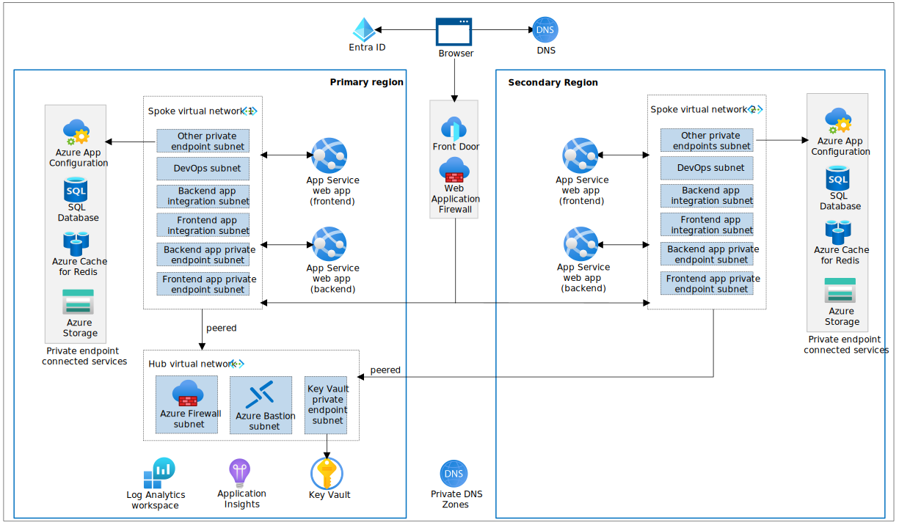

## 1 - Tooling and Deployment

Welcome to the RWA .NET Workshop, we are going to learn how build reliable web applications using .NET and enterprise Cloud Apps. We are going to deploy a Ticket Store Application, Relecloud Concerts!

For this guide, we assume you are using a Dev Container inside Visual Studio Code using Dev Containers.

> For your convenience, we use Dev Containers with a fully-featured development environment. If you prefer to use Visual Studio, we recommend installing the necessary [dependencies](../../prerequisites.md) and skip to the deployment instructions starting in [Step 3](#3-log-in-to-azure).

### 1. Clone the repo

> For Windows users, we recommend using Windows Subsystem for Linux (WSL) to [improve Dev Container performance](https://code.visualstudio.com/remote/advancedcontainers/improve-performance).

Open and run in a PowerShell Shell window, the following command.

```pwsh
wsl
```

Clone the repository from GitHub into the WSL 2 filesystem using the following command:

```shell
git clone https://github.com/Azure/reliable-web-app-pattern-dotnet.git
cd reliable-web-app-pattern-dotnet
```

> You still can run this guide outside of WSL in Windows, but performance may be affected. Clone the repo with the instructions above.

### 2. Open Dev Container in Visual Studio Code

If required, ensure Docker Desktop is started and enabled for your WSL terminal [more details](https://learn.microsoft.com/windows/wsl/tutorials/wsl-containers#install-docker-desktop). Open the repository folder in Visual Studio Code. You can do this from the command prompt in WSL:

```shell
code .
```

> If you are not running WSL, open VS Code and Docker, as usual, to open in Container the preconfigured environment.

Once Visual Studio Code is launched, you should see a popup allowing you to click on the button **Reopen in Container**.


If you don't see the popup, open the Visual Studio Code Command Palette to execute the command. There are three ways to open the command palette:

- For Mac users, use the keyboard shortcut ⇧⌘P
- For Windows and Linux users, use Ctrl+Shift+P
- From the Visual Studio Code top menu, navigate to View -> Command Palette.

Once the command palette is open, search for `Dev Containers: Rebuild and Reopen in Container`.


### 3. Log in to Azure

Before deploying, you must be authenticated to Azure and have the appropriate subscription selected. 

Run the following commands to authenticate:


> If you are not using PowerShell 7+, run the following command (you can use [$PSVersionTable.PSVersion](https://learn.microsoft.com/powershell/module/microsoft.powershell.core/about/about_powershell_editions) to check your version).

Open PowerShell on VSCode, or use:

```shell
pwsh
```

Import Az.Resources use Azure command in our Shell.

```pwsh
Import-Module Az.Resources
```

Login into Azure:

```pwsh
Connect-AzAccount -UseDeviceAuthentication 
```

Set the subscription to the one you want to use selecting from the list available subscriptions on the terminal. Enter the number corresponding to the subscription you do wish to use.

Use the next command to login with the Azure Dev CLI (AZD) tool:

```pwsh
azd auth login --use-device-code
```


### 4. Create a new environment

Next we provide the AZD tool with variables that it uses to create the deployment. The first thing we initialize is the AZD environment with a name.

The environment name should be less than 18 characters and must be comprised of lower-case, numeric, and dash characters (for example, `dotnetwebapp`).  The environment name is used for resource group naming and specific resource naming.

By default, Azure resources are sized for a development deployment. If doing a production deployment, see the [production deployment](../../prod-deployment.md) instructions for more detail.

```pwsh
azd env new <pick_a_name>
```

Use the Azure Subscription ID from the current Subscription, add this as variable.

```pwsh
$AZURE_SUBSCRIPTION_ID=(Get-AzContext).Subscription.Id
```

Select the subscription that will be used for the deployment:

```pwsh
azd env set AZURE_SUBSCRIPTION_ID $AZURE_SUBSCRIPTION_ID
```

Set the `AZURE_LOCATION` (Run `(Get-AzLocation).Location` to see a list of locations):

```pwsh
azd env set AZURE_LOCATION <pick_a_region>
```

### 5. Create the Azure resources and deploy the code

Run the following command to create the Azure resources and deploy the code (about 15-minutes to complete):

```pwsh
azd up
```

### 6. Open and use the application

Use the URL displayed in the console output to launch the web application that you have deployed:


The application is for the fictional company Relecloud, embodying the reliable web app pattern with a focus on .NET technologies. Relecloud Tickets is a production-grade web application that uses best practices from our guidance and gives developers concrete examples to build their own Reliable Web Application in Azure. Guiding developers through a simulated migration from an on-premises ASP.NET application to Azure, detailing the architectural changes and enhancements that capitalize on the cloud's strengths during the initial adoption phase. 



The infrastructure-as-code implementation implements the production deployment (shown above) and a development deployment, which is geared towards developer productivity and is more cost effective to run. Key aspects include:

- Cost Efficiency: Utilizes a hub for shared resources, such as Azure Bastion, to enable secure, cost-effective remote access without individual deployments.
- Traffic Control & Security: Employs Network Security Groups and Route tables for secure traffic management within subnets, complemented by Private endpoints and a jump box for secure local IP access.
- Network Integration: Facilitates data transfer and hybrid scenarios, with recommendations to consider ExpressRoute or Azure VPN Gateway for hybrid network connections.

For more details on the architecture and workflow for the Relecloud application, read the [main instructions](../../README.md) to learn more about the application in detail.

### 7. Next Steps

Fantastic! We've successfully deployed a production-like Relecloud concerts monolithic web application to Azure. Relecloud Concerts leverages the Reliable Web App Pattern with minimal code changes, seamlessly deployed to Azure using simple steps via azd. Now, let's dive deeper and explore the patterns and best-practices used in this application. As we advance, we'll simplify things by deploying a more basic application to help illustrate these concepts clearly before reviewing them in our main app. Ready to start? Click [next](../2%20-%20RWA%20Overview/README.MD). 

### Appendix A (To be run only after completing the workshop)

See how to clean up the app in [Chapter 8](../8%20-%20Clean%20Up/README.md).