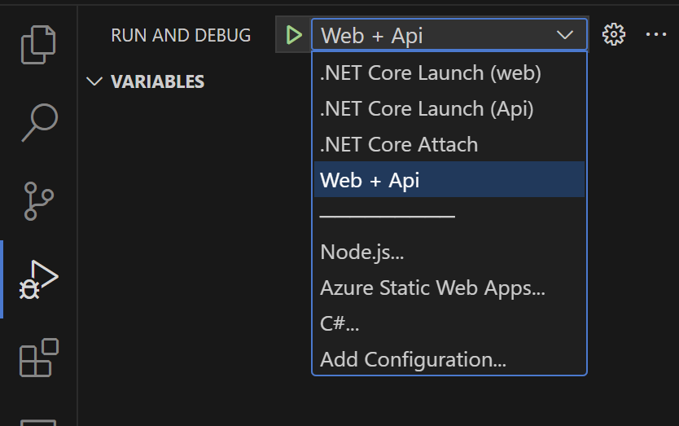
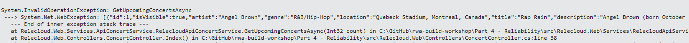
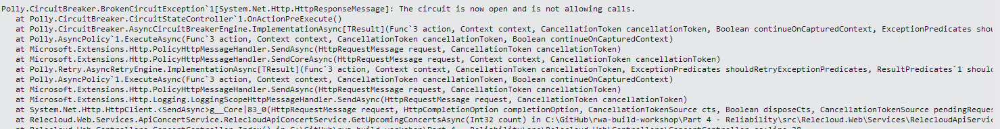

# 4 - Reliability

A reliable web application is one that is both resilient and available. Resiliency is the ability of the system to recover from failures and continue to function. Availability is a measure of whether your users can access your web application when they need to. You should use the Retry and Circuit Breaker patterns as critical first steps toward improving application reliability. 

These design patterns introduce self-healing qualities and help your application maximize the reliability features of the cloud. Here are our reliability recommendations.

## Use the retry pattern for transient faults

The Retry pattern is a technique for handling temporary service interruptions. These temporary service interruptions are known as transient faults. They're transient because they typically resolve themselves in a few seconds.

### Changing our application

To experiment with the Retry pattern, we'll need to change the application and manually simulate a transient fault.

1. Open the main solution in **src\Relecloud.sln**.
1. Open the **Relecloud.Web.CallCenter.Api** project's **appsettings.json** file.
1. Add the following key immediately after the **AllowedHosts** key:

    ```json
    "Api": {
        "App": {
            "RetryDemo":  "2"
        }
    }
    ```

    This sets the **Relecloud.Web.CallCenter.Api** service to throw an exception every other time it's called. This will simulate a transient fault.

1. Add a valid certificate for our .NET application, use the following command ``dotnet dev-certs https --trust`` in a terminal to generate a valid certificate.

1. Before we run the application, we need to generate our app registrations.
    1. Open PowerShell terminal.
    1. Use `cd ./infra/scripts/postprovision/` to change to the Scripts directory
    1. Run the `create-app-registrations.ps1` script.
    1. Paste the name in the Resource Group from the Azure Portal.
    1. Go with the default values in the following ones.

1. Verify that both the **Relecloud.Web.CallCenter.Api** and **Relecloud.Web.CallCenter** projects are set as startup projects.
    1. Verify that the **C# Dev Kit** is installed in your VS Code, if not install [here](https://marketplace.visualstudio.com/items?itemName=ms-dotnettools.csdevkit).
    1. From the **Run & Debug**, check that the correct option to deploy is selected **Web + Api** 

    

1. Press **F5** or the **Debug** button to start the application.
1. Once both the web client and web API are running, click on **Upcoming** from the client application.
1. Every other click on **Upcoming** should result in an exception. The web app handles the exception by displaying **There are no upcoming concerts**. You'll see the output of the exception in the Output window in Visual Studio.

    

    

> It's possible you'll also get an exception _before_ the application launches. This may be due to an issue connecting to Azure SQL. We'll fix that, but for now, just restart the application and it should work.

Let's make our application more resilient!

### Use Azure service SDKs and client libraries first

Most Azure services and client SDKs have a built-in retry mechanism. You should use the built-in retry mechanism for Azure services to expedite the implementation. Let's see how to implement the retry pattern using Entity Framework Core's built-in retry mechanism.

1. Select the main **Relecloud** solution.
1. Open the **Relecloud.CallCenter.Api** project's **Startup.cs** file.
1. Browse to the `AddConcertContextServices` method. This method configures the Entity Framework Core context for the application.
1. Change the `services.AddDbContextPool<ConcertDataContext>` call to the following code:

    ```csharp
    services.AddDbContextPool<ConcertDataContext>(options => options.UseSqlServer(sqlDatabaseConnectionString,
        sqlServerOptionsAction: sqlOptions =>
        {
            sqlOptions.EnableRetryOnFailure(
            maxRetryCount: 5,
            maxRetryDelay: TimeSpan.FromSeconds(3),
            errorNumbersToAdd: null);
        }));
    ```

    The `EnableRetryOnFailure` method enables the built-in retry mechanism for Entity Framework Core. The default retry policy is to retry up to 6 times with a 2-second delay between retries. You can change the default retry policy by passing a `MaxRetryCount` and `MaxRetryDelay` to the `EnableRetryOnFailure` method.

Now we'll use the Azure App Configuration's SDK to add a retry policy to communication with the Azure App Configuration service.


1. Open the **Program.cs** file from the same project.
1. Browse to the `builder.Configuration.AddAzureAppConfiguration` call. It should be on line 11.
1. Chain the following code onto the end of the `ConfigureKeyVault` method.

    ```csharp
    .ConfigureClientOptions(options =>
    {
        options.Retry.MaxRetries = 5;
        options.Retry.MaxDelay = TimeSpan.FromSeconds(3);
    });
    ```

    The `ConfigureClientOptions` method configures the retry policy for the Azure App Configuration SDK. The default retry policy is to retry up to 3 times with a 1-second delay between retries. You can change the default retry policy by passing a `MaxRetries` and `MaxDelay` to the `ConfigureClientOptions` method.

    The entire Azure App Configuration configuration should look like this:

    ```csharp
    builder.Configuration.AddAzureAppConfiguration(options =>
    {
        options
            .Connect(new Uri(builder.Configuration["Api:AppConfig:Uri"]), new DefaultAzureCredential())
            .ConfigureKeyVault(kv =>
            {
                // Some of the values coming from Azure App Configuration are stored Key Vault, use
                // the managed identity of this host for the authentication.
                kv.SetCredential(new DefaultAzureCredential());
            })
            .ConfigureClientOptions(options =>
            {
                options.Retry.MaxRetries = 5;
                options.Retry.Delay = TimeSpan.FromSeconds(3);
            });
    });
    ```    

1. Make sure you save your changes to both the **Startup.cs** and **Program.cs** files.

### Use Polly for custom retry policies

You might need to make calls to a dependency that isn't an Azure service or doesn't support the Retry pattern natively. In that case, you should use the [Polly library](https://github.com/App-vNext/Polly) to implement the Retry pattern. Polly is a .NET resilience and transient-fault-handling library.

Let's implement custom retry policies to the Relecloud.Web project to handle any transient communication faults with the Relecloud.Web.CallCenter.Api service.


1. Open in solution explorer in VS Code the main **Relecloud solution**.
1. Add the Polly NuGet package to **Relecloud.Web.CallCenter**. From **Solution Explorer**, right-click the **Relecloud.Web.CallCenter** project and select **Manage NuGet Packages**.
    1. From the **Browse** tab, search for **Polly.Contrib.WaitAndRetry** and then click **Install**.
1. Open the **Startup.cs** file from the **Relecloud.Web.CallCenter** project.
1. Add the following using statements to the top of the file:

    ```csharp
    using Polly;
    using Polly.Contrib.WaitAndRetry;
    using Polly.Extensions.Http;
    ```

1. Add the following method to the **Startup** class:

    ```csharp
    private static IAsyncPolicy<HttpResponseMessage> GetRetryPolicy()
    {
        var delay = Backoff.DecorrelatedJitterBackoffV2(TimeSpan.FromMilliseconds(500), retryCount: 3);

        return HttpPolicyExtensions
            .HandleTransientHttpError()
            .WaitAndRetryAsync(delay);
    }
    ```

    The `GetRetryPolicy` method returns a `IAsyncPolicy<HttpResponseMessage>` that can be used to retry HTTP requests. The `HandleTransientHttpError` method tells Polly to retry the HTTP request if the response is a transient HTTP error. The `WaitAndRetryAsync` method tells Polly to retry the HTTP request using a specified delay between retries.

1. Now we have to tell application that each `HttpClient` that is used to communicate to the **Relecloud.Web.Api** service to use the retry policy.
1. Open the `AddTicketPurchaseService` method in the **Startup** class.
1. Add the following code to the end of the `services.AddHttpClient` method:

    ```csharp
    .AddPolicyHandler(GetRetryPolicy());
    ```

    The `AddPolicyHandler` method adds the retry policy to the `HttpClient` that is injected into the `RelecloudApiTicketPurchaseService` class. That `HttpClient` is subsequently used to communicate with the **Relecloud.Web.Api** service.
1. Open the `AddConcertSearchService` method in the **Startup** class.
1. Add the following code to the end of the `services.AddHttpClient` method:

    ```csharp
    .AddPolicyHandler(GetRetryPolicy());
    ```

1. Open the `AddTicketImageService` method in the **Startup** class.
1. Add the following code to the end of the `services.AddHttpClient` method:

    ```csharp
    .AddPolicyHandler(GetRetryPolicy());
    ```

1. Finally, open the `AddConcertContextService` method in the **Startup** class.
1. Add the following code to the end of the `services.AddHttpClient` method:

    ```csharp
    .AddPolicyHandler(GetRetryPolicy());
    ```

1. Run the application locally again, and it will handle the transient errors successfully.

### Circuit breaker pattern

You should pair the Retry pattern with the Circuit Breaker pattern. The Circuit Breaker pattern handles faults that aren't transient. The goal is to prevent an application from repeatedly invoking a service that is down.

You can implement the circuit breaker pattern with Polly as follows:

1. Open the **Startup.cs** file from the **Relecloud.Web.CallCenter** project.
1. Add the following method

    ```csharp
    private static IAsyncPolicy<HttpResponseMessage> GetCircuitBreakerPolicy()
    {
        return HttpPolicyExtensions
            .HandleTransientHttpError()
            .OrResult(msg => msg.StatusCode == System.Net.HttpStatusCode.NotFound)
            .CircuitBreakerAsync(5, TimeSpan.FromSeconds(30));
    }
    ```

    The `GetCircuitBreakerPolicy` method returns a `IAsyncPolicy<HttpResponseMessage>` that can be used to implement the Circuit Breaker pattern. The `HandleTransientHttpError` method tells Polly to retry the HTTP request if the response is a transient HTTP error. The `OrResult` method tells Polly to retry the HTTP request if the response is a 404 Not Found. The `CircuitBreakerAsync` method tells Polly to break circuit if the HTTP request fails 5 times in 30 seconds.

1. Add that policy to the `AddTicketPurchaseService`, `AddConcertSearchService`, `AddTicketImageService`, and `AddConcertContextService` methods in the **Startup** class. Use the following code and chain it to the end of the `services.AddHttpClient` method:

    ```csharp
    .AddPolicyHandler(GetCircuitBreakerPolicy());
    ```

1. To simulate **Relecloud.Web.CallCenter.Api** being down, update the `Api:App:RetryDemo` key in the project's **appsettings.json** file to have a value of **1**.

    ```json
    "Api": {
        "App": {
            "RetryDemo":  "1"
        }
    }
    ```

    This sets the **Relecloud.Web.Api** service to throw an exception every time an HTTP request is received.

1. Run the application locally again, this time if 5 exceptions occur within 30 seconds, the circuit will break and the application will stop trying to communicate with the **Relecloud.Web.CallCenter.Api** service.
1. When you call it more than 5 times you will start to see a `Polly.CircuitBreaker.BrokenCircuitException` exception in the output window.

    

## Next Steps

Next up let's look at how to make sure our application stays secure in the [Part 5 - Security](../5%20-%20Security/README.md) module.
