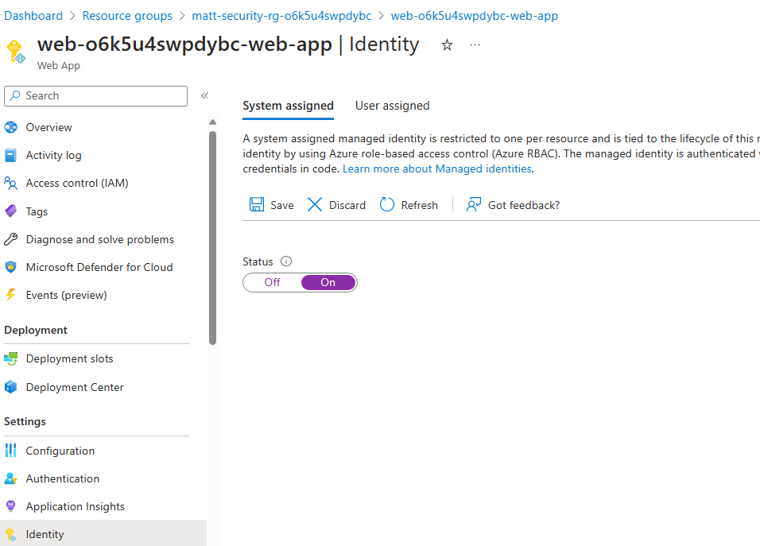
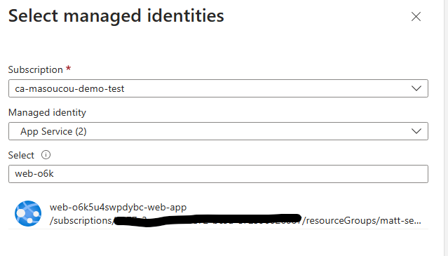
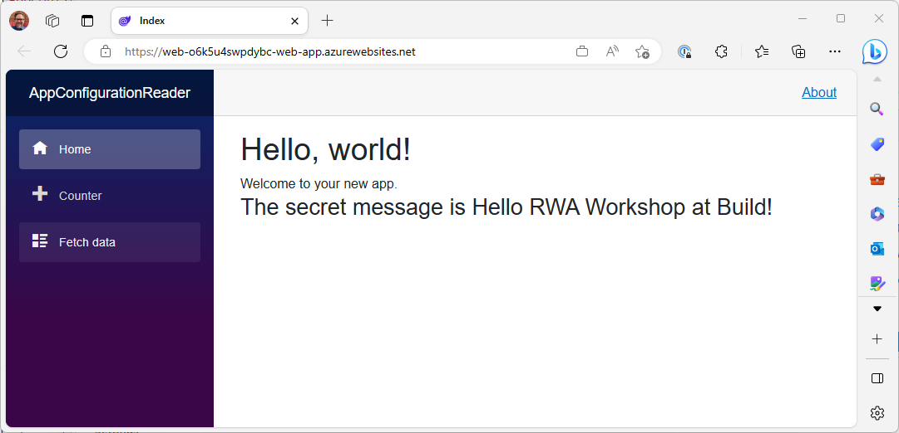
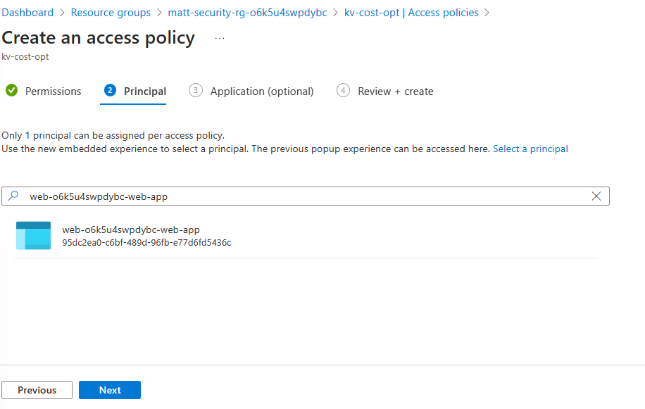
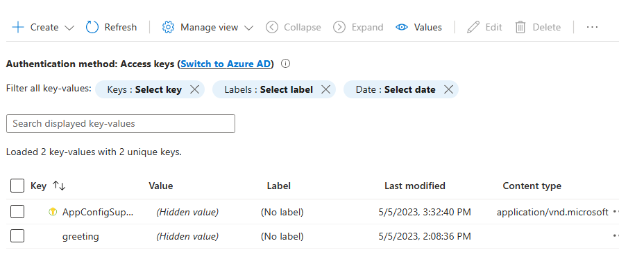
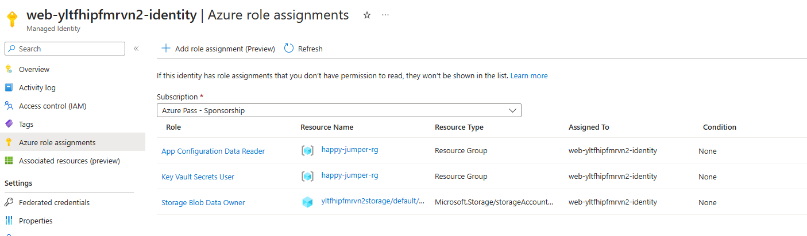

# 5 - Security

Cloud applications are often composed of multiple Azure services. Communication between those services needs to be secure. Enforcing secure authentication, authorization, and accounting practices in your application is essential to your security posture. At this phase in the cloud journey, you should use managed identities, secrets management, and private endpoints. Here are the security recommendations for the reliable web app pattern.

## Managed identities

Managed identities provide an automatically managed identity in Azure Active Directory (Azure AD) that applications can use when they connect to resources that support Azure AD authentication.

When you grant managed identities access to a resource, you should always grant the least permissions needed.

Let's see how managed identities can help us remove connection strings from our code.

1. We'll use the same sample application as we did during the [Cost Optimization](../3%20-%20Cost%20Optimization/README.md) module. A copy of the code is already in this module under the [azd-sample](./azd-sample) directory.
1. Copy the **.azure** directory from the **3 - Cost Optimization\azd-sample** directory to the **5 - Security\azd-sample** directory.
1. Open the [Azure portal](https://portal.azure.com) and browse for resource groups. The name of the resource group will start with  **<USERNAME>-cost-rg**. (Or what you named it in the previous module.)
1. Open the App Service within the resource group.
1. Click on the **Identity** menu item in the left navigation.
1. From the **System assigned** tab, click **On** to enable the system assigned identity. Then click **Save**.

    

1. Click yes at the prompt to enable the identity.
1. Make note of what the web application's name is. It will probably be easiest to copy it to a text file for reference later.
    _It will be named similar to: **matt-web-y6kur4iwg4nxw**_
1. Go back to the resource group and open the Azure App Configuration resource.
1. Click on the **Access control (IAM)** menu item in the left navigation.
1. Click the **+ Add** button. Then click **Add role assignment**.
1. Select **App Configuration Data Reader** and click **Next**.
1. In the **Members** tab, change **Assign access to** to **Managed identity**.
1. Click **+ Select members**.
1. In the **Select managed identities** blade, from the **Managed identity** drop down, select **App Service** under the **System-assigned managed identity** section.

    

1. Enter your web application's name in the **Select** field and then choose it. It should not appear under the **Selected members** section. Then click **Select**.
1. The blade will disappear and you should see your web application's name under the **Members** section. Click **Review and assign**.
1. Go through the same steps as above, but this time add your user account as a **App Configuration Data Reader**. _Note: you will use **User, group, or service principal** instead of **Managed identity** to search for your username to add._
1. Click **Review and assign** to move through the rest of the tabs and apply the changes.

The web application (and  you!) now has read access to Azure App Configuration. Let's update the application to use the managed identity and remove the connection string from it.

1. Click the **Overview** menu item in the left navigation of the Azure App Configuration service in the portal.
1. Copy the **Endpoint** value to the clipboard.
1. Open the **5 - Security\azd-sample\src\AppConfigurationReader.sln** solution in Visual Studio.
1. Open the **appsettings.json** file and replace the value for `AzureUrls:AppConfiguration` with the value you copied to the clipboard.
1. Replace the `options.Connect(appConfigUrl);` with the following:

    ```csharp
    options.Connect(new Uri(appConfigUrl), new DefaultAzureCredential());
    ```

    This will use the managed identity to authenticate to Azure App Configuration. In fact, it will use whoever is logged in to authenticate, including the Azure account you associated with Visual Studio.

1. Run the application locally. You should see the message from Azure App Configuration displayed in the browser.

    

   > **Note** Azure Active Directory lazily updates permissions. If you receive a `403 Forbidden` error (surfaced as an exception in Visual Studio), wait for five minutes and try again.

1. Back to the PowerShell terminal and run the following command to deploy the application to Azure:

    ```powershell
    azd deploy
    ```

1. When the deployment is finished, go back to the portal and open up the App Service.
1. Click on the **Configuration** menu item in the left navigation.
1. Change the `AzureUrls:AppConfiguration` value to the Azure App Configuration's URL value you copied to the clipboard earlier. Instead of the full connection string, it should just be a URL now.
1. Click **Ok**.
1. Click **Save** at the top of the page and confirm you want to restart the application.
1. Go to the **Overview** menu item in the left navigation and click on the **Browse** button from the top row of buttons.
1. The application will launch and will read the value from Azure App Configuration without using a connection string.

    

## Centralized secrets management

Sometimes you cannot help but to need a secret key or connection string. In those cases, you should use a centralized secrets management service. Azure Key Vault is a great option for this.

Let's provision an Azure Key Vault through the Azure CLI.

1. Make a note of the resource group name. It will probably be easiest to copy it to the clipboard.
1. Open the PowerShell terminal.
1. Type the following command to store the resource group name in a variable:

    ```powershell
    $resourceGroupName = "<RESOURCE_GROUP_NAME>"
    ```

    Replace `<RESOURCE_GROUP_NAME>` with the name of your resource group. It will probably be something like **<USERNAME>-cost-rg**.

1. Provision a new KeyVault with the following command:

    ```powershell
    az keyvault create --name <USERNAME>-cost-opt --resource-group $resourceGroupName --location eastus
    ```

    Replace `<USERNAME>` with your username.

1. Refresh the resource group view in the Azure portal. The new Key Vault should appear. Open it up.
1. Click on the **Access policies** menu item in the left navigation.
1. Click the **+ Create** button.
1. From **Secret permissions**, select **Get** and **List**. Click **Next**.
1. Paste the name of your web application into the search box. Select it and click **Next**.

    

1. Click **Next** until you get to the **Review and create** tab and then click **Create**.
1. You should now see your application listed.
1. To add a secret, click on the **Secrets** menu item in the left navigation.
1. Click the **+ Generate/Import** button.
1. Enter `SuperSecretSecret` for the **Name** field.
1. Put something clever in the **Secret value** field. Click **Create**.
1. Now we'll setup Azure App Configuration to read the secret from Key Vault. This way our application can use one single way to read both App Configuration and Key Vault.
1. Open Azure App Configuration from the resource group.
1. Click on **Configuration Explorer** in the left navigation.
1. Click **+ Create** then **Key Vault Reference**.
1. Enter `AppConfigSuperSecret` for the **Key** field.
1. Under the **Key Vault** dropdown, select the Key Vault you created earlier. Make sure the correct resource group is selected.
1. Once the Key Vault is selected, the **Secret** dropdown will be enabled. Select `SuperSecretSecret` from the dropdown and click **Apply**.
1. The new configuration value will appear in the list. It will be indicated that it is a KeyVault reference by a lock icon.

    

1. Now let's update the application to read the secret from Key Vault.
1. Back to Visual Studio. Right-click on the solution in **Solution Explorer** and select **Manage NuGet Packages for Solution...**.
1. Browse for **Azure.Security.KeyVault.Secrets** and install to the **AppConfigurationReader** project.
1. Open the **Program.cs** file.
1. Change the `builder.Configuration.AddAzureAppConfiguration` to look like this:

    ```csharp
    builder.Configuration.AddAzureAppConfiguration(options =>
    {
        options.Connect(new Uri(appConfigUrl), new DefaultAzureCredential())
        .ConfigureKeyVault(kv =>
        {
            kv.SetCredential(new DefaultAzureCredential());
        });
    });
    ```

    This will configure our code to use Azure App Configuration to use the managed identity to authenticate to Key Vault.

1. Open up the **Index.razor** file under the **Pages** directory.
1. Add in the following to the end of the file:

    ```html
    <h4>The KeyVault super duper secret is @Configuration["AppConfigSuperSecret"]</h4>
    ```

1. Run the application locally. You should see the message from Azure App Configuration and Azure KeyVault displayed.
1. Using the PowerShell terminal, run the following command to deploy the application to Azure:

    ```powershell
    azd deploy
    ```

1. When the deployment is finished, browse to it and you should see the Azure App Service also has access to Azure Key Vault.

## Review in the Reliable Web App's Code

Let's review where how Managed Identity, Azure App Configuration, and Azure Key Vault are used in the Reliable Web App reference application.

### User-assigned Managed Identity

The Reliable Web App reference application uses User-Assigned Managed Identities rather than System-Assigned. The major difference is that User-Assigned Managed Identities are not tied to a specific Azure resource. This allows you to use the same identity across multiple resources. This is useful when you have multiple resources that need to access the same Azure resources.

Of course, you also need to create the User-Assigned Managed Identity, then assign it to the various resources, then assign the appropriate permissions to the identity. This is all done through the Azure CLI, Azure portal, or even ARM or bicep templates when provisioning the Azure resources.

#### Creating bicep files

To see how the Reliable Web App reference application provisions the User-Assigned Managed Identity, let's look at the bicep files. Open up the **Reference App/infra** folder in VS Code or Visual Studio.

Scroll down to **line 68** in the **resources.bicep** file. You'll see the following:

```bicep
@description('A user-assigned managed identity that is used by the App Service app')
resource managedIdentity 'Microsoft.ManagedIdentity/userAssignedIdentities@2018-11-30' = {
  name: 'web-${resourceToken}-identity'
  location: location
  tags: tags
}
```

This provisions the user-assigned managed identity.

Keep scrolling down and you'll see this bit of code:

```bicep
@description('Built in \'Data Reader\' role ID: https://docs.microsoft.com/en-us/azure/role-based-access-control/built-in-roles')
var appConfigurationRoleDefinitionId = '516239f1-63e1-4d78-a4de-a74fb236a071'

@description('Grant the \'Data Reader\' role to the user-assigned managed identity, at the scope of the resource group.')
resource appConfigRoleAssignmentForWebApps 'Microsoft.Authorization/roleAssignments@2020-04-01-preview' = {
  name: guid(appConfigurationRoleDefinitionId, appConfigService.id, managedIdentity.name, resourceToken)
  scope: resourceGroup()
  properties: {
    principalType: 'ServicePrincipal'
    roleDefinitionId: resourceId('Microsoft.Authorization/roleDefinitions', appConfigurationRoleDefinitionId)
    principalId: managedIdentity.properties.principalId
    description: 'Grant the "Data Reader" role to the user-assigned managed identity so it can access the azure app configuration service.'
  }
}
```

The first part is just a variable that contains the ID of the **Data Reader** role for Azure App Config. This is the role that will be assigned to the user-assigned managed identity.

The second part is assigning the user-assigned managed identity to the **Data Reader** role.

Now, let's see where the user-assigned managed identity is assigned to the Azure App Service. Scroll down to **line 212** in the **resouces.bicep** file. You'll see the following:

```bicep
resource web 'Microsoft.Web/sites@2021-03-01' = {
  name: 'web-${resourceToken}-web-app'
  location: location
  
...

  identity: {
    type: 'UserAssigned'
    userAssignedIdentities: {
      '${managedIdentity.id}': {}
    }
  }

...

}
```

The `identity` node is where the user-assigned managed identity is assigned to the web app. Now the web app has all of the permissions of the user-assigned managed identity.

#### Examples in the Azure portal

You can see the roles the user-assigned managed identity has been assigned in the Azure portal. Open up the Azure portal and navigate to the resource group that was created for you. It will be named **<USERNAME>-rg**.

Filter the resources by type **Managed Identities**. You should see 2 the user-assigned managed identities. Open the one that starts with **web**.

Click on **Azure role assignments** in the left navigation. You'll then see the resources the identity has been granted access to. You can click into the resources to see the specific role assignments.



### Private endpoints

Azure KeyVault and Azure App Configuration are not accessible from the public internet. They are only accessible from within a virtual network. This is done through private endpoints.

You should use private endpoints to provide more secure communication between your web app and Azure services. By default, service communication to most Azure services crosses the public internet. In the reference implementation, these services include Azure SQL Database, Azure Cache for Redis, and Azure App Service. Azure Private Link enables you to add security to that communication via private endpoints in a virtual network to avoid the public internet.

This improved network security is transparent from the code perspective. It doesn't involve any app configuration, connection string, or code changes.

## Going Next

Next up learn about how to keep our application running smoothly in the [Part 6 - Operational Excellence](../6%20-%20Operational%20Excellence/README.md) module.
