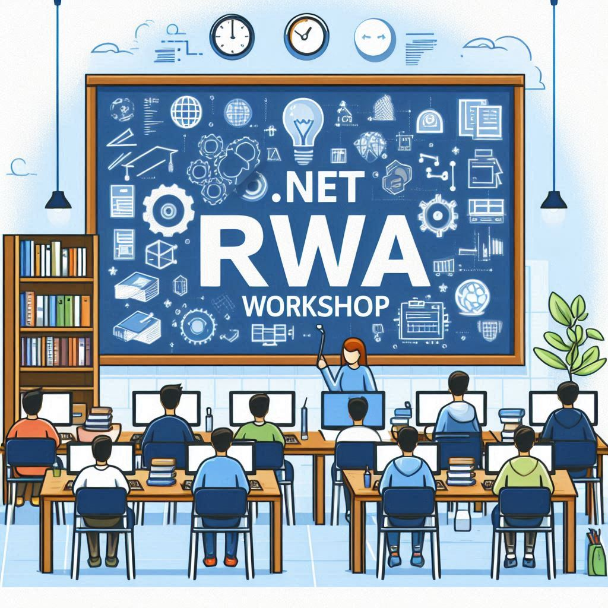

# Reliable Web Apps .NET Workshop

## Welcome

In this workshop, we'll introduce a simple starter app, and then deploy a single region of the Reliable Web Application Reference Architecture on Azure. 

This workshop should take approximately 1.5 hours to complete:

- The provisioning of the Azure resources for the reference architecure will take 20 minutes and the deployment 20 minutes.
- Between the provision and deployment, we will explain the other Parts so you can continue with the workshop while the installation is running.

## What the workshop covers

This workshop is designed to help you learn how to take your application's first step into the cloud and build reliable web applications using .NET. You can think of the Reliable Web Application (RWA) pattern as a pattern of patterns. Each pattern provides prescriptive guidance on how to build a specific aspect of a reliable web application. The patterns are derived from both the Azure Well-Architected Framework and the 12-factor app methodology.

## Table of Contents

- [1️⃣ Part 1 - Tooling and Deployment](./1%20-%20Tooling%20and%20Deployment/README.md)
- 2️⃣ Part 2 - RWA Overview
- 3️⃣ Part 3 - Cost Optimization
- 4️⃣ Part 4 - Reliability
- 5️⃣ Part 5 - Security
- 6️⃣ Part 6 - Operational Excellence
- 7️⃣ Part 7 - Performance Efficiency